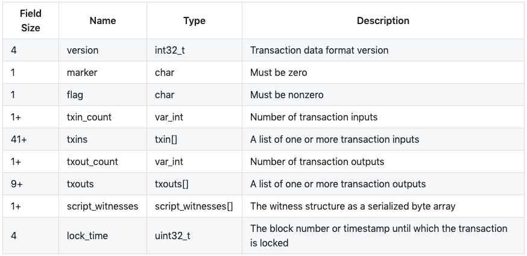
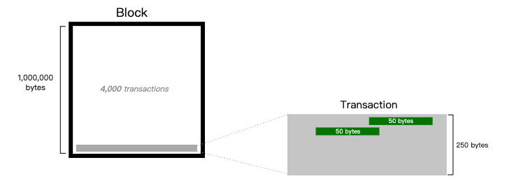
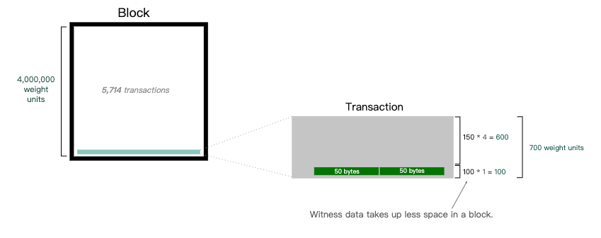
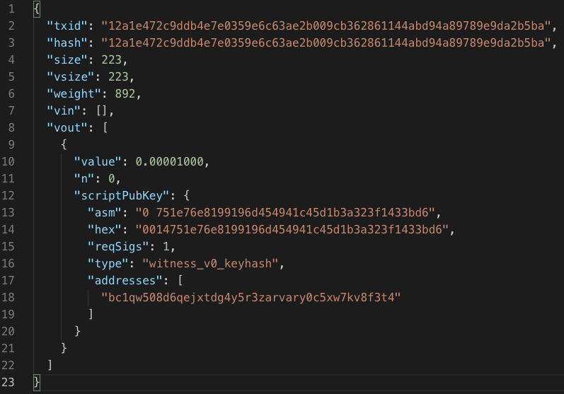
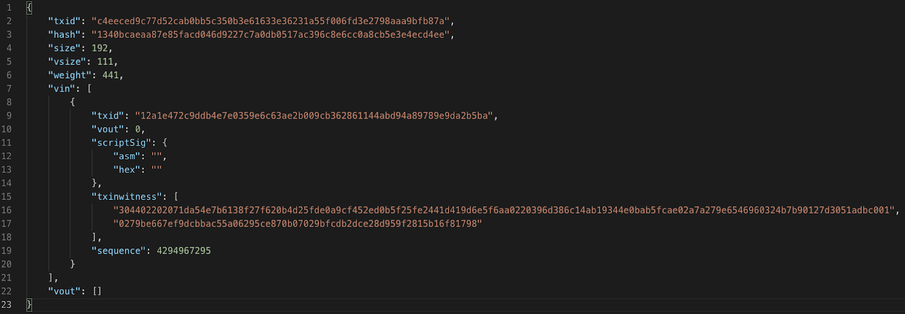
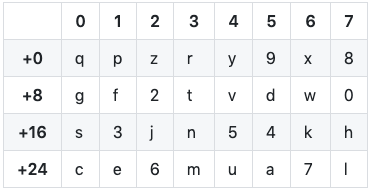

# 簡介
Bitcoin transaction 是由數個 input 以及 output 所組成的，而 input 含有 scriptSig，即 unlocking script 用來解鎖對應到的資產，而 output 含有 scriptPubKey，即 locking script 用來保護該資產，這些 script 是用來確認真正的擁有者才能夠花費對應的資產，但他們本身並不影響也不代表 transaction 的真實含義。

因此，BIP141 就提議，在 block 裡面創造一個新的資料結構叫 witness program 來存放 transaction 的 input script。如此一來會把簽名的部分分離 (segregate) 出 transaction 了，所以才叫做 segregated witness，簡稱 segwit。

## txID 與 wtxID(tx hash)
首先 Bitcoin 定義了一個 transaction 的 **txID** 是整個 transaction 的資料做兩次 sha256 出來的結果。

而 BIP141 的出現，因為把 transaction 的 input script 給移出 transaction 的架構中了，而 txID 的算法仍然保持不變。

另外因為 witness 的出現，產生了另一種 transaction ID 去涵蓋 witness program，稱做 wtxID，又或者是我們常看到的 **tx hash**。因此如果是一個 non-segwit transaction 因為根本沒有 witness data 所以他的 txID 會和 tx hash 一樣，但如果是 segwit transaction 的話，兩者的值則會不同。**需要注意的是，不管 transaction 是不是 segwit，input 去 reference 到前一個 output 的時候都是用 txID 而不是 tx hash。**
```
txID:         [nVersion][txins][txouts][nLockTime]
wtxID / hash: [nVersion][marker][flag][txins][txouts][witness][nLockTime]
```

### Transaction format


和一般的 non-segwit transaction 相比，基本上架構都一樣，但多了三個欄位。

1. marker: **這個只能是 0**。在 non-segwit transaction 的情形，這邊理當是 txin_count 的值，然而所有 Bitcoin transaction 都一定會有 input (連 coinbase transaction 都會有一個不存在的 input)，因此這個 0 就可以讓節點區別現在是在處理一個 segwit transaction。
2. flag: **這個目前就是 1**。是保留彈性用的。
3. script_witnesses: 這邊就是放 witness program 的地方。

## Increase Block Capacity
原本的 block 大小上限為 1MB，而 transaction 的大小也是用 bytes 來計算，BIP141 則提出一個不一樣的計算單位，叫做 weight。因此新的 block 大小上限被定義為 4M weight，在 block 的資料裡面，只要是 witness program 則 1 byte 就對應到 1 weight，如果是 non-witness program 則 1 byte 就佔了 4 weight。





由上面兩張圖可以看到，假設一個 transaction 為 250 bytes，且他有兩個 inputs。在原本的設計下，一個 block 可以容納 4000 筆這種 transaction。而 BIP141 的架構下，如果這筆 transaction 採用 segwit 將其中的 100 bytes (兩個 input script) 分離出來變成 witness program，這些 witness program 每 1 byte 就是 1 weight，因此每筆 transaction 就可以節省 300 weight 的空間，這個 block 就可以因此容納 5714 筆 transaction 了，比原本的多！

## Witness program
segwit 的關鍵，就是在於 witness program。而為了在一般 transaction 的架構下能支援 segwit，因此 BIP141 就選擇在前一筆 output 的 locking script 動點手腳，只要看到 scriptPubKey 是 0x00 開頭，他就被賦予了新的意義。

### P2WPKH
```
witness:      <signature> <pubkey>
scriptSig:    (empty)
scriptPubKey: 0 <20-byte-key-hash>
              (0x0014{20-byte-key-hash})
```
全名是 pay to witness public key hash，和原本的 P2PKH 一樣，需要有一個長度為 20 bytes 的 public key hash，用來之後驗證 signature。而當花費這個 output 時，本來要放入 input scriptSig 的 signature 和 public key 被放入到了 witness program，因此 input 的 scriptSig 就可以是空的。簡單來說，scriptPubKey 的開頭為 0 讓 script engine 知道這是一個 segwit transaction，而接下來的 20 bytes 讓 script engine 更明確知道這是一個 P2WPKH output，因此 script engine 就會去 witness program 拿 signature 和 public key，最後的驗證就和普通 P2PKH 一樣了。

### P2WPKH in P2SH
```
witness:      <signature> <pubkey>
scriptSig:    <0 <20-byte-key-hash>>
              (0x160014{20-byte-key-hash})
scriptPubKey: HASH160 <20-byte-script-hash> EQUAL
              (0xA914{20-byte-script-hash}87)
```
> 上面的 P2WPKH 也可以包在 P2SH 裡面，如此一來雖然較原生的 segwit transaction 消耗多一點的空間，但卻享有向下兼容的好處，因為 P2SH 是從 Bitcoin 0.6.0 就出現了。

本質上來說這就是一個 P2SH 的 output，所以 scriptPubKey 是不能亂改動的，因此本來表明 segwit 特性的 0 和 20-byte-hash 就移到了 input 的 scriptSig 了，因為這邊 hash 的長度是 20 bytes，也就表明了這是一個 P2WPKH 形態的 segwit transaction，所以 witness program 的內容就和原生的 P2WPKH 一樣。

### P2WSH
```
witness:      0 <signature1> <1 <pubkey1> <pubkey2> 2 CHECKMULTISIG>
scriptSig:    (empty)
scriptPubKey: 0 <32-byte-hash>
              (0x0020{32-byte-hash})
```
全名是 pay to witness script hash，和 P2SH 很類似，witness program 裝的內容基本上就是我們熟知的 redeem script。和上面一樣，scriptPubKey 的 0 讓 script engine 知道這是一個 segwit transaction，而接下來的 32 bytes 讓 script engine 更明確知道這是一個 P2WSH output，先透過驗證 witness program 的最後一個東西做 sha256，要等於 scriptPubKey 的 32-byte-hash，再來單獨驗證 witness program 即可。

### P2WSH in P2SH
```
witness:      0 <signature1> <1 <pubkey1> <pubkey2> 2 CHECKMULTISIG>
scriptSig:    <0 <32-byte-hash>>
              (0x220020{32-byte-hash})
scriptPubKey: HASH160 <20-byte-hash> EQUAL
              (0xA914{20-byte-hash}87)
```
和上面一樣，P2WSH 也可以包在 P2SH 裡面。因為這本質是一個 P2SH output，所以 segwit 的識別就移到了 input scriptSig 去，而 witness 的內容也和原生的 P2WSH 相同。

## Segwit transaction
要先產生一個有啟用 segwit 的 output (例如讓 output script 為 0 開頭，也就是我們上面介紹的那四種 output)，然後將來你花費他的時候，才可以真正使用 segwit 的功能，把 signature 移出去 transaction input 放到 witness program 裡去。

當一個 transaction 的其中一個 input 的 scriptSig 裡面沒有 signature，該筆 transaction 就算是 segwit transaction 了。但 non-segwit transaction 仍然可以產生 P2WPKH 或 P2WSH 或他們包在 P2SH 的版本，因為這四種 output 只**表明將來花他們的 input 是可以把 signature 給分離出去的** (啟用 segwit 的感覺)，**output 本身並沒有 signature 可以分離出去**，這個差別要分清楚。

## Example


上圖是一個簡化過後的 non-segwit transaction，而這邊我條列幾個重點

1. 這是一個 non-segwit transaction (儘管我把 input 刪掉了，因為太佔版面了，姑且相信我) 所以這筆 transaction 的 txid 和 hash 是相同的。
2. 而且因為沒有任何 witness program，所以每 byte 都是 4 weight，這筆 transaction 的 size 跟 weight 也就剛好是四倍的關係。
3. 雖然這是一筆 non-segwit transaction，但這個 transaction 產生了一個 P2WPKH output，因為他的 scriptPubKey 為一個 0 加上 20 bytes 的 hash，因此接下來花費這個 output 的 transaction 就一定會是 segwit transaction 了。



上圖是簡化過後的 segwit transaction，其實仔細看 vin 的 txid 可以發現這筆 transaction 就是去花費上一個我們產生的 output，這邊一樣我條列幾個重點

1. 因為是 segwit transaction，所以這筆 transaction 的 txid 和 hash 就是不同的了。
2. scriptSig 是空的，還多了一個 txwitness 的東西，裡面有兩樣東西，就是 signature 和 public key。
3. 因為有了 witness program，所以 size 乘以四倍也不會等於 weight 了 (事實上四倍的 size 一定會大於 weight)。

## Address format
以 P2PKH 來說，P2PKH address 其實就是拿 20 bytes 的 public key hash 加上一個 prefix 跟 checksum 然後做 base58 encoding 所得到的結果。

而原生的 P2WPKH 和 P2WSH 也是類似，早在 BIP141 之後，BIP142 就描述了 segwit transaction 的 address 該長什麼樣子，但後來的 BIP173 卻提出了一個新的 encoding 方式 (Bech32) 取代了 BIP142，理由就是因為一些效率上的考量。

### Bech32
1. human readable part (hrp): bc (mainnet) 或是 tb (testnet)，就是用來給人做區別的。
2. separator: 數值只能是 1。
3. data: 將資料透過下表 encode 出來的結果。



可以看到上面這個對照表只有 32 種可能，因此要 encode 的資料，以 P2WPKH 為例，就是那 20 bytes 的 public key hash，必須先轉成 binary，然後再從左至右 (MSB 開始) 五個 bits 一組做上表的轉換，最後如果有不足 5 個 bits 就補上 0。

最後，上述三樣東西，加上 checksum 全部一起就是他的 address 了。

> 在 Bitcoin 的世界，目前就兩種 encoding 的方式，一個就是本來的 base58 encoding，也就是大家常看到的 1 開頭或是 3 開頭的 address，另一種就是這邊我們介紹的，在 segwit 的世界裡用的 bech32 encoding，也就是 bc1 開頭的 address。

# Sample(not complete)
[p2wpkh(something wrong)](./file/btc-transaction/P2WPKH(something_wrong).js)