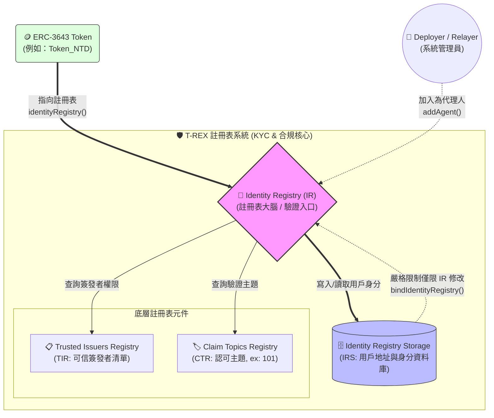
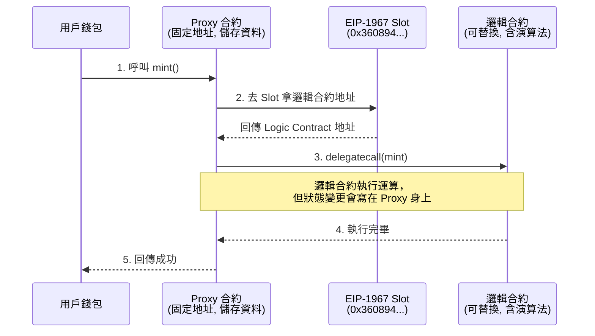

# ERC-3643 實戰指南 (一)：打造企業級 T-REX 註冊表大腦

ERC-3643（又稱 T-REX, Token for Regulated EXchanges）是目前 RWA 領域的黃金標準。與 ERC-20 這種「無權限」的代幣不同，ERC-3643 的核心精神是**「預設拒絕，合規才放行」**。

要實現這個機制，我們不能把邏輯全部塞進代幣合約裡。我們需要建立一個**「註冊表大腦」(Registry Ecosystem)** 來處理身份驗證 (KYC/AML) 與信任鏈。

---

## 🧠 核心架構：什麼是「註冊表大腦」？

在 T-REX 架構中，代幣合約 (Token Contract) 本身非常輕量，它在執行 `transfer` 之前，會去詢問「大腦」：這筆交易合法嗎？雙方都有 KYC 嗎？

這個「大腦」由三個核心註冊表合約組成，它們高度依賴去中心化身份標準 (ONCHAINID)：

* **ClaimTopicsRegistry (聲明主題註冊表)**: 定義我們關心什麼樣的認證。在我們的專案中，我們定義了 `Topic 101` 作為基礎的 KYC 驗證。
* **TrustedIssuersRegistry (受信任發行者註冊表)**: 定義「誰」有資格發布上述的認證。例如：我們指定的後端 Relayer 或法規授權的 KYC 機構的 ONCHAINID。
* **IdentityRegistry (身份註冊表)**: 整個大腦的中樞。它將使用者的錢包地址 (Wallet) 綁定到他們的去中心化身份 (ONCHAINID)，並驗證他們是否擁有由「受信任發行者」發布的「正確主題聲明」。

### 📊 T-REX 註冊表核心架構圖



---

## 🛠️ 實戰步驟：部署與組裝大腦

在企業級開發中，我們採用 **代理模式 (Proxy Pattern，如 EIP-1967)** 來部署這些註冊表，以保留未來的升級空間。以下是標準的組裝順序：

**步驟 1：部署 Claim Topics Registry (CTR)**
首先，我們需要定義合規需要哪些「標籤」。
* **實作重點**: 部署後，將所需的 Claim Topics 寫入合約。
* **情境**: `addClaimTopic(101)`，告訴大腦我們只認可主題為 101 的 KYC 聲明。

**步驟 2：部署 Trusted Issuers Registry (TIR)**
接著，設定誰可以發放這些標籤。
* **實作重點**: 需要將系統管理員或 KYC 機構加入白名單。
* **情境**: `addTrustedIssuer(relayerAddress, [101])`。這代表授權該後端 Relayer 專門發放主題為 101 的聲明。

**步驟 3：部署 Identity Registry Storage (IRS)**
這是一個企業級的 Best Practice。為了避免未來 `IdentityRegistry` 升級時遺失使用者的白名單資料，我們將「儲存層」獨立出來。
* **實作重點**: 這個合約只負責存儲 `Wallet -> ONCHAINID` 與 `國籍代碼 (Country Code)` 的映射。必須呼叫 `bindIdentityRegistry(IR_Address)`，將寫入權限死鎖在唯一的大腦上，防止越權篡改。

**步驟 4：部署 Identity Registry (IR) - 大腦中樞**
最後，把前面三個元件組合起來。
* **實作重點**: 在初始化時，將 CTR, TIR, IRS 的地址注入到 IR 中，並透過 `addAgent(deployer)` 賦予後端系統操作權限。

**架構虛擬碼:**
```solidity
interface IIdentityRegistry {
    function registerIdentity(address userAddress, address identity, uint16 country) external;
    function isVerified(address userAddress) external view returns (bool);
}
```
當呼叫 `isVerified(userAddress)` 時，IR 會：
1. 透過 IRS 找到 `userAddress` 對應的 ONCHAINID。
2. 去使用者的 ONCHAINID 合約檢查是否擁有 CTR 規定的 `Topic 101`。
3. 檢查該 Topic 的簽發者，是否在 TIR 的名單內。
4. 全部通過，回傳 `true`。

---

## 🔍 深入解析：什麼是 EIP-1967 代理合約標準？

在前述的部署中，我們提到了「代理模式」。在區塊鏈開發中，理解 **EIP-1967** 是掌握可升級智能合約 (Upgradeable Smart Contracts) 的關鍵。ERC-3643 的官方實作大量使用了此模式。

**1. 為什麼我們需要 Proxy (代理)？**
在以太坊上，智能合約一旦部署就無法修改。如果 `IdentityRegistry` 程式碼有 Bug 或法規改變，傳統做法只能「部署一個新合約」並要求使用者遷移，這在金融系統中是不可接受的。因此，代理模式將合約拆分為二：
* **Proxy Contract (代理合約)**：負責儲存資料，對外提供固定不變的地址。
* **Implementation Contract (邏輯合約)**：純粹包含程式碼邏輯。
升級時，我們只需告訴 Proxy：「請把指標改指向新的邏輯合約」。

**2. EIP-1967 的儲存槽黑洞**
代理模式最致命的問題是「儲存槽衝突 (Storage Collision)」。如果 Proxy 與邏輯合約都在同一個位置（如 Slot 0）宣告變數，執行時資料就會互相覆寫導致崩潰。
EIP-1967 解決了這個問題：**它將邏輯合約的地址，藏在一個極為冷門的儲存槽中。**

這個 Slot 就是我們在 `verify_trex.ts` 腳本中看到的 16 進位字串：
`0x360894a13ba1a3210667c828492db98dca3e2076cc3735a920a3ca505d382bbc`

在系統健康檢查中，我們不透過 ABI 呼叫，而是直接使用 Viem 讀取 EVM 底層儲存槽：
```typescript
const IMPLEMENTATION_SLOT = '0x360894a13ba1a3210667c828492db98dca3e2076cc3735a920a3ca505d382bbc';

// 檢查 Token 是否有正確掛載邏輯合約
const tokenImplSlot = await client.getStorageAt({
  address: ADDR_TOKEN,
  slot: IMPLEMENTATION_SLOT,
});
```
如果讀出來的值不是 `0x00000...`，就代表代理合約成功指向了實體邏輯。

### 💡EIP-1967 架構圖




---

## 🛡️ 高階工程師的企業級考量 (Best Practices)

在打造這個大腦時，我們需要考量的不只是把智能合約放上鏈：

1. **拒絕靜態白名單，走向「憑證驅動 (Claim-Driven)」**:
   初階實作往往只依賴 `registerIdentity` 綁定身份。但企業級作法必須利用 `addClaim` 寫入具備「過期時間」的憑證。這樣當 KYC 效期（如一年）屆滿時，智能合約能自動判定身份失效，達成零信任合規。
2. **全端整合與 Identity Discovery (解決 Gas 浪費)**:
   大腦的運作依賴鏈下來源。我們的後端系統整合了傳統的 Web2 KYC 審查，並在 API 實作了 **Identity Discovery** 機制：在為用戶部署 ONCHAINID 之前，先查詢資料庫。若用戶已有身份，則直接複用，避免身份碎片化與極為昂貴的重複部署 Gas 浪費。
3. **Gas 費代付與無感體驗 (Meta-Transactions)**:
   企業級應用不能期待使用者自己準備 ETH 付 Gas 費去更新身份。系統應如我們的 `deploy_identity` 與 `add_claim` API 實作，由企業方的 Relayer 錢包代付 Gas 費，或結合 ERC-4337 (Account Abstraction)，實現無縫的 Web2.5 體驗。
4. **系統健康檢查 (Health Checks)**:
   大腦部署後，必須實作如 `verify_trex.ts` 的檢驗腳本，直接讀取 EVM 底層的 EIP-1967 Slot，確保所有 Proxy 合約都正確掛載了實作邏輯，防止上鏈後的靜默錯誤。

---

## 🎯 總結

這套「註冊表大腦」是 ERC-3643 能夠符合真實世界金融法規的基石。它將「代幣邏輯」與「身份/合規邏輯」完美解耦。一旦這個大腦建置完成，未來我們要發行第二檔、第三檔 RWA 代幣（甚至是資產與負債雙代幣）時，都可以直接複用這個大腦，大幅降低合規成本。
