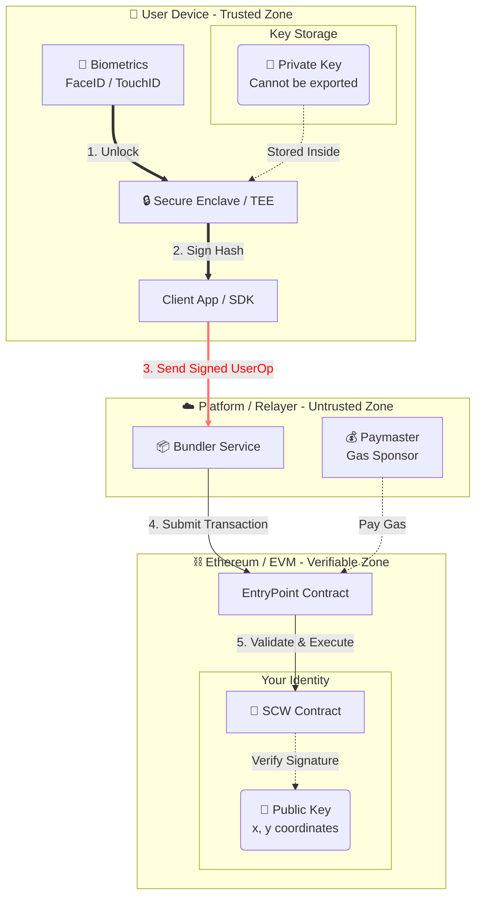

# 第二章：技術架構與信任模型 (Technical Architecture & Trust Model)

## 2.1 概述 (Overview)

本協議旨在建立一個「去中心化且自我主權 (Decentralized & Self-Sovereign)」的數位身分系統。與傳統中心化平台不同，本架構從設計之初就將「資金控制權 (Control of Funds)」與「平台營運權 (Platform Operation)」在物理與邏輯層面上徹底分離。

我們的信任模型建立在兩個核心支柱上：

1.  **身分即合約 (Identity as a Contract)**：用戶身分實體為區塊鏈上的智能合約，而非資料庫條目。
2.  **硬體級非託管 (Hardware-Based Non-Custodial)**：私鑰生成與保存完全依賴用戶終端設備的安全晶片 (Secure Enclave)，平台方在任何情況下均無法觸碰私鑰。

-----

## 2.2 用戶身分容器：智能合約錢包 (Smart Contract Wallet)

### 2.2.1 獨立合約實體 (Independent Contract Entity)

在本架構中，每位用戶的數位身分都對應一個獨立部署在以太坊區塊鏈上的 **智能合約錢包 (SCW)**。此合約遵循 ERC-4337 帳戶抽象標準，具備獨立的邏輯執行能力。

  * **主權自主 (Self-Sovereign)**：合約設有嚴格的 `onlySelf` 權限控制，這意味著**即便是平台的營運方或合約的部署者 (Factory)，也無權更改合約狀態或移動資金**。合約僅服從於用戶持有私鑰所簽署的指令。
  * **合規觀點**：這意味著資產不存在於平台的「大帳戶 (Omnibus Account)」中，而是分散在用戶各自持有的獨立鏈上保險箱內。
  * **技術實作**：我們的 SCW 實作了標準的 `IAccount` 介面，這確保了身分具備可編程性 (Programmability) 與互操作性。

> **代碼證據 2.2.1：**
> 參見 `contracts/scw.sol`，合約繼承自 IAccount，明確定義了這是一個獨立的帳戶實體，而非單純的記帳代幣。
>
> ```solidity
> contract SCW is IAccount {
>     EntryPoint public immutable entryPoint;
>     // ...
>     modifier onlySelf() {
>        require(msg.sender == address(this), "SCW: must call via UserOp");
>        _;
>     }
>     // ...
> }
> ```


### 2.2.2 確定性地址生成 (Deterministic Address Generation)

為了提供無縫的用戶體驗 (Onboarding)，我們採用了 `CREATE2` 操作碼來實現「反事實部署 (Counterfactual Deployment)」。這允許用戶在尚未支付 Gas 或正式上鏈之前，就擁有一個確定的、可接收資產的錢包地址。

  * **技術亮點**：地址的生成僅依賴於用戶的公鑰 (Public Key) 與隨機鹽值 (Salt)，完全公開透明，不依賴平台後端的黑箱分配。

> **代碼證據 2.2.2：**
> 參見 `contracts/scw_factory.sol` 的 `getAddress` 函式。地址計算公式為 `keccak256(0xff + sender + salt + bytecodeHash)`，保證了地址生成的數學確定性與不可篡改性。
>
> ```solidity
> function getAddress(uint256 pubKeyX, uint256 pubKeyY, uint256 salt) public view returns (address) {
>     // ...
>     bytes32 hash = keccak256(
>         abi.encodePacked(
>             bytes1(0xff),
>             address(this),
>             salt,
>             bytecodeHash
>         )
>     );
>     return address(uint160(uint256(hash)));
> }
> ```

-----

## 2.3 密鑰管理機制：零知識與硬體隔離 (Zero-Knowledge Key Management)

### 2.3.1 私鑰不出手機 (Keys Never Leave the Device)

這是本協議通過「非託管 (Non-Custodial)」審查的核心。我們利用 FIDO2 (WebAuthn) 標準，直接調用 iOS/Android 設備內建的 **可信執行環境 (TEE / Secure Enclave)** 生成密鑰對。

  * **私鑰 (Private Key)**：生成後被永久鎖定在硬體晶片中，僅能通過生物辨識 (FaceID/TouchID) 授權簽名操作，無法被匯出或讀取。
  * **公鑰 (Public Key)**：僅有公鑰會被傳輸並註冊到鏈上合約中。

### 2.3.2 平台方的「零知識」證明 (Zero-Knowledge Proof of Platform)

平台後端在註冊過程中，僅接收並解析標準的 WebAuthn Attestation Object，從中提取 `x, y` 座標作為公鑰。代碼邏輯證明了我們從未、也無法接收用戶的私鑰。

> **代碼證據 2.3.2：**
> 參見 `src/lib/fido2-parse.ts`。我們的解析邏輯明確顯示，系統僅從 `authData` 中提取公開的座標點，完全沒有涉及私鑰的傳輸路徑。
>
> ```typescript
> export function parsePublicKeyCoordinates(attestationObjectBase64: string): ICoordinates | null {
>     // ...
>     // 僅提取 x, y 公鑰座標
>     const xRaw = cosePublicKey[-2] as ArrayBuffer | Uint8Array;
>     const yRaw = cosePublicKey[-3] as ArrayBuffer | Uint8Array;
>     // ...
> }
> ```

### 2.3.3 鏈上授權註冊表 (On-Chain Authorization Registry)

用戶的公鑰最終被儲存在 SCW 合約的 `signers` 映射表中。這份註冊表是公開可查的，任何人都可以在區塊鏈上驗證「誰有權控制這個帳戶」。

  * **靈活的驗證邏輯**：不同於傳統錢包綁死在單一加密曲線 (Secp256k1)，我們的 SCW 架構支援多種驗證邏輯。目前的實作採用 NIST P-256 以相容主流硬體，但架構上保留了未來升級至抗量子演算法或其他加密標準的能力，無需遷移用戶資產。

> **代碼證據 2.3.3：**
> 參見 `contracts/scw.sol`。我們使用 `mapping` 儲存授權公鑰的雜湊值，這構成了鏈上的存取控制列表 (ACL)。
>
> ```solidity
> mapping(bytes32 => bool) public signers;
>
> function \_addSigner(uint256 x, uint256 y) internal {
> bytes32 hash = keccak256(abi.encode(x, y));
> if (\!signers[hash]) {
> signers[hash] = true;
> // ...
> }
> }
> ```

-----

## 2.4 信任邊界圖 (Trust Boundary Diagram)

為了釐清責任歸屬，我們定義了以下的信任邊界：

1.  **用戶端 (User Side - Trusted Boundary)**

      * **持有物**：生物特徵、硬體裝置、私鑰 (Private Key)。
      * **操作**：簽署交易 (Signing)、授權 (Authorization)。
      * **安全性**：由設備硬體商 (Apple/Google) 的 TEE 保障。

    *(紅線：Trust Gap / Air Gap)*
    *在此邊界上，僅有「已簽名的交易數據 (Signed UserOp)」與「公鑰 (Public Key)」可以跨越。私鑰永遠無法跨越此線。*

2.  **平台端 (Relayer Side - Untrusted Boundary)**

      * **持有物**：無 (Stateless)。
      * **角色**：傳遞者 (Bundler)。僅負責將用戶簽好的 UserOp 發送到區塊鏈，並墊付 Gas。
      * **權限**：無權修改交易內容，無權動用資金。

3.  **區塊鏈端 (Blockchain Side - Verifiable Boundary)**

      * **持有物**：SCW 智能合約、資產餘額、授權公鑰列表。
      * **操作**：驗證簽名 (Verification)、執行交易 (Execution)。
      * **安全性**：由以太坊共識機制與數學演算法保障 (Code is Law)。


架構與信任邊界圖 (Architecture & Trust Boundary Diagram)


## 2.5 小結 (Summary)

本章節展示了我們的架構如何從根本上消除了「中心化託管風險」。
通過將身分實體化為 **智能合約 (`contracts/scw.sol`)**，並將密鑰管理權限完全交還給 **用戶硬體 (`src/lib/fido2-parse.ts`)**，我們建立了一個既符合「非託管」監理要求，又具備高度安全性的信任模型。
