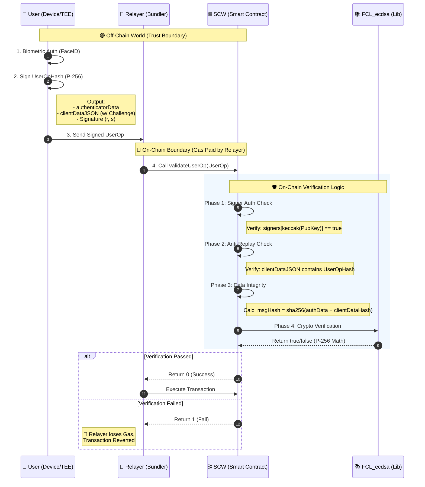

# 第三章：交易驗證與安全性證明 (Verification & Security Proof)

## 3.1 概述 (Overview)

在傳統的中心化金融系統中，交易的合法性依賴於銀行伺服器的私有邏輯驗證；而在本協議中，驗證權力被移交給了公開透明的以太坊虛擬機 (EVM)。

本章節將詳細闡述智能合約如何「看懂」並驗證來自用戶手機硬體晶片 (Secure Enclave) 的 FIDO2 簽名。我們透過在鏈上直接實作 **NIST P-256 (secp256r1)** 橢圓曲線演算法，確保了每一筆交易都具備數學上的不可否認性 (Non-Repudiation)，且完全不依賴平台方的介入。

-----

## 3.2 鏈上原生的 WebAuthn 驗證機制 (On-Chain Native WebAuthn Verification)

### 3.2.1 挑戰：曲線不兼容問題 (The Curve Mismatch Problem)

以太坊原生支援的加密曲線是 **secp256k1**，但全球數十億台智慧型手機（iPhone/Android）的 FIDO2 標準使用的是 **secp256r1 (P-256)**。這意味著 EVM 無法直接使用內建指令 (`ecrecover`) 來驗證 Passkey 簽名。

### 3.2.2 解決方案：純 Solidity 密碼學實作 (Pure Solidity Implementation)

為了維持「非託管」的承諾，我們拒絕使用中心化伺服器進行「簽名轉換」的折衷方案。相反，我們引入了高度優化的 Solidity 密碼學函式庫 (`FCL_Elliptic` 與 `FCL_ecdsa`)，在合約層直接執行 P-256 的數學運算。

> **代碼證據 3.2.2：**
> 參見 `contracts/lib/fcl_ecdsa.sol`。這段程式碼證明了驗證邏輯是完全運行在鏈上的數學公式，無任何外部依賴或黑箱。
>
> ```solidity
> //
> library FCL_ecdsa {
>      // ...
>      function ecdsa_verify(bytes32 message, uint256 r, uint256 s, uint256 Qx, uint256 Qy) internal view returns (bool) {
>          if (r == 0 || r >= n || s == 0 || s >= n) {
>              return false;
>          }
>          // 執行 P-256 橢圓曲線點乘運算與驗證
>          // ...
>      }
> }
> ```

-----

### 3.2.3 技術優勢：Gas 成本優化 (Gas Efficiency)

在傳統觀念中，於 EVM 執行非原生曲線 (Non-native Curve) 運算的成本極高。然而，本協議採用的 `FCL_ecdsa` 函式庫經過了極致的組合語言級優化（Assembly-level Optimization）。
這使得一筆包含 P-256 簽名驗證的交易成本，能夠控制在商業可行的範圍內。這不僅突破了以太坊的技術限制，更為大規模採用 (Mass Adoption) 掃除了成本障礙。

## 3.3 交易驗證流程詳解 (Anatomy of Verification)

當用戶發起一筆交易（例如：轉帳）時，SCW 合約的 `validateUserOp` 函式是唯一的守門員。以下是該函式內部的四階段安全檢查：

### 3.3 節的資料流向圖 (Mermaid Source Code)

這張圖精確對應了白皮書第三章描述的四個驗證階段。



### 圖表解讀

1.  **Trust Boundary (信任邊界)**：圖中清楚標示了紅線。私鑰運算完全發生在 `User (Device/TEE)` 內部。
2.  **Relayer 的角色**：可以看到 Relayer 只是傳遞者 (Step 3 -\> Step 4)，並在驗證失敗時承擔後果 (Step 4 的 `else` 分支)。
3.  **四階段驗證**：在 `SCW` 的淺藍色區塊中，對應了白皮書 3.3 節詳述的 Phase 1 到 Phase 4 邏輯。


### 階段一：簽名者授權檢查 (Signer Authorization)

合約首先從簽名資料中提取公鑰 (`pubKeyX`, `pubKeyY`)，並檢查該公鑰是否已在鏈上的白名單 (`signers` mapping) 中註冊。這確保了只有用戶綁定過的設備才能發起指令。

> **代碼證據 3.3.1：**
> 參見 `contracts/scw.sol`。
>
> ```solidity
> //
> function _verifyWebAuthnSignature(...) internal view returns (bool) {
>      WebAuthnSignature memory sig = abi.decode(signature, (WebAuthnSignature));
>      bytes32 pubKeyHash = keccak256(abi.encode(sig.pubKeyX, sig.pubKeyY));
>      // 檢查公鑰是否在白名單內
>      if (!signers[pubKeyHash]) {
>          return false; // 拒絕未授權的裝置
>      }
>      // ...
> }
> ```

### 階段二：抗重放攻擊驗證 (Anti-Replay Protection)

為了防止惡意攻擊者攔截舊的交易封包並重複發送，合約強制檢查簽名中的 Challenge 值。
在我們的實作中，`clientDataJSON` 必須包含當次交易的唯一雜湊 (`UserOpHash`)。這意味著即使簽名被洩露，也無法用於任何其他交易或重複執行同一筆交易。

> **代碼證據 3.3.2：**
> 參見 `contracts/scw.sol`。
>
> ```solidity
> //
> // 將 UserOpHash 轉為 Base64Url 格式，並比對 clientDataJSON 中的內容
> string memory challengeBase64 = Base64Url.encode(abi.encodePacked(userOpHash));
> bytes memory challengeBytes = bytes(challengeBase64);
> ```

> ```solidity
> // 逐字元檢查，確保簽名是針對「這筆」特定交易生成的
> for (uint i = 0; i \< challengeBytes.length; i++) {
> if (sig.clientDataJSON[sig.challengeLocation + i] \!= challengeBytes[i]) {
> return false;
> }
> }
>
> ```

### 階段三：資料完整性驗證 (Data Integrity)

合約依循 W3C WebAuthn 標準，重建簽名原文 (Signed Message)。
`messageHash = sha256(authenticatorData || sha256(clientDataJSON))`
這確保了簽名範圍涵蓋了瀏覽器環境參數 (`authenticatorData`) 與交易內容 (`clientDataJSON`)，任何對內容的微小篡改都會導致雜湊值劇烈變化。

> **代碼證據 3.3.3：**
> 參見 `contracts/scw.sol`。
>
> ```solidity
> //
> bytes32 clientDataHash = sha256(sig.clientDataJSON);
> bytes32 messageHash = sha256(abi.encodePacked(sig.authenticatorData, clientDataHash));
> ```

### 階段四：橢圓曲線數學驗證 (Cryptographic Verification)

最後，合約調用 `FCL_ecdsa.ecdsa_verify`，傳入上述計算出的 `messageHash` 以及簽名中的 `r, s` 值。如果數學驗證通過，則證明該交易確實由持有私鑰的用戶裝置所簽署。

> **代碼證據 3.3.4：**
> 參見 `contracts/scw.sol`。
>
> ```solidity
> //
> return FCL_ecdsa.ecdsa_verify(messageHash, sig.r, sig.s, sig.pubKeyX, sig.pubKeyY);
> ```

-----

## 3.4 執行層隔離與 Relayer 的角色 (Relayer Isolation & Censorship Resistance)

在我們的架構中，平台方扮演 **Relayer (或稱 Bundler)** 的角色。釐清 Relayer 的權力邊界對於合規至關重要。

### 3.4.1 無法偽造 (Unforgeable)

由於 Relayer 不擁有用戶的私鑰，因此無法生成通過 `FCL_ecdsa.ecdsa_verify` 檢查的簽名。任何試圖偽造簽名的 `UserOperation` 都會在 `validateUserOp` 階段被拒絕。

### 3.4.2 無法篡改 (Untamperable)

如果 Relayer 試圖修改用戶原本簽署的交易內容（例如：將收款人改為自己），`UserOpHash` 將會改變。這會導致 **階段二 (抗重放)** 的檢查失敗（簽名中的 Challenge 與新的 Hash 不符），交易將被合約拒絕執行。

### 3.4.3 經濟懲罰機制 (Economic Security)

在 ERC-4337 標準下，Relayer 負責將交易提交上鏈並預付 Gas。如果 Relayer 提交了無效的交易（簽名驗證失敗），該交易雖會上鏈但執行會失敗 (Revert)，且 Relayer 支付的 Gas 費用將無法獲得用戶退款。這種經濟誘因迫使平台方必須誠實運作，僅傳遞驗證通過的交易。

> **代碼證據 3.4.3：**
> 參見 `contracts/scw.sol` 的 `validateUserOp` 返回值。
>
> ```solidity
> //
> if (!_verifyWebAuthnSignature(userOp.signature, userOpHash)) {
>      return 1; // 返回 1 代表驗證失敗，Bundler 將損失 Gas
> }
> return 0; // 返回 0 代表成功
> ```

-----

#### 3.4.4 權限升級防禦 (Defense against Privilege Escalation)

除了防止交易被篡改，本協議還從根本上杜絕了 Relayer 試圖「劫持帳戶」的可能性。
SCW 合約中的所有管理功能（如 `addSigner`, `removeSigner`）均受到 `onlySelf` 修飾符的保護。這意味著這些函式**只能由合約自身**在執行驗證通過的 `UserOperation` 時呼叫，任何外部地址（包括 Relayer 或合約部署者）直接發起的呼叫都會被立即回滾 (Revert)。

> **代碼證據 3.4.4：**
> 參見 `contracts/scw.sol`。`onlySelf` 確保了只有持有合法私鑰的用戶才能授權新增設備。
>
> ```solidity
> //
> modifier onlySelf() {
>     require(msg.sender == address(this), "SCW: must call via UserOp");
>     _;
> }
> ```

> ```solidity
> function addSigner(uint256 x, uint256 y) public onlySelf {
> \_addSigner(x, y);
> }
> ```

-----

## 3.5 小結 (Summary)

本章透過詳盡的代碼分析證明了：

1.  **驗證去中心化**：交易驗證邏輯完全封裝在智能合約 (`contracts/scw.sol`) 與鏈上數學庫 (`contracts/lib/fcl_ecdsa.sol`) 中。
2.  **安全性可證明**：每一筆交易都經過 NIST P-256 橢圓曲線的嚴格數學檢驗。
3.  **權限強隔離**：平台方 (Relayer) 僅能擔任搬運工，受制於密碼學與經濟學的雙重約束，無法對用戶資產進行任何未經授權的操作。

這套機制構成了本協議「無需信任 (Trustless)」的安全基石。
