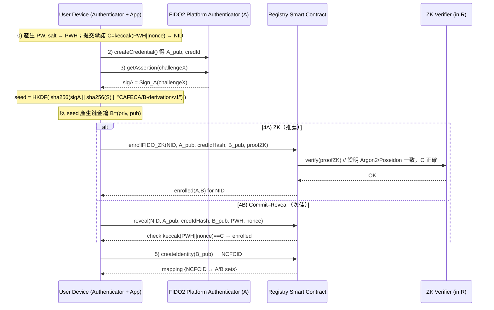
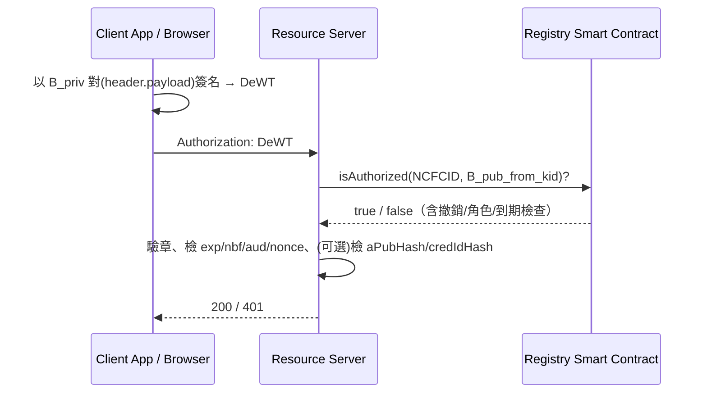
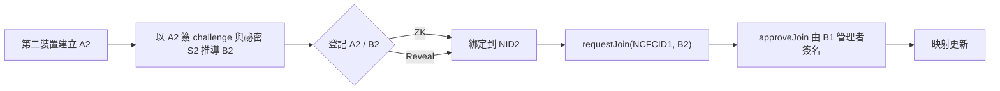

# DeWT：流程圖與安全性說明

> 內容分成四張圖：①註冊與裝置綁定、②A→B 推導與鏈上登記、③DeWT 簽發與驗證、④第二裝置加入與授權；最後用威脅模型表說明「為什麼安全」。

---

## 1) 全流程鳥瞰（對應你列的 0–11 步）

---

## 2) A→B 推導與鏈上登記（細節版）

---

## 3) DeWT 簽發與驗證（像 JWT 但回鏈核驗）

---

## 4) 第二裝置加入與授權

---

## 為什麼這樣設計是安全的（威脅模型 → 對策）

| 威脅/攻擊面            | 可能手法                | 設計對策                                                           | 關聯步驟      |
| ----------------- | ------------------- | -------------------------------------------------------------- | --------- |
| 密碼上鏈外洩            | 明文或弱雜湊上鏈被永久蒐集       | **ZK** 證明承諾正確，不揭露 PW/PWH；退一步才用 commit–reveal 並限時               | 0–4       |
| 前置/搶跑 (front-run) | 攻擊者提前送出同資料          | 承諾先行 + **deadline** + 綁定 sender/nonce；ZK 最佳                    | 1,4       |
| 重放攻擊              | 重用舊 challenge/nonce | FIDO2 assertion 綁 **challengeX**、token 帶 **nonce/exp/nbf/aud** | 3, DeWT   |
| 裝置複製              | 匯出私鑰/複製金鑰           | FIDO2 **platform key + credProtect**；鏈上記 `credIdHash` 防重登      | 2,4       |
| 私鑰 B 洩漏           | B 被盜用簽交易            | **A與S不外流**；可即時 **revoke/rotate B**，DeWT 需回鏈驗證                  | 3,5, DeWT |
| 釣魚來源混淆            | 在惡意網域引導簽章           | FIDO2 斷言可綁定 RP ID / origin（平台金鑰）                               | 2,3       |
| 權限橫向提升            | 新裝置未審核即具權限          | 必須 `requestJoin` + **管理者 B** `approveJoin`                     | 11        |
| 隱私洩露              | 公鑰/憑證 ID 追蹤         | 鏈上存 **哈希**（aPubHash/credIdHash），attestation 放 IPFS 僅存 CID      | 4–5       |
| 依賴單點              | Token 自己說了算         | DeWT **回鏈核驗授權/撤銷**，而非僅本地驗章                                     | DeWT      |

---

## 設計關鍵點（簡短白話）

* **A（FIDO2）只用來推導，不上鏈簽**：A 綁裝置唯一、抗釣魚；鏈上與 API 交互用 **B**，一旦 B 洩漏可撤銷/輪替，A 與 S 不受影響。
* **ZK 取代密碼上鏈**：註冊與裝置綁定靠承諾 + ZK，密碼與其雜湊不落地。
* **DeWT ≠ 單機 JWT**：它攜帶資訊，但驗證**必須回鏈**查 NCFCID 當下的授權與撤銷，天然支援 key rotation。
* **多裝置透過申請/審批**：第二裝置（A2/B2）加入需管理者 B 同意，權限邊界清楚。
* **重放/搶跑控制**：所有簽名都綁 challenge/nonce/exp/aud；commit–reveal 時限與 sender 綁定。

---

## 一句話版本

**不要把不能改的祕密放鏈上；把可以隨時撤銷/輪替的金鑰放鏈上；驗證時回鏈查「現在的真相」。**

---

### 目標 → 威脅 → 對策（設計脈絡地圖）

**目標（業務/產品需求）**

1. **裝置唯一**且**無密碼體驗**（用 FIDO2）
2. **多裝置共用同一身分**、可授權/撤銷
3. **憑證可攜帶**（像 JWT 一樣好用）但**不可被盜用或離線永久有效**
4. **不能把密碼或雜湊上鏈**（區塊鏈不可更改、可被永遠蒐集）

**威脅（風險場景）**

* 前置/搶跑、重放（replay）、裝置被複製、鏈上不可逆洩露、私鑰被盜、橫向權限升級

**對策（對應設計）**

* **A（FIDO2 平台金鑰）**：綁裝置唯一、抗釣魚
* **S（裝置祕密）** + **A 的簽章** → **推導 B（鏈金鑰）**：B 用於對鏈/服務簽名，**A 不上鏈、不外簽**
* **ZK/Commit 承諾**：用零知識或承諾–揭露完成初次註冊，**不暴露密碼/雜湊**
* **Registry 合約**：維護 **NCFCID ↔ B key set** 與 A 的對應，可**撤銷/輪替**
* **DeWT**：像 JWT 的可攜令牌，但**驗證時回鏈查當下授權**（避免離線永久通行）

---

### 為什麼要 **A → B 推導**（而不是直接拿 FIDO2 簽鏈）？

* **FIDO2 A** 是「網站/裝置世界」的金鑰：帶 RP ID、起源限制、硬體策略；
  直接用來簽鏈有**相容性與隱私風險**（演算法/格式、可追蹤性）。
* **推導出 B**：

  * 讓鏈上簽章用鏈友善金鑰（如 secp256k1），**可撤銷/輪替**。
  * **A 與 S 永不外流**，B 洩漏時只要撤銷 B 即可，**根基（A+S）還在**。
  * 裝置層的防釣魚、credProtect、platform 限制仍由 **A** 提供。

> 心智模型：**A 是硬體底座**（不可見、不可外簽）；**B 是可替換的工作證**（真的去對鏈與 API 簽名）。

---

### 為什麼要 **上鏈的 Registry + NCFCID**？

* 你需要一個**跨應用、可共識**的「**現在有效的金鑰集合**」。
* 有了 **NCFCID → {B 公鑰集合}**，你可以：

  * 加新裝置（B2）→ **審批加入**
  * 撤銷失竊 B、**輪替**金鑰
  * 服務端在驗證 DeWT 時**回鏈查真相**（而不是盲信舊 token）

---

### 為什麼要 **ZK / 承諾–揭露** 來處理密碼？

* 區塊鏈**不可刪**，一旦把密碼或 PWH 上鏈就**永遠暴露**。
* 用 **ZK**：證明「我知道 PW 對應到這個承諾」，**但我不揭露 PW/PWH**。
* 若先做 MVP：用 **commit–reveal + deadline**（有時效的揭露承諾值），之後再升級 ZK。

---

### 為什麼要 **DeWT（像 JWT）但要回鏈查**？

* 純 JWT：**一旦發出，在有效期內離線可用**，撤銷困難。
* **DeWT**：攜帶者用 **B** 簽，但驗證時**必須回鏈**確認該 B 目前仍被 **NCFCID 授權**、未撤銷、權限正確。
* 好處：**可攜性 + 即時撤銷 + 多裝置可控**。

---

### 把 0–11 步驟，翻成「做這樣是為了什麼」

* **0–1 承諾註冊**：先把「我之後會揭露/證明的東西」**做成承諾**，防前置與永久暴露。
* **2 建 A**：把身分綁在**實體裝置**上（platform FIDO2）。
* **3 推導 B**：用 A 的簽章 + 祕密 S → **產生鏈世界的工作證**。
* **4 登記 A/B**：鏈上記錄「這個裝置（A）可以派生出這把 B」，用 **ZK** 避免洩露 PW/PWH。
* **5 造 NCFCID**：建立「**這個人**」的鏈上身分根（**現在有效金鑰名簿**）。
* **6–10 第二裝置**：同樣 A2→B2，**但要走合約登記**，避免偽造。
* **11 申請/審批**：**由管理者 B1 批准** B2 加入，形成多裝置但**可控**的身分。

---

### 和熟悉的東西對照

| 問題       | 傳統做法           | DeWT 做法                |
| -------- | -------------- | ---------------------- |
| 裝置唯一、無密碼 | WebAuthn/FIDO2 | **保留**（A）但不上鏈簽         |
| 多裝置同身分   | 各站各管、難協調       | **NCFCID** 上鏈統一管理      |
| 憑證撤銷     | JWT 不好撤銷       | **回鏈查**授權/撤銷           |
| 密碼處理     | 伺服器存雜湊         | **ZK/承諾**，不上鏈暴露        |
| 鏈上簽名     | 直接拿同一把鑰        | **A→B 推導**，B 可輪替、A 不曝光 |

---

### 如果只做最小可行（MVP）怎麼切？

1. **Commit–Reveal** 版本合約（有 deadline + sender 綁定）
2. **A→B 推導**（HKDF）
3. **Registry** 只做：註冊承諾、登記/查詢 A/B、建立 NCFCID、加入/審批、撤銷
4. **DeWT** 驗證器：驗章 + 回鏈 `isAuthorized`

> 之後再把 **ZK** 換上來、補角色/權限、做金鑰輪替 UX。

---

### 最短心智模型

1. **A 是底座**（裝置 FIDO2），**不對外**；**B 是工作證**（對鏈/服務簽名），**可撤可換**。
2. **密碼不上鏈**：用 **ZK/承諾**說「我知道它」。
3. **DeWT** 就像可攜票，但**檢票要回鏈**看你票現在還有效。

