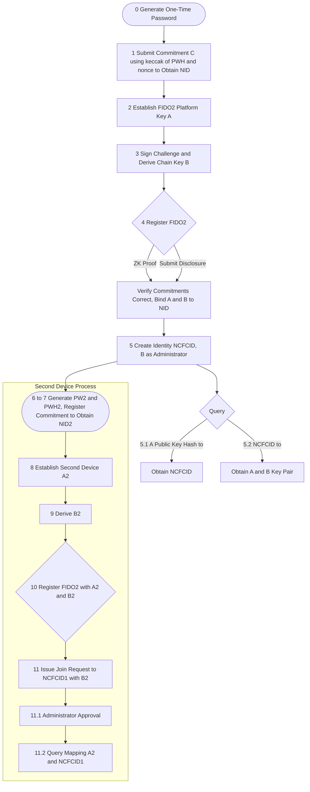
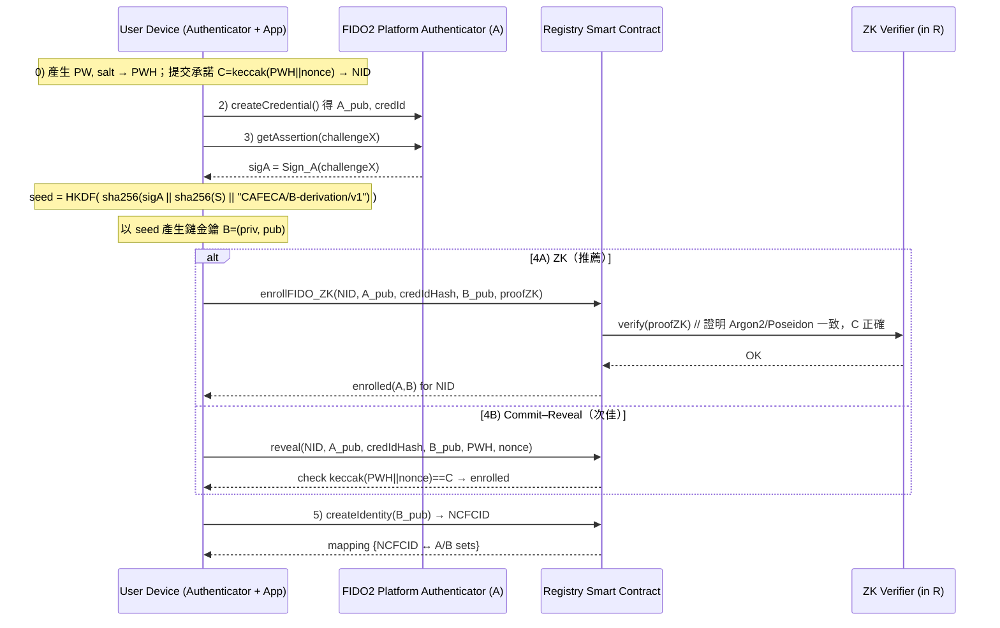
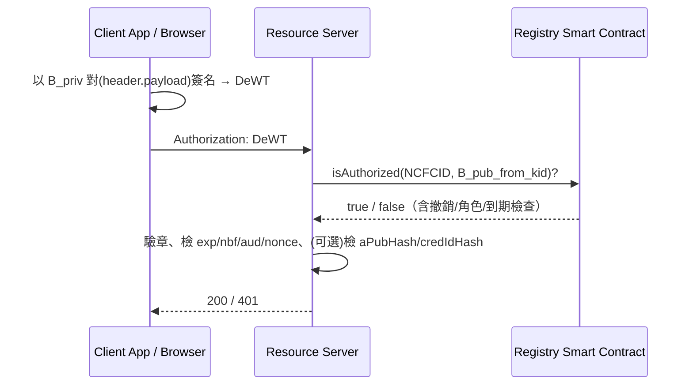
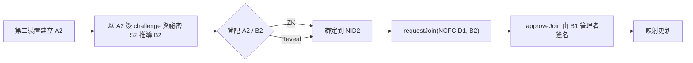

# CAFECA DeWT：流程圖與安全性說明

> 下面用 **Mermaid** 畫出完整流程（可直接貼到 GitHub/Notion/Obsidian/mermaid.live 渲染）。
> 內容分成四張圖：①註冊與裝置綁定、②A→B 推導與鏈上登記、③DeWT 簽發與驗證、④第二裝置加入與授權；最後用威脅模型表說明「為什麼安全」。

---

## 1) 全流程鳥瞰（對應你列的 0–11 步）

---

## 2) A→B 推導與鏈上登記（細節版）

---

## 3) DeWT 簽發與驗證（像 JWT 但回鏈核驗）

---

## 4) 第二裝置加入與授權

---

## 為什麼這樣設計是安全的（威脅模型 → 對策）

| 威脅/攻擊面            | 可能手法                | 設計對策                                                           | 關聯步驟      |
| ----------------- | ------------------- | -------------------------------------------------------------- | --------- |
| 密碼上鏈外洩            | 明文或弱雜湊上鏈被永久蒐集       | **ZK** 證明承諾正確，不揭露 PW/PWH；退一步才用 commit–reveal 並限時               | 0–4       |
| 前置/搶跑 (front-run) | 攻擊者提前送出同資料          | 承諾先行 + **deadline** + 綁定 sender/nonce；ZK 最佳                    | 1,4       |
| 重放攻擊              | 重用舊 challenge/nonce | FIDO2 assertion 綁 **challengeX**、token 帶 **nonce/exp/nbf/aud** | 3, DeWT   |
| 裝置複製              | 匯出私鑰/複製金鑰           | FIDO2 **platform key + credProtect**；鏈上記 `credIdHash` 防重登      | 2,4       |
| 私鑰 B 洩漏           | B 被盜用簽交易            | **A與S不外流**；可即時 **revoke/rotate B**，DeWT 需回鏈驗證                  | 3,5, DeWT |
| 釣魚來源混淆            | 在惡意網域引導簽章           | FIDO2 斷言可綁定 RP ID / origin（平台金鑰）                               | 2,3       |
| 權限橫向提升            | 新裝置未審核即具權限          | 必須 `requestJoin` + **管理者 B** `approveJoin`                     | 11        |
| 隱私洩露              | 公鑰/憑證 ID 追蹤         | 鏈上存 **哈希**（aPubHash/credIdHash），attestation 放 IPFS 僅存 CID      | 4–5       |
| 依賴單點              | Token 自己說了算         | DeWT **回鏈核驗授權/撤銷**，而非僅本地驗章                                     | DeWT      |

---

## 設計關鍵點（簡短白話）

* **A（FIDO2）只用來推導，不上鏈簽**：A 綁裝置唯一、抗釣魚；鏈上與 API 交互用 **B**，一旦 B 洩漏可撤銷/輪替，A 與 S 不受影響。
* **ZK 取代密碼上鏈**：註冊與裝置綁定靠承諾 + ZK，密碼與其雜湊不落地。
* **DeWT ≠ 單機 JWT**：它攜帶資訊，但驗證**必須回鏈**查 NCFCID 當下的授權與撤銷，天然支援 key rotation。
* **多裝置透過申請/審批**：第二裝置（A2/B2）加入需管理者 B 同意，權限邊界清楚。
* **重放/搶跑控制**：所有簽名都綁 challenge/nonce/exp/aud；commit–reveal 時限與 sender 綁定。

---

需要我把這幾張圖打包成一頁 **README.md**（含上述 Mermaid 區塊與威脅模型表）或再加上 **最小可行的合約 PoC** 範本嗎？
