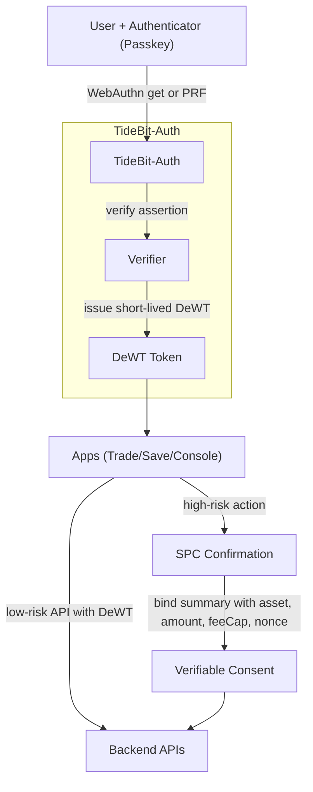

# Cross-Application FIDO2 Enhanced Cryptographic Authentication

**TideBit-DeFi v2 — 白皮書版（面向一般讀者 × 工程讀者）**

> 以「中心化的使用感受」實現「去中心化的信任」。你像用 Apple Pay 一樣按一次確認，就能在 TideBit 旗下多個應用完成安全登入與授權；任何單一方（包含伺服器）都無法代你操作資產。

---

## 摘要（Abstract）

TideBit-DeFi v2 在多應用（Web、行動、後台）提供一致的無密碼登入與高風險操作的再次確認：以 FIDO2／Passkeys 完成人機綁定與抗釣魚，以短時效權杖（DeWT）在系統內傳遞最小權限。對提領、清算、提高限額等高風險操作，採用 Secure Payment Confirmation（SPC）展示可驗證的交易摘要，並將摘要綁入授權證據。進階場景串接 WebAuthn L3 擴充（PRF／hmac-secret、devicePublicKey、largeBlob），為後續一次性簽名提供高熵材料與裝置風控訊號。本篇聚焦「跨應用 FIDO2 強化式認證」；與下一篇《Partial Private-Key Protection》共同形成「登入 → 授權 → 一次性鏈上簽名」的完整鏈路。

---

## 1. 設計目標

* **中心化體驗**：單一帳號、跨產品 SSO、一次確認。
* **去中心化信任**：私鑰不在伺服器；伺服器無法單獨代你操作。
* **分級風險**：登入（低風險）／提領清算（高風險）分流處理。
* **可稽核**：同意證據與會計／稽核事件全程留痕可追溯。
* **相容性**：各瀏覽器／裝置具備合理回退（degrade）策略。

---

## 2. 架構總覽

```
[使用者 + 裝置(指紋/臉)]  -- FIDO2/Passkey -->  [TideBit-Auth]
           │                                        │
           │ (核驗 WebAuthn, 頒發短時效 DeWT)      │
           ▼                                        ▼
   [App A / App B / Console]  -- 攜帶 DeWT 呼叫 API（低風險）
                     └─ 高風險操作 → SPC 視窗 → 二次授權與可驗證證據
```

**TideBit-Auth**：統一身分與授權服務；驗證 FIDO2 回應，簽發短時效權杖（DeWT）。

---

## 3. 核心觀念（一般讀者）

* **免密碼、免助記詞**：以指紋／臉解鎖即可。Passkey 可為**裝置綁定／硬體金鑰**，或以**端到端加密**在平台帳號間同步（multi-device passkey）；**高風險操作預設要求裝置綁定或硬體金鑰**。
* **抗釣魚**：FIDO2 只對正確網域有效，假網站無法調用你的 Passkey。
* **看得到才算數**：高風險操作會彈出「支付／交易確認」視窗；你看到的金額、資產與手續費上限會被綁進授權證據。
* **短時效權杖（DeWT）**：像場內通行證，幾分鐘自動失效；被竊也很快失效。

---

## 4. 核心技術（工程讀者）

### 4.1 RP 網域策略（Cross-App）

* 使用 **主網域作 RP ID**（例：`tidebit.com`），各子域（`trade.tidebit.com`、`save.tidebit.com`、`console.tidebit.com`）共用信任根。
* 嚴格驗 `origin` 與 `rpId`；RP ID 必須是來源的**可註冊後綴（registrable suffix）**，不可為 eTLD（例如不能是 `com`）。

### 4.2 二次授權（Secure Payment Confirmation, SPC）

* 提領、清算、提高限額等**高風險操作**必經 SPC。
* 視窗以一致格式呈現：**資產／金額／最大手續費（feeCap）／目的／nonce／到期**。
* **摘要綁定**：將交易摘要做雜湊並**併入 WebAuthn challenge** 與／或作為 **PRF（hmac-secret）的 salt**，確保後端與鏈上策略能驗證「所見即所簽」。

### 4.3 WebAuthn L3 擴充

* **PRF / hmac-secret**：認證時請求 32-byte 高熵輸出，供後續一次性簽名做密鑰派生材料。
* **devicePublicKey**：偵測首次登入的新裝置、提升風險分數並觸發額外驗證或限制。
* **largeBlob**（選用）：保存少量偏好／提示資料（非安全根基）。
* **回退策略**：若環境不支援 `PRF`／`devicePublicKey`／`largeBlob`，降級為基礎 WebAuthn + SPC，並**提升風險分數**或要求硬體金鑰。

### 4.4 DeWT（短時效權杖）

* **最小 Claims**、**短時效（5–15 分）**、**不得存敏感個資**。
* 建議使用 **RS256/ES256** 簽發並透過 **JWKS** 發佈公鑰（避免對稱金鑰在多服務間擴散）；加入 `jti` 以便撤銷、`kid` 指向當前金鑰。

---

## 5. 協定流程圖（Flow Diagram）



> 若部分環境不支援 `PRF` 或 `devicePublicKey`，流程可退化為僅基礎 WebAuthn + SPC，仍維持安全性（高風險行為可額外要求硬體金鑰）。

---

## 6. 風險矩陣（Risk Matrix）

| 風險事件      | 可能影響 | 發生機率 | 影響程度 | 緩解設計                                            | 殘餘風險 |
| --------- | ---- | ---: | ---: | ----------------------------------------------- | ---- |
| 網站釣魚（偽站）  | 盜取登入 |    低 |    高 | FIDO2 綁 RP/Origin，偽站無法調用 Passkey；HSTS／CSP       | 低    |
| 伺服器入侵     | 權杖外洩 |    中 |    高 | 權杖短時效（5–15 分）、最小權限；RS/ES 簽章＋JWKS；速率限制與審計        | 低    |
| 交易調包      | 資產損失 |    低 |    高 | SPC 將摘要雜湊併入 challenge／PRF salt；後端／鏈上核對摘要與 nonce | 低    |
| 憑證重放      | 非法操作 |    低 |    中 | `challenge`/`nonce` 唯一；DeWT 短時效；回放偵測            | 低    |
| 裝置遺失      | 使用受阻 |    中 |    中 | 備援金鑰／硬體金鑰；人工＋冷卻期恢復；裝置風險名單                       | 低    |
| 新裝置首次登入   | 權限濫用 |    中 |    中 | `devicePublicKey` 風險加權；高風險行為要求再驗證或暫緩            | 低    |
| 帳號同步備份濫用※ | 憑證濫用 |    低 |    高 | 高風險操作預設要求**裝置綁定／硬體金鑰**；風險分級限制                   | 低    |

> ※ 指 multi-device passkey 的雲端端到端加密備份；本設計以風險分級避免濫用。

---

## 7. 操作流程（使用者視角）

1. **首次綁定**：像綁 Apple Pay 一樣建立 Passkey。
2. **跨應用登入**：到任何 TideBit 應用以指紋／臉登入。
3. **高風險操作**：彈出 SPC 視窗；你確認畫面後，系統生成可驗證的同意證據。
4. **遺失裝置**：以備援裝置／硬體金鑰登入；若皆不可用，走「人工＋冷卻期」安全恢復。

---

## 8. 運維與合規

* **最小化紀錄**：不保存生物特徵與裝置私鑰；只存必要的驗證材料與審計雜湊。
* **安全標頭與 Cookie**：HSTS、CSP、X-Frame-Options、`HttpOnly`、`Secure`、`SameSite=Strict`（若跨**不同註冊後綴**的 SSO，評估改 `Lax` 或改用 Bearer）。
* **審計事件**：登入、裝置變更、二次授權、失敗嘗試、速率限制觸發等，記錄時間戳、`jti`、摘要雜湊；重大事件上鏈或存不可竄改儲存。
* **HSTS preload 提醒**：僅正式網域啟用；測試／暫存網域勿加 preload 以免鎖死 HTTP。

---

## 附錄 A — 建議 JWT Claims（DeWT）

**最小集合（範例，使用 `jsonc` 註解）**

```jsonc
{
  "iss": "https://auth.tidebit.com",
  "sub": "<user-id>",
  "aud": ["trade.tidebit.com", "save.tidebit.com", "console.tidebit.com"],
  "exp": 1710000000,
  "iat": 1709996400,
  "jti": "<uuid>",             // 權杖唯一 ID，便於撤銷
  "kid": "<jwks-key-id>",      // 指向簽章金鑰（JWKS）
  "amr": ["swk", "user"],      // 平台認證器；硬體金鑰改用 ["hwk","user"]
  "webauthn": {
    "rpid": "tidebit.com",
    "uv": true,
    "devicePubKey": true
  },
  "nonce": "<per-login-uuid>"
}
// 簽章演算法：建議 RS256 或 ES256；由 JWKS 發佈公鑰給各服務驗簽
```

**建議**

* `exp` 5–15 分（依風險分層可再縮短）。
* 高風險 API 以 SPC 同意證據換取一次性 `consent_token`（有效 60–180 秒）。
* 不在 Token 內放入可識別個資（PII）；以 `sub`、角色與最小必要宣告為原則。

---

## 附錄 B — 伺服器設定要點

* **Origin／RP 驗證**：每次 WebAuthn 回應皆檢查 `rpId` 與 `origin`。
* **金鑰管理**：伺服端只保存公開資料與權杖；不保存私鑰。
* **速率限制**：登入、二次授權、新裝置事件均設置 rate limiting 與冷卻期。
* **安全標頭**：

  * HSTS：`max-age=63072000; includeSubDomains; preload`
  * CSP：嚴格限制 `script-src`、`connect-src`、`frame-ancestors`
  * Cookie：`HttpOnly; Secure; SameSite=Strict`（跨站需求時再調整）
* **日誌與審計**：高風險事件寫入安全日誌（簽名或雜湊保全）；支援查核。

---

## 附錄 C — RP ID 跨子域指南

1. **RP ID 選擇**：以 eTLD+1 為信任根（例 `tidebit.com`）；子域共享。
2. **本機開發**：使用可解析的開發網域（如 `dev.tidebit.local`）＋本機憑證；`localhost` 可做單體測試，但**不適合模擬跨子域 SSO**。
3. **混合部署**：多品牌或不同主域應各自配置 RP ID，分區 SSO；避免 RP ID 跨越不同註冊後綴。
4. **支援差異紀錄**：追蹤各瀏覽器對 PRF／devicePublicKey／largeBlob 支援；對不支援者降級並提高風險分級。

---

## 名詞備註（Glossary）

* **FIDO2／Passkey**：以裝置金鑰＋生物特徵取代密碼；私鑰不可導出，天生抗釣魚。
* **RP ID（Relying Party ID）**：FIDO2 信任根；通常為主網域（eTLD+1）。
* **WebAuthn L3 PRF／hmac-secret**：認證器在認證過程輸出的高熵值；可作為一次性密鑰材料。
* **devicePublicKey**：裝置層級公鑰擴充；可用於新裝置偵測與風控。
* **largeBlob**：與憑證綁定的小型資料儲區；體驗優化用途。
* **SPC（Secure Payment Confirmation）**：可驗證的支付／交易確認流程，將摘要綁入授權證據。
* **DeWT**：TideBit 內部短時效存取權杖；最小權限、短時效。
* **一次性同意證據**：高風險操作經 SPC 產生、含摘要與 nonce／到期的可驗證資料。
* **EIP-1271**：合約錢包的簽名驗證標準（於下一篇一次性簽名中使用）。

---

## 版本

* **版本**：v2.0-WP-FIDO2-CA（2025-08）
* **作者**：Tzuhan (Emily)
