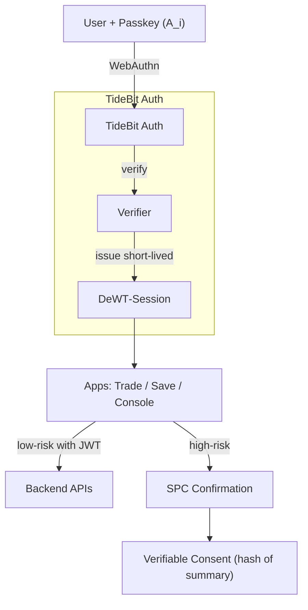
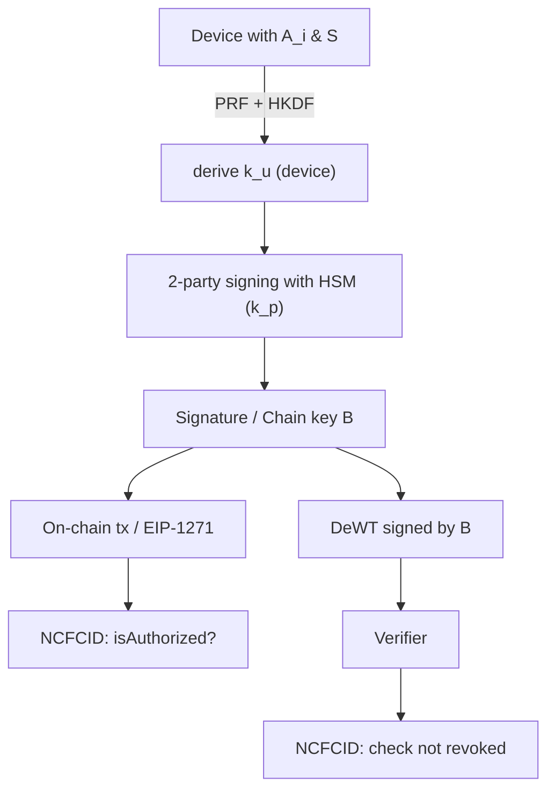

# Cross‑Application FIDO2 Enhanced Cryptographic Authentication — Whitepaper v2.2

> **一句話**：每一台裝置各自擁有一把 FIDO2 金鑰（A\_i），在鏈上以 **NCFCID 合約**將多把 A\_i 與使用者同一身分綁定；高風險時以 **Partial Private‑Key Protection（PPK）** 從 A\_i 決定性導出/協作簽名鏈上金鑰 **B**；所有 **DeWT** 與鏈上操作的驗證都必須同時檢查 **有效期**與 **是否已撤銷**。

---

## 摘要（Abstract）

TideBit‑DeFi 於多應用（Web、行動、後台）提供一致的免密碼 SSO 與可稽核的高風險授權。登入層以 **FIDO2/Passkeys** 完成人機綁定與抗釣魚，簽發短時效 **DeWT‑Session**（內部最小權限）。資產層採 **SPC 所見即所簽**，並以 **Partial Private‑Key Protection for FIDO2**（PPK）從每台裝置的 **FIDO2 平台金鑰 A\_i** 決定性導出或閾值協作出鏈上金鑰 **B**，再由 **NCFCID（身分證合約）** 維護「一個身分 ↔ 多把裝置金鑰 A\_i / 多把鏈上金鑰 B\_j」的授權清單與撤銷狀態。\*\*DeWT（鏈背書憑證）\*\*與任何鏈上動作的驗證，除檢查 `exp/nbf` 外，**必須回鏈確認當下所用金鑰是否尚未被撤銷**。

---

## 1. 設計目標（Design Goals）

* **多裝置映射**：每裝置一把 FIDO2 金鑰 **A\_i**；可為同一身分新增/撤銷裝置。
* **中心化體驗 × 去中心化信任**：SSO 流暢；資產授權以鏈上名簿為最終真相。
* **分級風險**：低風險走 DeWT‑Session；高風險必經 SPC + PPK。
* **可撤銷/可稽核**：遺失裝置或風險事件時，**上鏈撤銷**對應 A\_i/B\_j；事件可追溯。

---

## 2. 關鍵構件（Components）

* **A\_i（Platform Key）**：每台裝置一把 FIDO2 平台金鑰（記 `credIdHash`、`aPubHash`）。
* **S（Device Secret）**：裝置祕密（TEE/SE），永不外流。
* **B\_j（Chain Key）**：由 **PRF(A\_i)** 與 **S** 經 HKDF 決定性導出，或由 PPK 2 方簽名（k\_u + k\_p）對外表現為同一把公鑰 P。
* **NCFCID**：身分證合約，維護 {A\_i, B\_j, 角色, 撤銷/輪替}；`isAuthorized(ncfcid, pub)` 為最終真相。
* **DeWT‑Session**：短時效 JWT（5–15 分），內部低風險 API 使用。
* **DeWT（鏈背書）**：由 **B** 簽出之自含憑證；驗證端**回鏈查**授權/撤銷後再驗章。

---

## 3. 多裝置 × 單一身分的鏈上映射

* **建立/綁定**：新裝置註冊時，記錄 `credIdHash` 與（選擇性）`devicePublicKey`，並把 **A\_i → NCFCID** 的關係寫入合約事件 `FIDOEnrolled`。
* **導出/授權 B**：透過 PPK（§4）從 A\_i 導出或協作產生 **B\_j**，以 `IdentityCreated/JoinApproved` 將 **B\_j** 掛到同一 **NCFCID**。
* **遺失/撤銷**：裝置遺失或疑似外洩時，呼叫 `revokeA(credIdHash)` 與/或 `revokeB(bPub)`；驗證端在任何時間點都以**當下鏈上狀態**為準。

---

## 4. Partial Private‑Key Protection（PPK）整合

**目的**：避免把登入金鑰 A\_i 直接用於鏈上，並讓資產簽名需要「本人裝置 + 平台 HSM」共同參與。

* **決定性導出（裝置側材料）**：

  * `F = PRF(A_i, salt = challengeX)`（WebAuthn PRF/hmac‑secret）
  * `seed = HKDF(sha256, IKM = F || H(S), salt = H("PPK/v1" || challengeX), info = A_pub, len = 32)`
  * `k_u = int(seed) mod n`（裝置分片，不落地）
* **2 方簽名（推薦）**：平台 HSM 持 `k_p`，簽名時以 Schnorr 2PC：`K = k_u + k_p (mod n)`，輸出標準簽名 `(R, s)`；任何單方皆無法代簽。
* **摘要綁定**：`challengeX = H(tag || digest(summary) || rpId || origin || nonce || exp)`，確保 SPC 所見即所簽。

---

## 5. 協定與流程（簡化）

**登入/SSO（低風險）**  → FIDO2 驗證 → **DeWT‑Session**（短時效、最小權限）

**高風險（鏈上/鏈背書）**  → SPC 顯示摘要 → PRF(A\_i) + S → PPK 2PC 簽名或導出 B →

* **On‑chain**：鏈上交易/EIP‑1271 驗證，合約以 **NCFCID** 查授權 → 執行
* **DeWT**：由 B 對 payload 簽出 DeWT → 驗證端檢 `exp/nbf` **且回鏈查** `isAuthorized(ncfcid, B_pub)` **未撤銷** → 放行

> 任一路徑，**撤銷即失效**：只要把對應 A\_i 或 B\_j 在 NCFCID 上標記撤銷，所有驗證立刻失效。

---

## 6. 遺失裝置與事件處理（On‑chain Revocation）

1. 使用者報失 → 進入**冷卻期**與審批（可選 KYC/多簽）。
2. 合約呼叫 `revokeA(credIdHash)`（必要時同步 `revokeB`）。
3. 新裝置重新註冊（新 A\_k）並以 PPK 導出/協作新 B\_m，呼叫 `join/approve` 綁回同一 NCFCID。
4. 所有驗證端（含 DeWT 驗證器）在每次驗證時皆回鏈檢查撤銷狀態。

---

## 7. DeWT 驗證規格（關鍵強化）

* **時效**：檢查 `nbf/exp`（預設極短，60–300 秒對高風險 consent，5–15 分對 Session）。
* **授權**：

  1. 從 header.kid 解析 **NCFCID#keyIndex** 與 `chain.registry`；
  2. 回鏈呼叫 `isAuthorized(ncfcid, B_pub)`；
  3. 檢查是否在**當下**已被 `revokeB`；若撤銷則驗證失敗（即便 DeWT 未過期）。
* **裝置綁定（可選策略）**：比對 `device.aPubHash/credIdHash` 是否仍屬於該 NCFCID 且未被 `revokeA`。

---

## 8. 風險矩陣（摘錄）

| 風險    |   影響 | 緩解                                   |
| ----- | ---: | ------------------------------------ |
| 偽站釣魚  | 盜取登入 | FIDO2 RP/Origin 綁定、HSTS/CSP          |
| UI 調包 | 資產損失 | SPC 摘要雜湊入 `challengeX`，所見即所簽         |
| 權杖外洩  | 非法請求 | DeWT‑Session 短時效、最小權限；高風險需 PPK + SPC |
| 裝置遺失  | 濫用風險 | `revokeA/revokeB` 上鏈撤銷；冷卻期＋審批＋重新綁定   |

---

## 9. 實作要點（工程）

* **前端（Next.js/TS）**：WebAuthn `get()` 啟用 UV+PRF；SPC 固定序列化摘要；PPK 2PC 流與 HSM 用 WebSocket/gRPC。
* **後端**：DeWT‑Session 採 RS/ES + JWKS；高風險 API 僅接受含 SPC 證據與/或 DeWT 的請求；所有驗證器**回鏈**查 NCFCID。
* **合約**：`enrollFIDO_ZK`（或 commit–reveal PoC）、`resolveByAPub/NCFCID`、`isAuthorized`、`revokeA/revokeB/rotateB`、完整事件。

---

## 10. 協議流程

**SSO + 高風險授權**



**PPK × NCFCID × DeWT**



---

## 附錄：最小介面（Solidity 摘要）

```solidity
interface INCFCID {
  event FIDOEnrolled(uint256 nid, bytes32 credIdHash, bytes aPubHash);
  event IdentityCreated(bytes32 ncfcid, bytes bPub);
  event JoinApproved(bytes32 ncfcid, bytes bPub);
  event Revoked(bytes32 ncfcid, bytes bOrAHash);
  function isAuthorized(bytes32 ncfcid, bytes calldata pub) external view returns (bool);
  function revokeA(bytes32 credIdHash) external;
  function revokeB(bytes calldata bPub) external;
  function rotateB(bytes32 ncfcid, bytes calldata oldB, bytes calldata newB) external;
}
```

---

## Reference

* [DeWT：流程圖與安全性說明](https://github.com/CAFECA-IO/KnowledgeManagement/blob/master/TideBit-DeFi/DeWT_sequence_digram.md)

## 版本（Versioning）

* **版本**：v2.2‑WP‑FIDO2‑CA（2025‑09）
* **作者**：Tzuhan (Emily)
