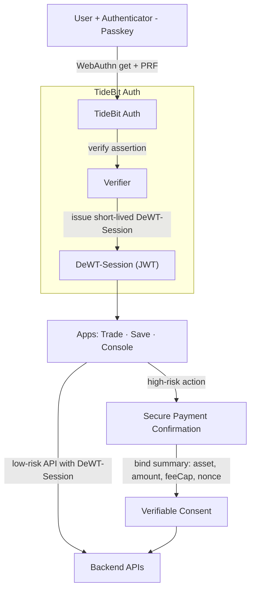
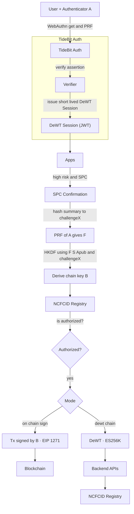

# Cross‑Application FIDO2 Enhanced Cryptographic Authentication — Whitepaper

> **一句話**：
> 以 **FIDO2 + 短時效 DeWT‑Session** 完成跨應用 SSO（低風險），
> 以 **SPC + WebAuthn PRF(A) 衍生 B + NCFCID** 完成可稽核高風險授權（高風險）。
> 讓使用者感受像中心化一樣順暢，但信任來源去中心化、可撤銷、可審計。

---

## 摘要（Abstract）

TideBit‑DeFi 在多應用（Web、行動、後台）提供一致的免密碼登入與高風險操作的再次確認。
登入面以 FIDO2/Passkeys 完成人機綁定與抗釣魚，並簽發短時效權杖 **DeWT‑Session** 於內部傳遞最小權限；高風險操作採 **Secure Payment Confirmation（SPC）** 顯示可驗證交易摘要，並將摘要綁入授權證據。
進一步整合 **DeWT**：
  - 使用者裝置的 **平台金鑰 A** 與裝置祕密 **S** 加上 WebAuthn **PRF** 衍生鏈上金鑰 **B**，以 **NCFCID**（身分證合約）管理 B 的授權與撤銷，確保「登入 → 授權 → 一次性鏈上簽名 / 去中心化憑證（DeWT）」完整且可稽核。

---

## 1. 緒論（Introduction）

**目標**：以最少的認知負擔與交互步驟，提供多應用 SSO 與安全的高風險授權；同時保留去中心化的可撤銷性與審計能力。

**動機**：傳統 SSO 權杖一旦外洩，常可直接操作敏感資產；而純鏈上錢包簽名雖去中心，但 UX 和釣魚風險較高。本方案結合兩者優勢並補足缺點。

---

## 2. 設計目標（Design Goals）

* **中心化體驗**：單一帳號、跨產品 SSO、一次確認。
* **去中心化信任**：私鑰不在伺服器；伺服器無法單獨代操。
* **分級風險**：登入（低風險）與資產操作（高風險）強隔離。
* **可稽核/可撤銷**：同意證據可重演核對；金鑰可即時撤銷。
* **相容性**：對不同瀏覽器/裝置提供降級策略。

---

## 3. 威脅模型（Threat Model）

* **釣魚/偽站**：在假網域誘騙登入或授權。
* **中間人與 UI 調包**：畫面顯示 1 實際簽 100。
* **伺服器入侵**：權杖外洩、權限橫向移動。
* **裝置遺失/備份濫用**：多裝置 passkey 被濫用。
* **鏈上永久暴露**：敏感雜湊或密碼材料上鏈後不可回收。

---

## 4. 系統總覽（System Overview）

**關鍵角色**：

* **A（Platform Key）**：FIDO2 平台金鑰（每裝置一把，記錄 credIdHash）。
* **S（Device Secret）**：裝置祕密（TEE/SE 內，永不上鏈）。
* **B（Chain Key）**：由 PRF(A) 與 S 經 HKDF 衍生之鏈上簽名金鑰，只公開 B\_pub。
* **NCFCID**：身分證合約，維護允許的 B 集合、角色與撤銷。
* **DeWT‑Session**：短時效 JWT，用於內部微服務低風險 API。
* **DeWT**：由 B 簽出之自含式憑證，驗證端回鏈確認授權狀態。

**使用者旅程**：

1. 首次綁定 Passkey（A）。
2. 登入任一 TideBit 應用，以 FIDO2 認證換取短時效 **DeWT‑Session**。
3. 進行高風險操作時彈出 **SPC**，摘要內容被綁定進授權證據。
4. 需要鏈上動作或跨組織驗證時，以 **PRF(A) + S** 衍生 **B**，走 On‑chain 或 DeWT 路徑；
   授權與撤銷以 **NCFCID** 即時為準。

---

## 5. 協定與流程（Protocols）

### 5.1 登記（Enrollment）

* 用戶以承諾 C1 註冊（`C1 = keccak(PWH1 || nonce_c1)`），避免上鏈暴露；
* 建立 A，要求 PRF 能力；
* 以 **PRF(A)** 與 **S** 衍生 **B**；
* 以 **ZK（建議）** 或 **commit–reveal（PoC）** 將 `A_pub / B_pub / credIdHash` 與承諾關聯上鏈；
* 以 B 建立 `NCFCID` 或加入既有身份並由管理者 B 審批。

### 5.2 登入（SSO，低風險）

* RP ID = eTLD+1（例如 `tidebit.com`），驗 `origin` 與 `rpId`；
* TideBit‑Auth 驗證成功後簽發 **DeWT‑Session**（5–15 分有效，RS/ES + JWKS）；
* 低風險 API 僅需 DeWT‑Session 即可。

### 5.3 高風險授權（SPC + 所見即所簽）

* 在 SPC 視窗顯示 **資產/金額/feeCap/目的/nonce/到期**；
* 交易摘要雜湊被**併入 WebAuthn challenge** 或作 **PRF salt**，確保「看見什麼就簽什麼」。

### 5.4 鏈上金鑰衍生（PRF + HKDF）

* `F = PRF(A, salt = H(challengeX || context))`（WebAuthn PRF/hmac‑secret）；
* `seed = HKDF(sha256, IKM = F || H(S), salt = H("CAFECA/B-derivation/v1" || challengeX), info = A_pub)`；
* 由 seed 產生 B（secp256k1 或 ed25519）。

### 5.5 執行路徑

* **On‑chain 路徑**：以 **B** 對交易簽章或由 EIP‑1271 驗證策略驗章；
* **DeWT 路徑（鏈背書）**：由 **B** 簽出 DeWT，自含 `kid/chain/iss/nbf/exp/nonce` 等，驗證端**回鏈查** `NCFCID` 的授權與撤銷。

---

## 6. 安全分析（Security Analysis）

* **抗釣魚**：FIDO2 綁定 RP/Origin；假站無法調用 Passkey。
* **所見即所簽**：SPC 摘要綁入 challenge/PRF，後端與鏈上均可重演驗證。
* **權杖外洩風險可控**：DeWT‑Session 短時效、最小權限；高風險需 SPC 再授權。
* **可撤銷性**：B 洩漏可在 `NCFCID` 即時撤銷；DeWT（鏈背書）雖自含，但驗證必回鏈，撤銷即生效。
* **裝置遺失/備份濫用**：要求 platform authenticator、credProtect、`credIdHash` 追蹤；高風險行為可要求硬體金鑰或冷卻期。

---

## 7. 相容性與回退（Compatibility）

* **PRF 不支援**：降級為基礎 WebAuthn + SPC；或以 largeBlob 存一次性 T 值，再 HKDF。
* **多品牌/多主域**：各自 RP ID，分區 SSO；避免跨 eTLD 分享 RP。
* **瀏覽器差異**：記錄 PRF/devicePublicKey/largeBlob 支援矩陣，動態升降級。

---

## 8. 實作指南（Implementation）

**前端（Next.js + TypeScript + Tailwind）**：

* 使用 `navigator.credentials.get()` 請求 UV、PRF；
* SPC 彙整摘要並顯示統一格式；
* 失敗與風險事件打點到稽核流。

**後端（Node/Edge）**：

* DeWT‑Session 使用 RS/ES 與 JWKS 發佈公鑰；
* 高風險 API 僅接受含 SPC 同意證據或一次性 consent token 的請求；
* 日誌與稽核：時間戳、`jti`、摘要雜湊、決策。

**安全標頭/Cookie**：HSTS、CSP、`X-Frame-Options`、`HttpOnly`、`Secure`、`SameSite=Strict`（跨不同註冊後綴再調整）。

---

## 9. 風險矩陣（Risk Matrix）

| 風險事件    | 可能影響 | 機率 | 影響 | 緩解設計                               | 殘餘風險 |
| ------- | ---: | -: | -: | ---------------------------------- | ---- |
| 網站釣魚    | 盜取登入 |  低 |  高 | FIDO2 RP/Origin 綁定；HSTS、CSP        | 低    |
| 伺服器入侵   | 權杖外洩 |  中 |  高 | DeWT‑Session 短時效；RS/ES + JWKS；速率限制 | 低    |
| 交易調包    | 資產損失 |  低 |  高 | SPC 摘要綁入 challenge/PRF；nonce 核對    | 低    |
| 憑證重放    | 非法操作 |  低 |  中 | 唯一 challenge/nonce；短時效；重放偵測        | 低    |
| 裝置遺失    | 使用受阻 |  中 |  中 | 備援/硬體金鑰；人工＋冷卻期恢復；風險名單              | 低    |
| 新裝置首次登入 | 權限濫用 |  中 |  中 | devicePublicKey 風險加權；二次驗證          | 低    |
| 帳號備份濫用  | 憑證濫用 |  低 |  高 | 高風險預設要求裝置綁定或硬體金鑰                   | 低    |

---

## 10. 效能與體驗（Performance and UX）

* DeWT‑Session 建議 5–15 分有效，短鏈路降低重放面；
* SPC 僅在高風險場景出現，對日常交易影響極小；
* PRF/A 衍生 B 僅在需要鏈背書或鏈上簽名時執行，可快取 F 於安全區。

---

## 11. 治理與金鑰管理（Governance）

* `NCFCID` 為最終真相；
* 事件主導：`FIDOEnrolled/IdentityCreated/JoinApproved/Revoked`；
* 金鑰輪替：`rotateB`；撤銷：`revokeB`；角色：`admin/member/tx-only`。

---

## 12. 合規（Compliance）

* 不保存生物特徵或裝置私鑰；
* 最小化個資與稽核雜湊；
* 支援被遺忘權與可攜權（依 `NCFCID` 名簿狀態進行撤銷/匯出）。

---

## 13. 相關工作與比較（Related Work）

| 方案        | 體驗 | 安全                | 撤銷/治理   | 稽核      |
| --------- | -- | ----------------- | ------- | ------- |
| 密碼 + OTP  | 一般 | 易釣魚/重放            | 弱       | 弱       |
| 純 JWT SSO | 好  | 伺服器入侵風險           | 需集中黑名單  | 中       |
| 只用鏈上錢包簽   | 普通 | 易釣魚/調包            | 只能憑私鑰治理 | 中       |
| MPC 代簽    | 好  | 受託風險              | 中心化流程   | 強（但中心化） |
| **本方案**   | 好  | 抗釣魚 + 所見即所簽 + 可撤銷 | 鏈上治理    | 強（鏈上事件） |

---

## 14. 侷限與未來工作（Limitations and Future Work）

* 部分環境尚不支援 PRF；需維持降級方案與風險分級策略；
* ZK 電路成本仍高，PoC 期以 commit–reveal 過渡；
* 需持續維護支援矩陣與自動化回歸測試（瀏覽器/OS/認證器）。

---

## 15. 名詞備註（Glossary）

FIDO2／Passkey、RP ID、PRF（hmac‑secret）、devicePublicKey、largeBlob、SPC、DeWT‑Session、DeWT、A/S/B、NCFCID、EIP‑1271。

---

## 附錄 A — DeWT‑Session 最小 Claims（`jsonc`）

```jsonc
{
  "iss": "https://auth.tidebit.com",
  "sub": "<user-id>",
  "aud": ["trade.tidebit.com","save.tidebit.com","console.tidebit.com"],
  "exp": 1710000000,
  "iat": 1709996400,
  "jti": "<uuid>",
  "kid": "<jwks-key-id>",
  "amr": ["swk","user"],
  "webauthn": { "rpid": "tidebit.com", "uv": true, "devicePubKey": true },
  "nonce": "<per-login-uuid>"
}
```

## 附錄 B — DeWT 最小格式

**Header**

```json
{ "typ":"DeWT","alg":"ES256K","kid":"NCFCID#bKey-0","chain":{"chainId":8453,"registry":"0xRegistryAddr"} }
```

**Payload（節選）**

```json
{ "iss":"0xRegistryAddr","sub":"NCFCID","aud":"cafeca.app","nbf":1724630400,"exp":1724634000,"nonce":"<128-bit>",
  "device":{"aPubHash":"0x...","credIdHash":"0x..."},"scope":["tx:submit"] }
```

**驗證**：依 `kid` 回鏈定位 `B_pub` → `isAuthorized(NCFCID,B_pub)` 與撤銷 → 驗章與宣告檢查（`exp/nbf/aud/nonce`）。

## 附錄 C — EIP‑712 Consent 範例（摘要）

```json
{
  "types":{"Consent":[{"name":"domain","type":"string"},{"name":"tos","type":"string[]"},{"name":"privacy","type":"string[]"},{"name":"signer","type":"address"},{"name":"exp","type":"uint256"},{"name":"iat","type":"uint256"},{"name":"nonce","type":"bytes32"}]},
  "primaryType":"Consent",
  "domain":{"name":"TideBit-DeFi","version":"2","chainId":1,"verifyingContract":"0x0000000000000000000000000000000000000000"},
  "message":{"domain":"https://www.tidebit-defi.com","tos":["https://www.tidebit-defi.com/terms/{hash}"],"privacy":["https://www.tidebit-defi.com/privacy/{hash}"],"signer":"0x000000000000000000000000000000000000dcba","exp":1710000000,"iat":1709996400,"nonce":"0xaaaaaaaaaaaaaaaaaaaaaaaaaaaaaaaaaaaaaaaaaaaaaaaaaaaaaaaaaaaaaaaa"}
}
```

## 附錄 D — RP ID 跨子域指南

1. RP ID 選擇：使用 eTLD+1 作信任根（如 `tidebit.com`）；
2. 本機開發：`dev.tidebit.local`＋本機憑證；避免用 `localhost` 模擬跨子域；
3. 多品牌/多主域：各自 RP ID，分區 SSO；
4. 支援差異：紀錄 PRF/devicePublicKey/largeBlob 支援，未支援者降級並提高風險分級。

## 附錄 E — 流程圖（GitHub 安全版 Mermaid）

**SSO + SPC**



**FIDO2 × DeWT 整合**



---

## Reference

* [DeWT：流程圖與安全性說明](https://github.com/CAFECA-IO/KnowledgeManagement/blob/master/TideBit-DeFi/DeWT_sequence_digram.md)

## 版本（Versioning）

* **版本**：v2.1‑WP‑FIDO2‑CA（2025‑08）
* **作者**：Tzuhan (Emily)
