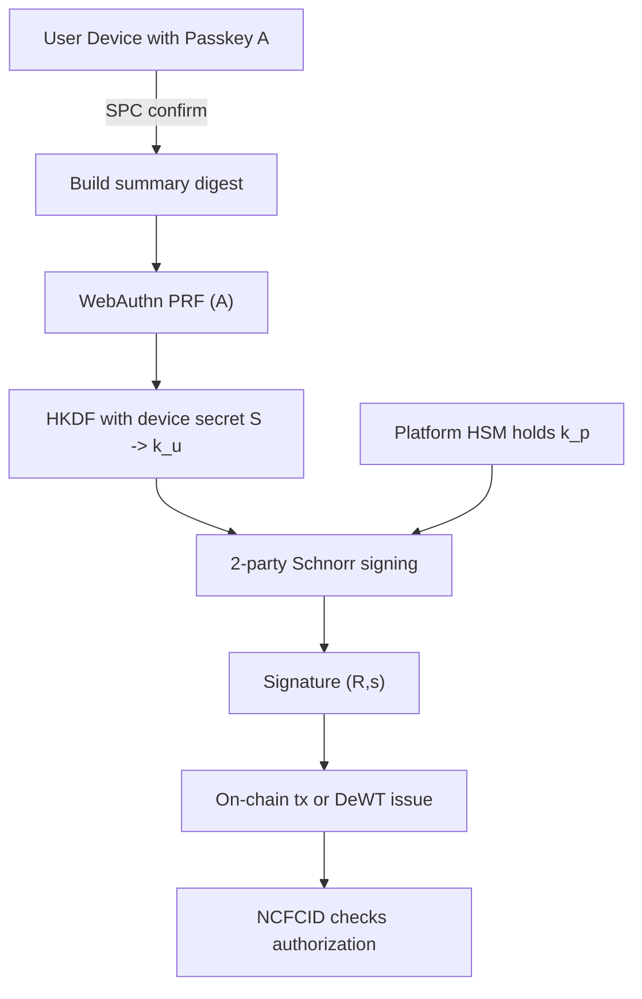
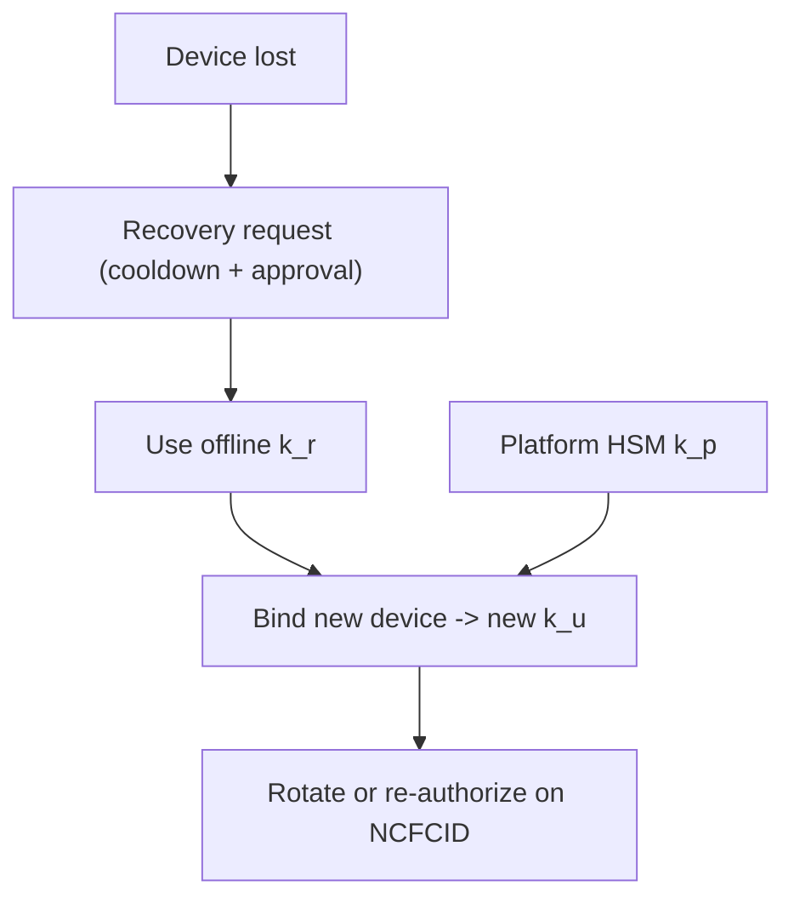

# Partial Private‑Key Protection for FIDO2 — Whitepaper v1.1（Readable × Technical）

> **一句話**：把「能動資產的私鑰」拆成多份，日常簽名需 **本人裝置（k\_u）+ 平台 HSM（k\_p）** 共同參與；任一方單獨無法代簽。遺失或風險時，啟用 **備援分片（k\_r）** 在鏈上 **即時撤銷與重建**。全程以 **SPC 所見即所簽**與 **NCFCID 合約**確保可稽核、可治理。

---

## 摘要（Abstract）

本白皮書提出一套與 **FIDO2/WebAuthn** 完整整合的「部分私鑰保護」方法：登入用 FIDO2 綁定本人（抗釣魚），高風險操作以 **Secure Payment Confirmation（SPC）** 呈現「所見即所簽」摘要；真正能動資產的鏈上私鑰 **K** 不以整把存在任何單點，而是以 **2 方閾值簽名**（使用者裝置分片 \`k\_u\` ＋ 平台 HSM 分片 \`k\_p\`）完成簽名，並以 **備援分片 \`k\_r\`** 處理恢復與輪替。授權狀態由 **NCFCID（身分證合約）** 維護，任何驗證都以鏈上現況為準，可即時撤銷。方案與前篇 **Cross‑Application FIDO2**、**DeWT v2** 無縫銜接。

---

## 讀者地圖（讀者怎麼讀）

* **決策者**：看 §1–§4、§8、§11（10 分鐘掌握價值與風險）。
* **工程師**：關鍵看 §5（協定）、§6（恢復/輪替）、§10（落地指南）、附錄。

---

## 1. 問題與目標（Motivation & Goals）

**痛點**：單把私鑰即單點風險；裝置/伺服器任何一端被攻破都可能代簽；同時不能犧牲使用者體驗與合規稽核。

**目標**：

* 任何單一實體（裝置或伺服器）**都無法單獨簽名**。
* **日常 2 方**即可簽名（快速），**第 3 方備援**僅於恢復/輪替動用。
* 與 **FIDO2、SPC、NCFCID、DeWT** 深度整合，維持「中心化體驗 × 去中心化信任」。

---

## 2. 威脅模型（Threat Model）

* **釣魚/偽站**：誘導在假網域登入/確認。
* **UI 調包/中間人**：所見非所簽。
* **伺服器入侵**：平台憑證/金鑰被濫用。
* **裝置惡意程式**：攔截或注入。
* **遺失/毀損**：需要安全恢復/撤銷。

> **假設**：使用者通過 FIDO2 UV（指紋/臉）；平台有 HSM 與審計；鏈上可部署 NCFCID 合約。

---

## 3. 設計總覽（System Overview）

**名詞**：

* **A（Passkey）**：FIDO2 平台鑰，用於人機在場與 PRF，**不直接簽鏈上交易**。
* **S（Device Secret）**：裝置祕密，存於 TEE/SE，永不外流。
* **k\_u（User Share）**：由 **PRF(A)** 與 **S** 經 **HKDF** 決定性導出；只存在裝置記憶體。
* **k\_p（Platform Share）**：HSM 內的伺服器分片，具速率/審批限制。
* **k\_r（Recovery Share）**：離線備援，只用於恢復/輪替。
* **NCFCID**：鏈上身分證合約，維護授權的公鑰/角色與撤銷。

**直覺**：登入像 Apple Pay；動資產要「本人在場 + 平台共簽」；任何一方被攻破都無法單獨挪用資產；撤銷在鏈上即時生效。

---

## 4. 流程圖（GitHub 安全版 Mermaid）

**4.1 日常簽名路徑**



**4.2 恢復與輪替路徑**



> 圖中省略了雜湊/序列化細節；規格見 §5.3 與附錄 A。

---

## 5. 協定與規格（Protocols）

### 5.1 SPC 所見即所簽（摘要綁定）

**摘要欄位**（固定序列化順序）：`asset, amount, feeCap, purpose, nonce, exp`。將 JSON 去空白序列化後 **SHA‑256**，作為訊息的一部分（§附錄 A）。

### 5.2 WebAuthn 認證與 PRF

* 以 `navigator.credentials.get()` 要求 **UV** 與 **PRF**；
* 伺服器下發 `challengeX = H(tag || digest(summary) || H(ciphertext) || rpId || origin)`，其中 `ciphertext` 為你要綁定的「密文」（例如已加密的同意單），**只取雜湊用於綁定**；
* 認證器返回 **PRF 輸出 F（32 bytes）** 與 WebAuthn 簽章（供登入驗證）。

### 5.3 裝置分片導出 k\_u（決定性）

* `seed = HKDF(sha256, IKM = F || H(S), salt = H("PPK/v1" || challengeX), info = A_pub, len = 32)`；
* `k_u = int(seed) mod n`（曲線群階）；
* **性質**：相同 A、S、challengeX 導出相同 `k_u`；變更摘要/密文/nonce/到期 → `k_u` 改變，達成上下文綁定。

### 5.4 2 方 Schnorr 簽名（secp256k1）

* 私鑰視為加法分享：`K = k_u + k_p (mod n)`；
* 互換臨時點：裝置產 `r_u`，HSM 產 `r_p`，合成 `R = R_u + R_p`；
* 計算 `e = H(R || P || m)`（`P` 為公鑰，`m` 包含 SPC 摘要雜湊與交易資料）；
* 分別出 `s_u = r_u + e·k_u`、`s_p = r_p + e·k_p`，合成 `s = s_u + s_p (mod n)`；
* 輸出 `(R,s)`；鏈上/鏈下照標準 Schnorr 驗章。

> **為何不用 ECDSA 2PC？** 可行但時序與邏輯複雜；Schnorr 在 2PC 更簡潔且易審計。

### 5.5 恢復與輪替

* **恢復**：啟動冷卻＋審批流程，以 `k_r` 與 `k_p` 綁定新裝置導出 `k_u'`，並在 NCFCID 重新授權；
* **輪替**：選擇隨機 Δ，裝置/平台各自本地更新：`k_u' = k_u + Δ`、`k_p' = k_p − Δ`；或直接導出新公鑰並呼叫 `rotateB`。

---

## 6. 與 NCFCID / DeWT 的關係

* **NCFCID**：`isAuthorized(ncfcid, pub)` 為最終真相；`revokeB/rotateB` 即時生效；事件可稽核。
* **DeWT（鏈背書憑證）**：由合成公鑰 `P` 對 payload 簽名；驗證端先依 `kid` 回鏈定位公鑰並檢撤銷，再驗章。可搭配前篇 **DeWT‑Session（短時效 JWT）** 做內部 SSO。

---

## 7. 安全分析（Threats ↔ Controls）

| 威脅     | 控制                 | 解釋                     |
| ------ | ------------------ | ---------------------- |
| 釣魚/偽站  | FIDO2 RP/Origin 綁定 | 假站叫不動 Passkey。         |
| UI 調包  | SPC + 摘要雜湊入訊息      | 後端/合約可重演核對，所見即所簽。      |
| 伺服器入侵  | 只持有 k\_p；鏈上撤銷      | 單方無法簽；撤銷即時生效。          |
| 裝置惡意程式 | UV + TEE/SE        | 本人在場；分片不可導出。           |
| 憑證重放   | 唯一 nonce/exp/aud   | 重放無效；DeWT‑Session 短時效。 |
| 恢復濫用   | 冷卻期 + 多簽審批 + 審計    | k\_r 使用受控、全程留痕。        |

---

## 8. 相容性與降級（Compatibility & Fallback）

* **無 PRF 的瀏覽器**：

  1. 要求硬體金鑰路徑（platform/hybrid）；
  2. largeBlob 存一次性祕密 T，`HKDF(H(S||T||challenge))`；
  3. 保留 SPC 強綁定，必要時提高風險等級或人工覆核。

---

## 9. 風險矩陣（Risk Matrix）

| 事件      | 機率 | 影響 | 緩解                       | 殘餘 |
| ------- | -: | -: | ------------------------ | -- |
| 裝置惡意程式  |  中 |  高 | FIDO2 UV、TEE/SE、SPC、速率限制 | 低  |
| 平台被入侵   |  中 |  高 | 只持 `k_p`、HSM 守護、回鏈撤銷     | 低  |
| 備援分片被盜  |  低 |  中 | 離線保管、多簽+冷卻、全程審計          | 低  |
| 中間人調包摘要 |  低 |  高 | 摘要雜湊入訊息、nonce/exp 綁定     | 低  |
| 分片不同步   |  低 |  中 | 健檢與對賬、支援輪替               | 低  |

---

## 10. 工程落地指南（Next.js × Node × Solidity）

**前端（Next.js/TS/Tailwind）**

* WebAuthn `get()`：要求 UV、PRF；把 `challengeX` 放入 `publicKey.challenge`。
* SPC：統一摘要格式與固定序列化；UI 顯示資產/金額/feeCap/nonce/到期。
* 2PC：與後端開 WebSocket/gRPC 流程，錯誤需可重試且防重放。

**後端（Node/Edge）**

* Gate：高風險 API 必帶 SPC 證據；
* 2PC：HSM 計算 `s_p`，有速率與配額；
* JWT：DeWT‑Session 走 RS/ES + JWKS，`exp` 5–15 分、`jti` 可撤銷；
* 稽核：重大事件簽名雜湊與時間戳寫入不可竄改倉。

**鏈上（Solidity）**

* NCFCID：`isAuthorized/revokeB/rotateB`；狀態精簡、事件完整；
* 可選 EIP‑1271：支援合約錢包策略核驗。

---

## 11. 限制與未來工作（Limitations & Future Work）

* PRF 覆蓋率仍不一致；
* 2PC 需完善的中止/重試協定（避免 nonce 重用）；
* 將恢復流程（KYC/審批）形式化為 **ZK 憑證**，降低對平台信任面。

---

## 附錄 A — SPC 摘要規格（固定序列化）

```json
{"a":"USDT","x":"100.00","f":"0.5","p":"withdraw","n":"<nonce>","e":1710000000}
```

* 以 UTF‑8、無多餘空白序列化，再做 SHA‑256；
* 此雜湊納入 `challengeX` 與訊息 `m` 用於簽名。

## 附錄 B — 2 方 Schnorr 訊息順序（簡化）

1. 裝置送 `R_u`，HSM 回 `R_p`；
2. 合成 `R`，計 `e = H(R || P || m)`；
3. 裝置回 `s_u`，HSM 回 `s_p`；
4. 驗 `(R, s_u + s_p)`。

## 附錄 C — TypeScript 型別（不使用 any）

```ts
export type ConsentSummary = {
  asset: string;
  amount: string; // decimal string
  feeCap: string; // decimal string
  purpose: "withdraw" | "liquidate" | "raiseLimit";
  nonce: string; // hex or uuid
  exp: number;   // unix seconds
};

export type TwoPCMsg = {
  Ru: string; // hex
  Rp: string; // hex
  R: string;  // hex
  e: string;  // hex
  su?: string; // hex
  sp?: string; // hex
};
```

## 附錄 D — Recovery Checklist（作業指引）

* 驗身：KYC + 多因素；
* 時間鎖：冷卻期 ≥ 24h；
* 審批：至少 2 人/多簽；
* 稽核：全程事件上鏈或寫入不可竄改倉；
* 完成後：舊公鑰撤銷、新公鑰廣播、用戶確認。

---

**版本**：v1.1‑WP‑FIDO2‑PPK（2025‑09）
**作者**：Tzuhan (Emily)
