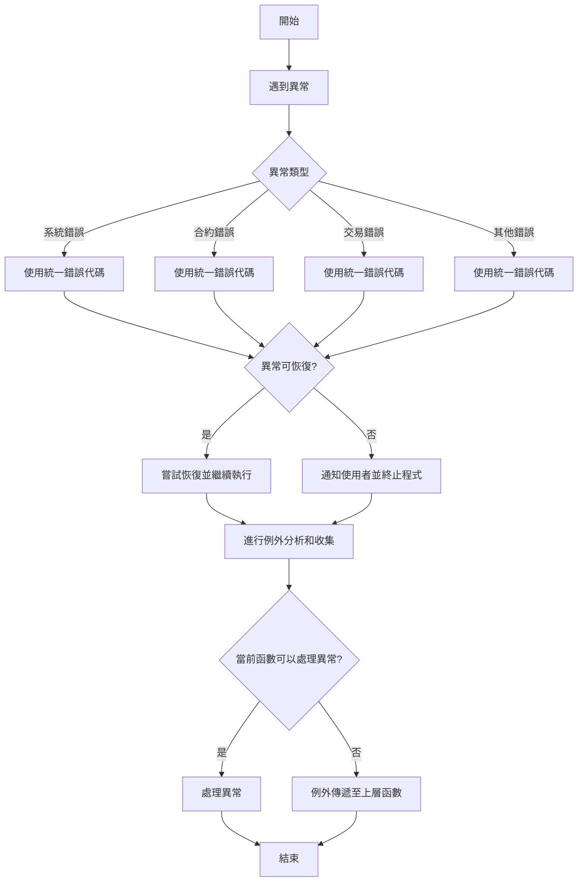

- [Error Handling](#error-handling)
  - [概述](#概述)
  - [自定義錯誤代碼與物件](#自定義錯誤代碼與物件)
    - [錯誤代碼](#錯誤代碼)
    - [錯誤物件](#錯誤物件)
  - [例外處理原則](#例外處理原則)
    - [例外傳遞](#例外傳遞)
    - [敏感資訊隱藏](#敏感資訊隱藏)
    - [例外分析](#例外分析)
    - [例外收集](#例外收集)
  - [例外處理流程示意圖](#例外處理流程示意圖)
  - [例外處理的例子: CFD 建倉](#例外處理的例子-cfd-建倉)
  - [注意事項](#注意事項)

# Error Handling

## 概述

開發時，很多例外處理情境，一個好的錯誤處理策略可以提高程式的穩定性以及可維護性。

## 自定義錯誤代碼與物件

### 錯誤代碼

使用以下 8 位錯誤代碼規則來統一管理錯誤：

1. 前兩位：錯誤類型

- **`10`**：系統錯誤
- **`20`**：合約錯誤
- **`30`**：交易錯誤
- **`40`**：用戶驗證錯誤
- **`50`**：資料庫錯誤
- **`60`**：API 錯誤
- **`70`**：業務邏輯錯誤
- **`80`**：其他錯誤

1. 第三位：錯誤級別

- **`1`**：致命錯誤
- **`2`**：嚴重錯誤
- **`3`**：一般錯誤
- **`4`**：警告

1. 第四位：錯誤區域

- **`1`**：前端錯誤
- **`2`**：後端錯誤
- **`3`**：區塊鏈錯誤
- **`4`**：第三方服務錯誤

1. 最後四位：具體錯誤編號，從 0001 到 9999 的連續編號，每個錯誤類型、級別和區域組合下的具體錯誤編號。

例如：

- **`10110001`**：表示前端系統致命錯誤的編號 0001。
- **`20220005`**：表示後端合約嚴重錯誤的編號 0005。
- **`30330010`**：表示區塊鏈交易一般錯誤的編號 0010。

### 錯誤物件

- 用規範好的錯誤代碼丟出錯誤

```tsx
try {
	// Do something
} catch (e: any) {
	const code = Code.SERVICE_TERM_DISABLE;
	const error = new CustomError(code);
	throw error;
}
```

## 例外處理原則

1. 使用統一的錯誤代碼規則：遵循下文所述的錯誤代碼規則，以便統一管理錯誤並快速定位問題。
2. 盡早捕捉例外：在可能出現錯誤的地方，應該盡早捕捉例外，進行適當的處理。
3. 區分可恢復與不可恢復的錯誤：可恢復的錯誤應該嘗試進行恢復，不可恢復的錯誤則應該通知使用者並終止程式執行。
4. 適當地使用 try-catch 語句：避免過度使用 try-catch，否則可能影響程式的可讀性和效能。

### 例外傳遞

例外傳遞（Exception Propagation）是指在程式執行過程中，當某個函數或方法中出現異常情況（例如運行時錯誤）時，該函數或方法無法正確地處理該異常，因此將異常傳遞給上一層的函數或方法來處理。這個過程會一直持續，直到找到一個能夠處理該異常的函數或方法，或者異常傳遞到最頂層，導致程式終止運行。

例外傳遞的目的是將異常處理的責任轉交給適當的函數或方法，這樣做可以提高程式的可維護性和模組化。通常，一個函數或方法只應該負責處理與其功能相關的異常，而將其他無法處理的異常傳遞給上層。

### 敏感資訊隱藏

在錯誤處理過程中，應避免將敏感資訊暴露給用戶或外部系統。敏感資訊包括但不限於：

1. 使用者密碼
2. 資料庫連接資訊
3. API 金鑰
4. 加密金鑰等

為了保護這些資訊，可以將敏感資訊替換為對應的代碼或標記，在需要時可以通過錯誤代碼或標記查找具體的錯誤訊息。

### 例外分析

例外分析是對捕獲到的錯誤進行分析，以找出錯誤的根本原因。在例外分析過程中，應該關注以下方面：

1. 錯誤的頻率：分析錯誤發生的頻率，以找出可能的系統性問題。
2. 錯誤的類型：對錯誤進行分類，以便針對不同類型的錯誤制定對應的解決方案。
3. 錯誤的根本原因：深入分析錯誤的根本原因，以便從源頭解決問題。

### 例外收集

例外收集是將捕獲到的錯誤訊息進行統一收集和儲存，以便於後續的分析和處理。在實現例外收集時，可以使用以下技術：

1. 日誌系統：使用日誌系統將錯誤訊息記錄到檔案、資料庫或其他儲存介質中。
2. 監控系統：使用監控系統實時收集和分析錯誤訊息，以便及時發現並處理問題。
3. 通知系統：使用通知系統在捕獲到嚴重錯誤時及時通知相關人員。

## 例外處理流程示意圖



## 例外處理的例子: CFD 建倉

1. **`signTransaction`**: 負責用戶的去中心化錢包簽名。
2. **`transformData`**: 負責將資料轉換成需要的格式。
3. **`matchOrder`**: 負責搓合訂單。

```tsx
// 假設我們有以下三個 function，分別負責不同的開倉操作：

async function signTransaction(wallet: Wallet, txData: any): Promise<SignedTransaction> {
    try {
        // 用戶的去中心化錢包簽名
        const signedTransaction = await wallet.signTransaction(txData);
        return signedTransaction;
    } catch (e) {
        // 例外傳遞：將錯誤傳遞給上層 function 處理
        	const code = Code.SERVICE_TERM_DISABLE;
	        const error = new CustomError(code);
	        throw error;
    }
}

function transformData(data: any): any {
    try {
        // 資料格式轉換
        const transformedData = /* 轉換過程 */;
        return transformedData;
    } catch (e) {
        // 例外傳遞：將錯誤傳遞給上層 function 處理
        	const code = Code.INVALID_INPUT;
	        const error = new CustomError(code);
	        throw error;
    }
}

function matchOrder(order: Order): MatchedOrder {
    try {
        // 搓合訂單
        const matchedOrder = /* 搓合過程 */;
        return matchedOrder;
    } catch (e) {
        // 例外傳遞：將錯誤傳遞給上層函數處理
        	const code = Code.INTERNAL_SERVER_ERROR;
	        const error = new CustomError(code);
	        throw error;
    }
}

// 開倉 function
async function openPosition(wallet: Wallet, orderData: any): Promise<void> {
    try {
        const transformedData = transformData(orderData);
        const signedTransaction = await signTransaction(wallet, transformedData);
        const matchedOrder = matchOrder(signedTransaction);
        // 開倉成功
    } catch (e) {
          console.error(`開倉失敗: ${error.message}`);
          // 可以在這裡進行錯誤分析、收集或通知用戶等操作

        if (error instanceof CustomError) {
          if (error.code === Code.INVALID_INPUT) {
            // ...
          } else if (error.code === Code.INTERNAL_SERVER_ERROR) {
            // ...
          } else if (error.code === Code.SERVICE_TERM_DISABLE) {
            // ...
          }
          result.code = error.code;
          result.reason = error.message;
          return result;
        } else {
          // ...
        }

    }
}
```

## 注意事項

1. 適當地進行例外傳遞：如果當前函數無法對異常進行處理，應該適當地將異常傳遞給上層調用者，讓上層調用者進行相應處理。在傳遞異常時，可以考慮對異常進行包裝，以便上層調用者更好地理解和處理異常。
2. 區分程式邏輯錯誤與異常狀況：程式邏輯錯誤應該通過代碼修復解決，而非用異常處理來解決。異常處理機制應該用於處理不可預測的錯誤情況，例如外部資源不可用、網絡中斷等。
3. 在進行例外處理時，遇到 if-else 結構又需要 try-catch 時，可以在 if 或 else 語句內部進行 try-catch 處理。以下是一些建議和注意事項：

- 在 if-else 語句內部使用 try-catch：根據條件判斷，在 if 或 else 內部使用 try-catch，這樣可以根據不同的條件進行針對性的異常處理。

```tsx
if (condition) {
	try {
		// 嘗試執行某些代碼
	} catch (error) {
		// 處理異常
	}
} else {
	try {
		// 嘗試執行其他代碼
	} catch (error) {
		// 處理異常
	}
}
```

- 用 try-catch 把 if-else 包在一起，再根據發生錯誤的地方得知現在出現什麼異常

```tsx
let point = '';
    try {
      // 嘗試執行某些代碼
      point = '10110001';
      if (condition) {
        point = '30330010';
      } else if (condition) {
        point = '20220005';
      } else {
        point = '10410001';
      }
    } catch (error) {
      // 處理異常
      if ((point = '10110001')) {
        // 處理前端系統致命錯誤
      } ...
    }
```
