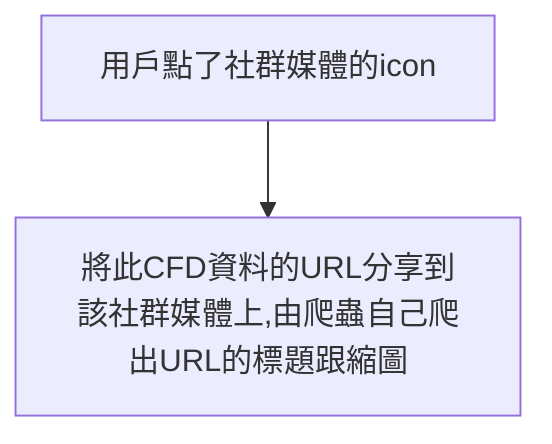

> ## [Notion 好讀版](https://soul-quenching.notion.site/Next-js-KM-shared-5f291916630742bf8955176e4888fd93)

- [目的](#目的)
- [實踐原理](#實踐原理)
- [採取的作法](#採取的作法)
- [Dev Tool - Network \& Elements](#dev-tool---network--elements)
- [關於 ImageResponse](#關於-imageresponse)
  - [目前只接受 `<div style={{…}}>` 排版，⚠️ 用 TailwindCSS 排版還在 experimental 階段 (OG Image Playground)](#目前只接受-div-style-排版️-用-tailwindcss-排版還在-experimental-階段-og-image-playground)
  - [設定字型 (Font Buffer / ArrayBuffer)](#設定字型-font-buffer--arraybuffer)
- [要設定的 HTML Tag](#要設定的-html-tag)
  - [通用的 tag](#通用的-tag)
  - [分享到 Twitter 所需的 tag](#分享到-twitter-所需的-tag)
- [\[附錄\] 踩過的坑 🩸](#附錄-踩過的坑-)
  - [Trial 1: 從 Context 拿資料](#trial-1-從-context-拿資料)
  - [Trial 2: getServerSideProps + `<Head>`](#trial-2-getserversideprops--head)
- [Ref](#ref)

## 目的



## 實踐原理

- 在用戶點下 icon 分享之後，產生一個 URL 包含要分享的資訊跟圖片，並放在分享路徑後面

## 採取的作法

- 在用戶點下 icon 分享之後，把包含 CFD ID 跟 share 路徑的 URL （`share/cfd/[cfdId]`） 用 encodeURIComponent 包起來，放在對應的社群媒體分享路徑後面。
- 其中為了讓爬蟲能爬到我們要它顯示的資料，須設定好對應的 HTML Tage 並確保在顯示網頁之前，圖片已經生成，並且有絕對路徑可以放在 `<meta>` img src 裡
  - 因為 Next.js v13.3.0 提供在 API Route 裡面寫 JSX 且將其轉成圖片並回傳圖片的功能，所以省下很多繞彎路的時間

1. `share/cfd/[cfdId]` 會把拿到的 CFD ID 傳給 `api/images/cfd/[cfdId]`
2. `api/images/cfd/[cfdId]` 透過傳 CFD ID 給 API，即時跟後端拿這筆 CFD 的資料
3. `api/images/cfd/[cfdId]` 依照資料跟設計稿，用 JSX 排版
4. `api/images/cfd/[cfdId]` 把 JSX 轉成圖檔（JPEG、PNG 格式）並回傳這份圖檔
5. `share/cfd/[cfdId]` 把圖片放到要被分享的網頁上，並設定好 HTML Tag，確保爬蟲能爬到它要的資料

- 實作示意圖（[高清版](https://miro.com/app/board/uXjVMK0CRHY=/?share_link_id=391689350778)）
  


## Dev Tool - Network & Elements

- 產生圖片 `/api/images/cfd/[cfdId]`


- 產生分享網頁 `/share/cfd/[cfdId]`


## 關於 ImageResponse

### 目前只接受 `<div style={{…}}>` 排版，⚠️ 用 TailwindCSS 排版還在 experimental 階段 ([OG Image Playground](https://og-playground.vercel.app/))

- 可直接在 ImageResponse 裡面用 JSX (HTML + Javascript) 排版，但不能在其他 component 裡面排版後直接導入 component

  ```tsx
  import { ImageResponse } from 'next/server'

  new ImageResponse(
    **element: ReactElement,**
    options: {
      width?: number = 1200
      height?: number = 630
      emoji?: 'twemoji' | 'blobmoji' | 'noto' | 'openmoji' = 'twemoji',
      fonts?: {
        name: string,
        **data: ArrayBuffer,**
        weight: number,
        style: 'normal' | 'italic'
      }[]
      debug?: boolean = false

      // Options that will be passed to the HTTP response
      status?: number = 200
      statusText?: string
      headers?: Record<string, string>
    },
  )
  ```

### 設定字型 (Font Buffer / ArrayBuffer)

- `[feat: 🎸 BarlowBuffer in /api/images/cfd/[cfdId] to change font](https://github.com/CAFECA-IO/TideBit-DeFi/pull/631/commits/99fe18589d62e0eeaff2983d8b7cc758267ea1d8)`

  1. 下載 Barlow.ttf
  2. 到[此](https://products.aspose.app/font/base64/ttf) encode .ttf as base64 (`<your_base64_encoded_font_string>`)
  3. 將 base64 字串放到 `const BarlowBuffer = Buffer.from('<your_base64_encoded_font_string>', 'base64');`
  4. 將 `BarlowBuffer` 放到 `data` 裡面

     ```
     {
           width: WIDTH_HEIGHT_OF_SHARING_RECORD,
           height: WIDTH_HEIGHT_OF_SHARING_RECORD,
           fonts: [
             {
               name: 'Barlow',
               **data: BarlowBuffer,**
               weight: 400,
               style: 'normal',
             },
           ],
         }
     ```

  5. 用在實際排版上

     ```tsx
     <div style={{ fontFamily: "'Barlow', sans-serif" }}>...</div>
     ```

     - 但其實這一步不做的話也能成功改變字型，但 Next.js 將 HTML & CSS 轉成 SVG 的 [satori](https://github.com/vercel/satori#fonts) lib 提供的例子有將 `fontFamily` 用上就跟著做了

## 要設定的 HTML Tag

Open Graph (OG) 協議使任何網頁分享在不同的社群媒體上，都可以被擷取到相同的資訊。

- 圖片解析度
  - 建議 1200x630 px
  - [Facebook 分享 og:image 的要求](https://developers.facebook.com/docs/sharing/webmasters/images/)
- ⚠️ Tips: `` 的 src 可以是相對路徑，但`<meta>`裡面的 og:image 或 twitter:image 都只能給絕對路徑

### 通用的 tag

```html
<meta name="description" content="CFD Sharing" />
<meta name="keywords" content="CFD Sharing" />
<meta name="author" content="TideBit" />
<meta name="application-name" content="TideBit DeFi" />
<meta name="apple-mobile-web-app-title" content="TideBit DeFi" />
<meta name="apple-mobile-web-app-capable" content="yes" />
<meta name="apple-mobile-web-app-status-bar-style" />

<meta property="og:title" content="TideBit DeFi CFD" />
<meta property="og:type" content="website" />
<meta property="og:url" content="https://tidebit-defi.com/" />
<meta property="og:image" content="{img}" />
<meta
	property="og:image:width"
	content="{WIDTH_HEIGHT_OF_SHARING_RECORD.toString()}"
/>
<meta
	property="og:image:height"
	content="{WIDTH_HEIGHT_OF_SHARING_RECORD.toString()}"
/>
<meta property="og:description" content="CFD Sharing" />
<meta property="og:site_name" content="TideBit" />
<meta property="og:locale" content="en_US" />
```

### 分享到 Twitter 所需的 tag

```html
<meta name="twitter:card" content="summary" />
<meta name="twitter:site" content="@tidebit" />
<meta name="twitter:creator" content="@tidebit" />
<meta name="twitter:url" content="https://tidebit-defi.com/" />
<meta name="twitter:title" content="TideBit DeFi CFD" />
<meta name="twitter:description" content="TideBit DeFi CFD" />
<meta name="twitter:image" content="{img}" />
<meta name="twitter:image:alt" content="TideBit DeFi CFD" />
```

## [附錄] 踩過的坑 🩸

### Trial 1: 從 Context 拿資料

- Context 是 Client 端的資料，而瀏覽器載入網頁之後， Client 再開始執行 Javascript 畫 component 再轉成圖片，這樣無法讓網頁被瀏覽器載入後就馬上拿到包含圖片的 HTML，也就無法讓爬蟲順利拿到我們要它顯示的資料

### Trial 2: getServerSideProps + `<Head>`

- getServerSideProps 是 Next.js 提供的 function ，在 Server 端執行，預想上在 Server 將 component 轉成圖片再透過 `<Head>` 改變 `<meta>` 等 tag
  - 卡住的地方是
  1. 在 Server 將 component 或 JSX 轉成圖片有障礙
  2. <meta> 似乎無法被即時更改並且被爬蟲爬到
     1. 後來發現有些 [Workaround](https://github.com/vercel/next.js/issues/35172) 可以解決這個問題
  - 此時 @Luphia 提供 Next.js v13.3.0 的 ImageResponse 作法，故 Trial 2 就沒繼續實驗了，未來若原本作法失效，可以考慮從這邊下手
- 什麼是 getServerSideProps、getStaticPath + getStaticProps
  [getServerSideProps & getStaticPaths & getStaticProps 三種 Data Fetching 的用途跟差別](https://www.notion.so/getServerSideProps-getStaticPaths-getStaticProps-Data-Fetching-f3c4daa41a774050a4182e6efea7ba53)

## Ref

- [The Open Graph protocol](https://ogp.me/)
- [Open Graph: How to create sharable social media previews](https://blog.logrocket.com/open-graph-sharable-social-media-previews/)
- [Facebook, Line, Twitter 的網址預覽內容設定](https://medium.com/chichangnotes/facebook-line-twitter%E7%9A%84%E7%B6%B2%E5%9D%80%E9%A0%90%E8%A6%BD%E5%85%A7%E5%AE%B9%E8%A8%AD%E5%AE%9A-839a0109b0bd)
- [Customize Social Media Preview of your NextJS Website Links](https://articles.wesionary.team/customize-social-media-preview-of-your-nextjs-website-links-82f6bce035b)
- [Facebook 分享 og:image 的要求](https://developers.facebook.com/docs/sharing/webmasters/images/)
- \***\*[imageResponse - Next.js docs](https://nextjs.org/docs/app/api-reference/functions/image-response)\*\***
- [https://github.com/vercel/satori#fonts](https://github.com/vercel/satori#fonts)
- [https://og-playground.vercel.app/](https://og-playground.vercel.app/)
- [next/head <meta> tags for pages overriding default \_app.js <meta> tags are rendered in the browser but not visible to facebook debugger.](https://github.com/vercel/next.js/issues/35172)
