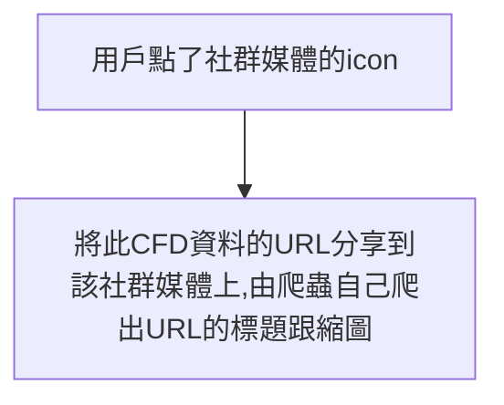

- [目的](#目的)
- [實踐原理](#實踐原理)
- [採取的作法](#採取的作法)
- [要設定的 HTML Tag](#要設定的-html-tag)
  - [通用的 tag](#通用的-tag)
  - [分享到 Twitter 所需的 tag](#分享到-twitter-所需的-tag)
- [Ref](#ref)

## 目的



## 實踐原理

- 在用戶點下 icon 分享之後，產生一個 URL 包含要分享的資訊跟圖片，並放在分享路徑後面

## 採取的作法

- 在用戶點下 icon 分享之後，把包含 CFD ID 跟 share 路徑的 URL （`share/cfd/[cfdId]`） 用 encodeURIComponent 包起來，放在對應的社群媒體分享路徑後面。
- 其中為了讓爬蟲能爬到我們要它顯示的資料，須設定好對應的 HTML Tage 並確保在顯示網頁之前，圖片已經生成，並且有絕對路徑可以放在 `<meta>` img src 裡
  - 因為 Next.js v13.3.0 提供在 API Route 裡面寫 JSX 且將其轉成圖片並回傳圖片的功能，所以省下很多繞彎路的時間

1. `share/cfd/[cfdId]` 會把拿到的 CFD ID 傳給 `api/images/cfd/[cfdId]`
2. `api/images/cfd/[cfdId]` 透過傳 CFD ID 給 API，即時跟後端拿這筆 CFD 的資料
3. `api/images/cfd/[cfdId]` 依照資料跟設計稿，用 JSX 排版
4. `api/images/cfd/[cfdId]` 把 JSX 轉成圖檔（JPEG、PNG 格式）並回傳這份圖檔
5. `share/cfd/[cfdId]` 把圖片放到要被分享的網頁上，並設定好 HTML Tag，確保爬蟲能爬到它要的資料

- 實作示意圖
  

## 要設定的 HTML Tag

Open Graph (OG) 協議使任何網頁分享在不同的社群媒體上，都可以被擷取到相同的資訊。

- 圖片解析度
  - 建議 1200x630 px
  - [Facebook 分享 og:image 的要求](https://developers.facebook.com/docs/sharing/webmasters/images/)
- ⚠️ Tips: `` 的 src 可以是相對路徑，但`<meta>`裡面的 og:image 或 twitter:image 都只能給絕對路徑

### 通用的 tag

```html
<meta name="description" content="CFD Sharing" />
<meta name="keywords" content="CFD Sharing" />
<meta name="author" content="TideBit" />
<meta name="application-name" content="TideBit DeFi" />
<meta name="apple-mobile-web-app-title" content="TideBit DeFi" />
<meta name="apple-mobile-web-app-capable" content="yes" />
<meta name="apple-mobile-web-app-status-bar-style" />

<meta property="og:title" content="TideBit DeFi CFD" />
<meta property="og:type" content="website" />
<meta property="og:url" content="https://tidebit-defi.com/" />
<meta property="og:image" content="{img}" />
<meta
	property="og:image:width"
	content="{WIDTH_HEIGHT_OF_SHARING_RECORD.toString()}"
/>
<meta
	property="og:image:height"
	content="{WIDTH_HEIGHT_OF_SHARING_RECORD.toString()}"
/>
<meta property="og:description" content="CFD Sharing" />
<meta property="og:site_name" content="TideBit" />
<meta property="og:locale" content="en_US" />
```

### 分享到 Twitter 所需的 tag

```html
<meta name="twitter:card" content="summary" />
<meta name="twitter:site" content="@tidebit" />
<meta name="twitter:creator" content="@tidebit" />
<meta name="twitter:url" content="https://tidebit-defi.com/" />
<meta name="twitter:title" content="TideBit DeFi CFD" />
<meta name="twitter:description" content="TideBit DeFi CFD" />
<meta name="twitter:image" content="{img}" />
<meta name="twitter:image:alt" content="TideBit DeFi CFD" />
```

## Ref

- [The Open Graph protocol](https://ogp.me/)
- [Open Graph: How to create sharable social media previews](https://blog.logrocket.com/open-graph-sharable-social-media-previews/)
- [Facebook, Line, Twitter 的網址預覽內容設定](https://medium.com/chichangnotes/facebook-line-twitter%E7%9A%84%E7%B6%B2%E5%9D%80%E9%A0%90%E8%A6%BD%E5%85%A7%E5%AE%B9%E8%A8%AD%E5%AE%9A-839a0109b0bd)
- [Customize Social Media Preview of your NextJS Website Links](https://articles.wesionary.team/customize-social-media-preview-of-your-nextjs-website-links-82f6bce035b)
