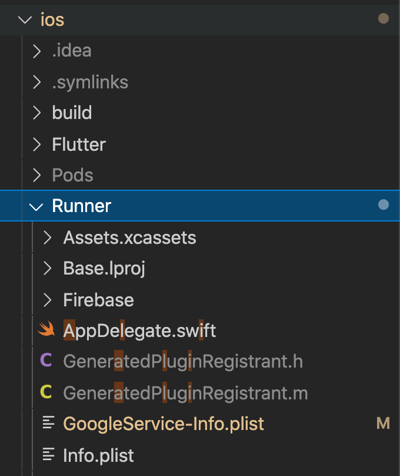
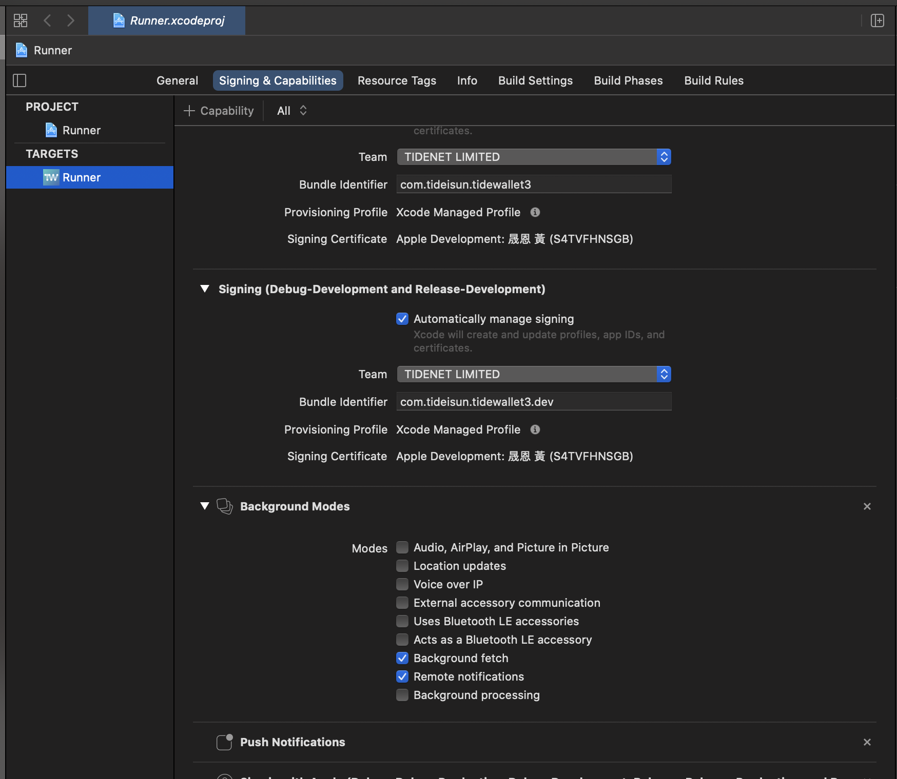
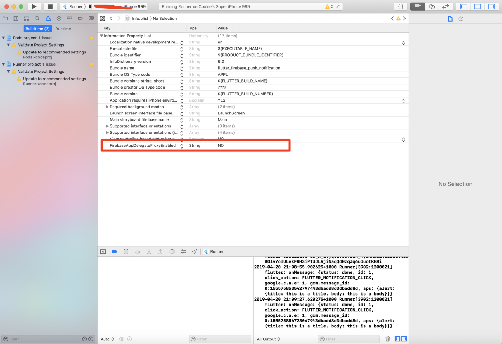

# Flutter FCM
> [firebase_messaging](https://pub.dev/packages/firebase_messaging)

- [iOS配置](#iOS)
- [Android配置](#Android)
- [Flutter Code](#Flutter)

### iOS
#### Setup
1. 創建 Firebase 專案
2. GoogleService-Info.plist 放到 Runner (通常情況)
    
3. 上傳 APNs
    - https://developer.apple.com -> Certificates, Identifiers & Profiles -> Keys -> (+ 按鈕) -> Apple Push Notifications service (APNs) 打勾 -> 下載 .p8 檔
    - https://console.firebase.google.com -> 專案設定 -> 雲端通訊 -> iOS 應用程式設定
4. XCode -> Runner -> Signing & Capability -> 新增 `Push Notifications` 和 `Background Modes` (有兩個選項要打勾)
    
5. 配置 info.plist
    


### Android
#### Setup
1. 創建 Firebase 專案
2. google-services.json 放到 android/app (通常情況)
3. android/app/src/main/AndroidManifest.xml 新增
    ```xml
        <intent-filter>
            <action android:name="FLUTTER_NOTIFICATION_CLICK" />
            <category android:name="android.intent.category.DEFAULT" />
        </intent-filter>
    ```
4. android/build.gradle
    ```xml
        buildscript {
            dependencies {
                // ... other dependencies
                classpath 'com.google.gms:google-services:4.3.3' // 新增這一行 版本找最新的
            }
        }
    ```
5. android/app/build.gradle
    ```
        apply plugin: 'com.android.application'
        apply plugin: 'com.google.gms.google-services'   // 新增這一行

    ```

### Flutter
```
// 待補
```
- ref:
    - https://medium.com/@jun.chenying/flutter-tutorial-part3-push-notification-with-firebase-cloud-messaging-fcm-2fbdd84d3a5e