# Flutter Flavor

#### 原因

- 分開後端服務或第三方服務資料
- debug, release 版不能滿足需求，測試環境也需要用 release 版 APP 測試

### vscode

.vscode/launch.json

```json
{
  "configurations": [
    // ... 其他設定
    {
      "name": "TideWallet3",
      "request": "launch",
      "type": "dart"
    },
    // 新增 Development
    {
      "name": "Development",
      "request": "launch",
      "type": "dart",
      "program": "lib/main.dart",
      "args": ["--flavor", "development"]
    },
    // 新增 Production
    {
      "name": "Production",
      "request": "launch",
      "type": "dart",
      "program": "lib/main.dart",
      "args": ["--flavor", "production"]
    }
  ]
}
```

### iOS

1.  新增 xcconfig

    - 點擊 Runner > Flutter > 要複製的檔案
      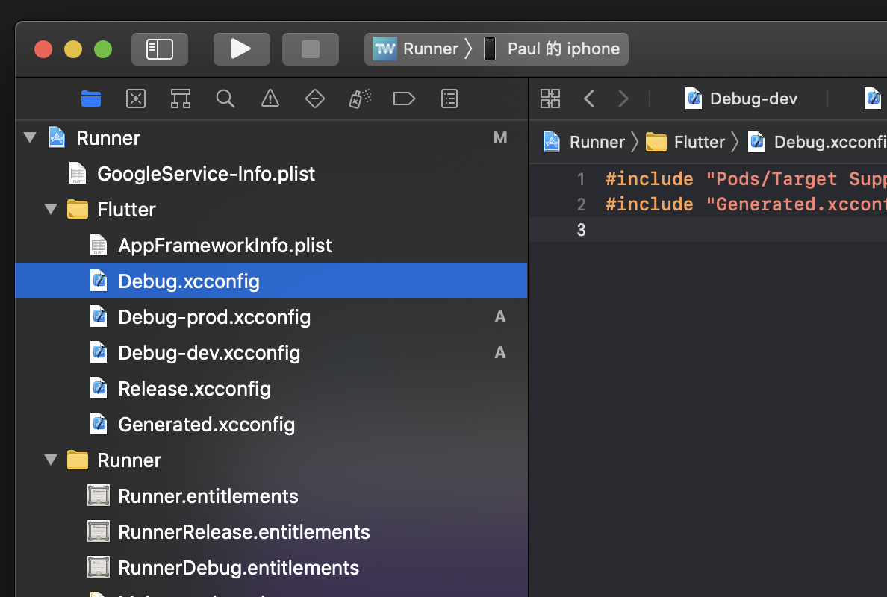

    - File > Duplicate
      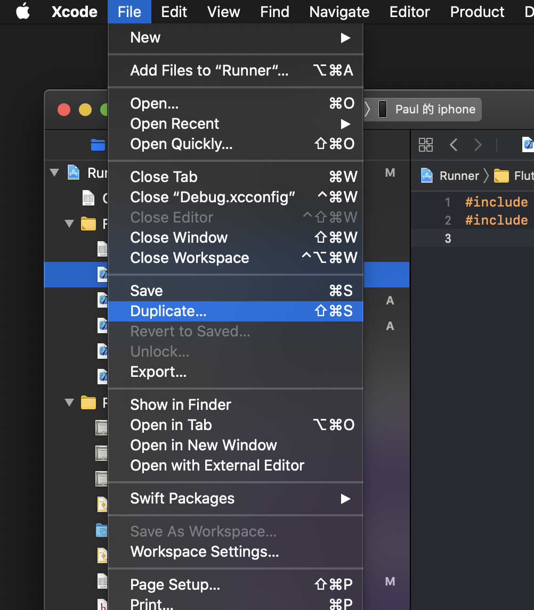

    - 修改名稱， `Targets |Runner|` 要勾
      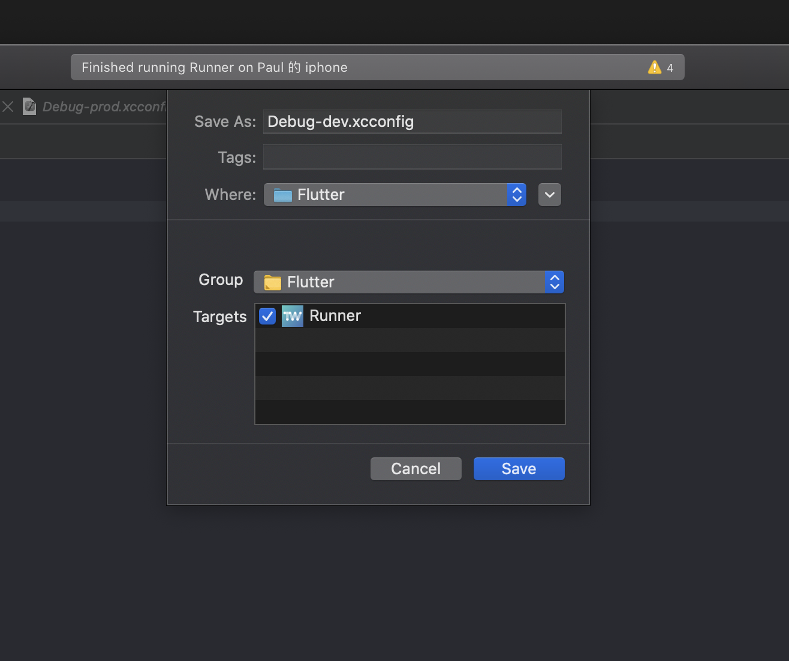

    - 修改 xcconfig 內容 e.g

      ```json
      #include "Pods/Target Support Files/Pods-Runner/Pods-Runner.debug.xcconfig"
      #include "Generated.xcconfig"

      FLUTTER_TARGET=lib/main.dart // main 進入點，根據需求可改
      bundle_suffix=.dev // 用於分辨是不同 app
      app_display_name=TideWallet 3 DEV // App 名稱
      ```

    * 此步驟重複完成後
      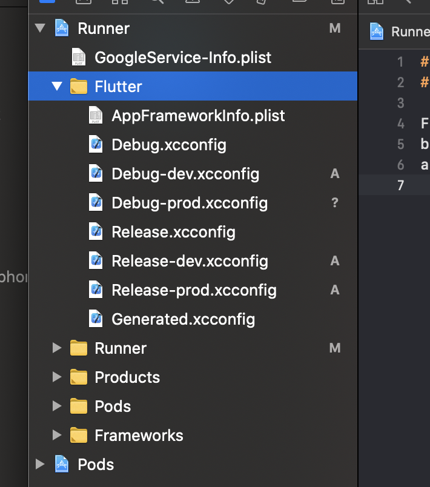

    * [可能遇到的問題](#Flavor%20iOS)

2.  新增 configurations

- 複製 configuration 並修改名稱
  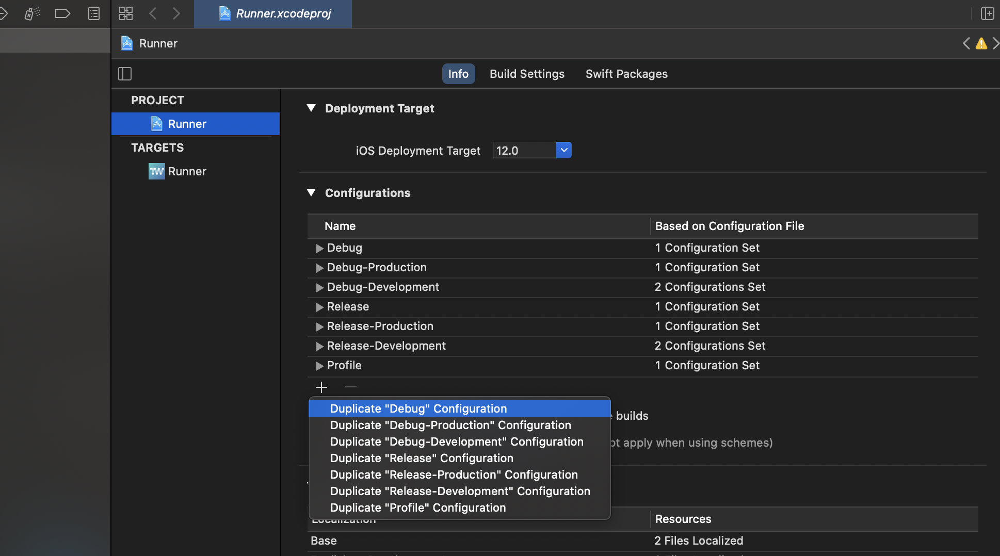
- 修改 Runner 使用的 xcconfig
  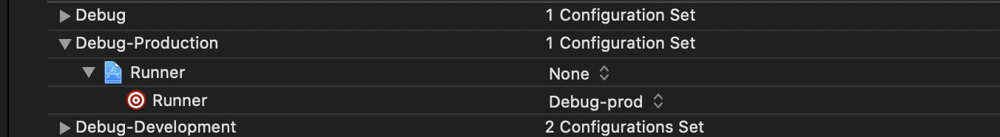

3. 更新 scheme

- 新增 Development, Production scheme
  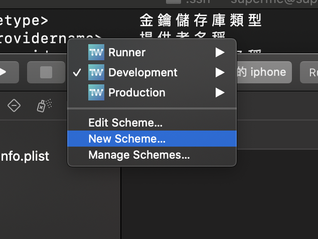
  
- 更新 scheme 用的 configuration
  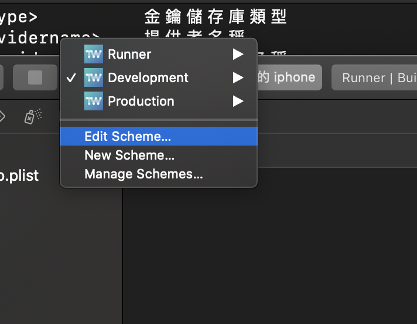
  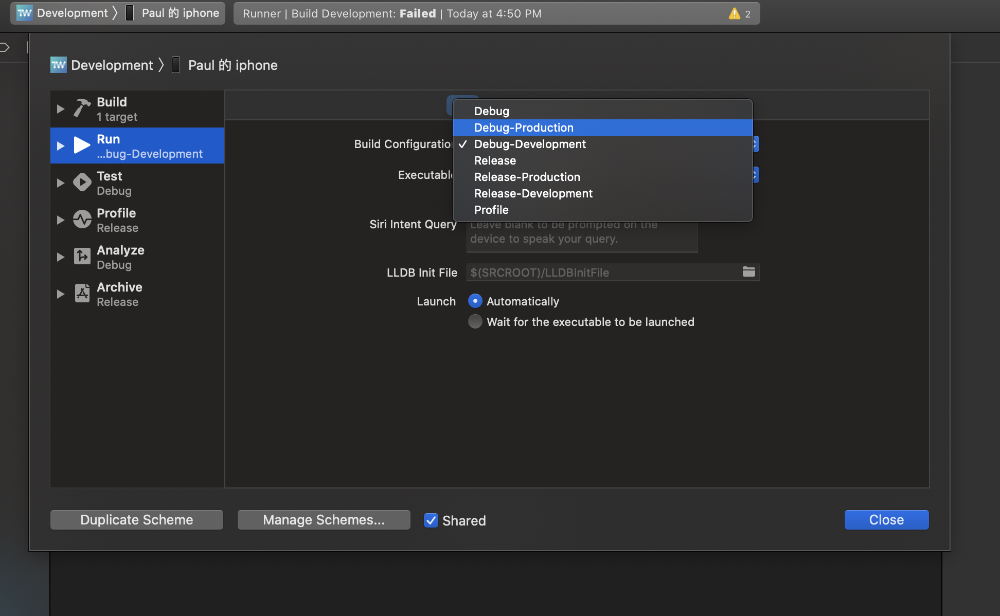

### Android

1. 開啟 Android studio 專案
   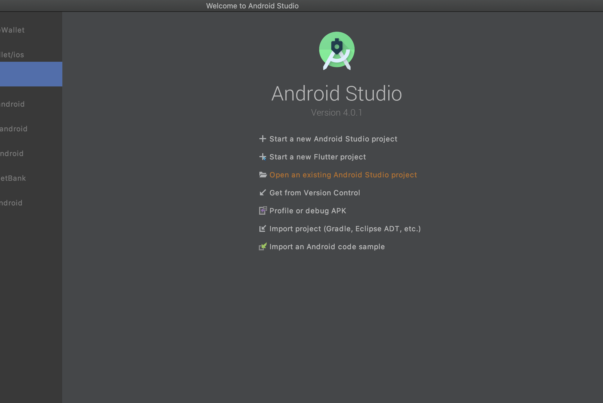
2. 編輯 configuration
   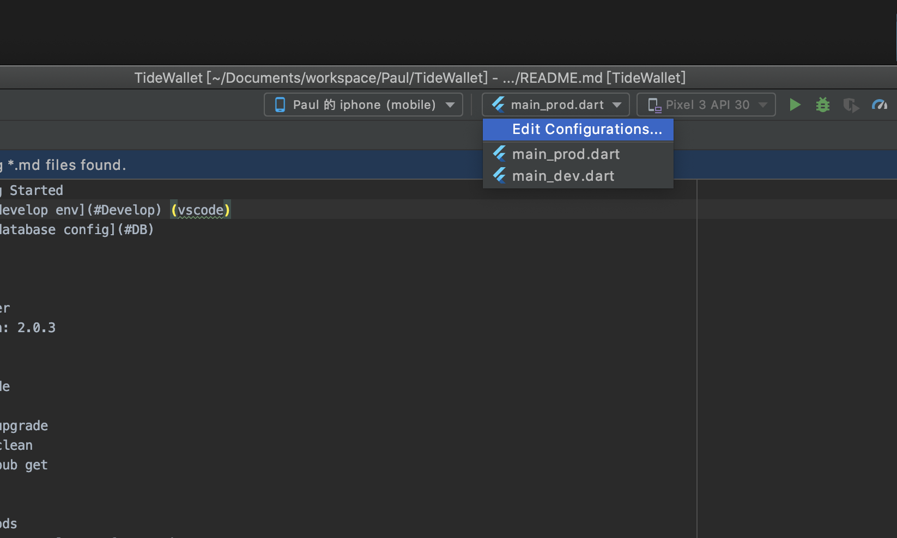
3. 配置 Flavor
   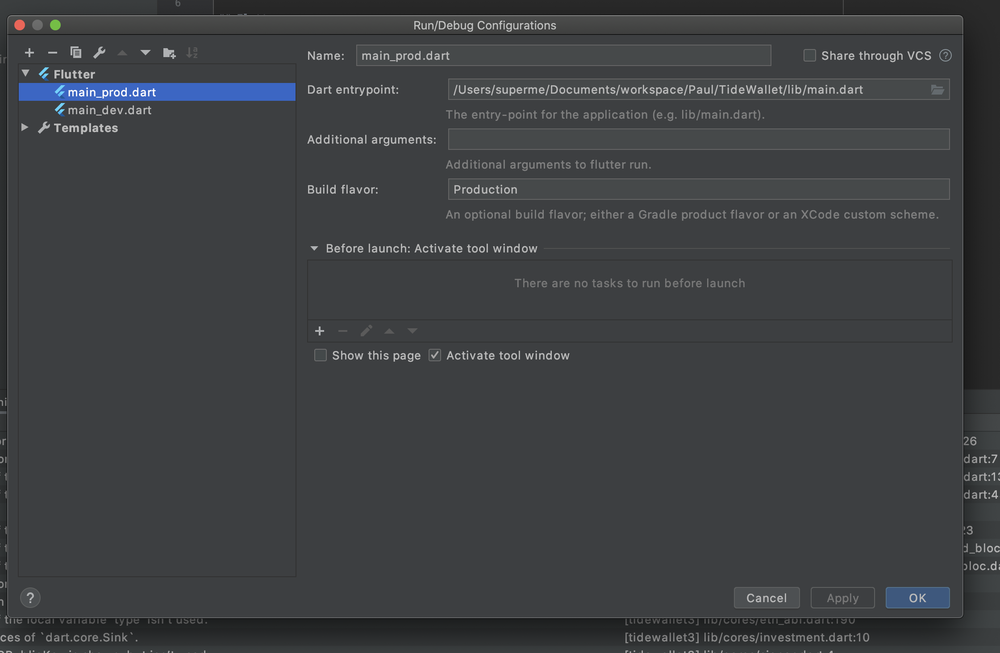
4. 配置不同 App Name (optional)

- `android/app/build.gradle`

  ```gradle
    android {
      // ...
        buildTypes {
          // ...
        }


      flavorDimensions "flavor-type"

      productFlavors {
          development {
              dimension "flavor-type"
              applicationIdSuffix ".dev"
              resValue "string", "app_name", "TideWallet 3 DEV"
          }
          production {
              dimension "flavor-type"
              resValue "string", "app_name", "TideWallet"
          }
      }
    }
  ```

- `android/app/src/main/AndroidManifest.xml`

  ```xml
    // ...
    <application
      android:name=".Application"
      android:label="@string/app_name"

    // ...
  ```

### Bonus

**_FCM_**

#### Android

- 將設定檔個別放到路徑
  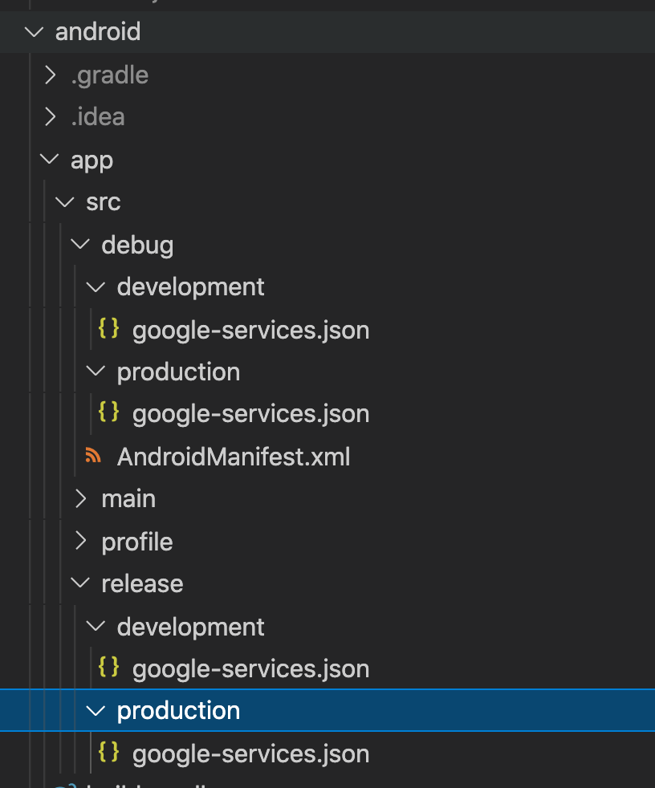

#### iOS

1. 創建 ios/Runner/Firebase/Development(Production) 資料夾，並放入 FCM 設定
   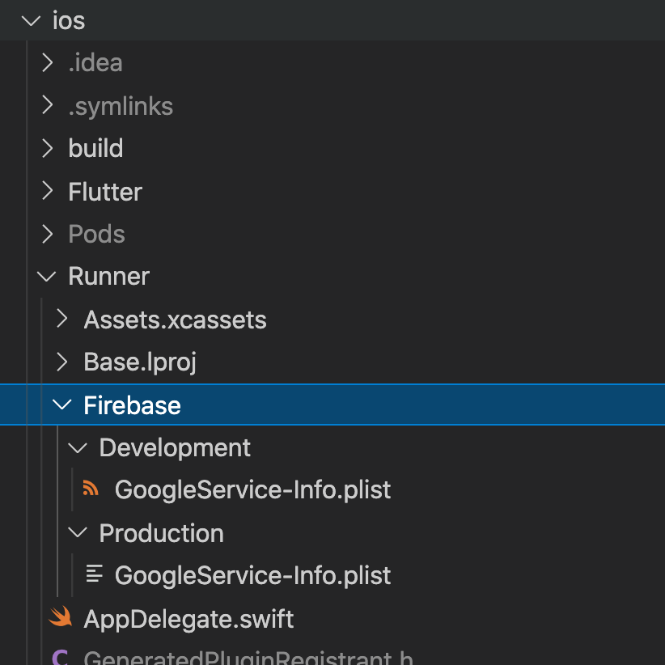

2. 新增 pre-build script

- 點擊 Targets > Runner --> `Build Phrases`
  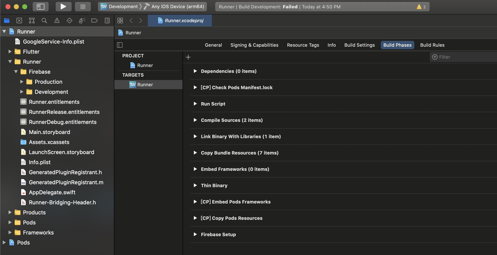
- 新增 Run Script
  
- 修改名稱和 Script

  ```sh
    # Type a script or drag a script file from your workspace to insert its path.
    exec > ${PROJECT_DIR}/prebuild.log 2>&1
    echo "${CONFIGURATION}"

    if [ "${CONFIGURATION}" == "Debug-Development" ] || [ "${CONFIGURATION}" == "Release-Development" ] || [ "${CONFIGURATION}" == "Debug" ]; then
    cp -r "${PROJECT_DIR}/Runner/Firebase/Development/GoogleService-Info.plist" "${PROJECT_DIR}/Runner/GoogleService-Info.plist"
    echo "Development plist copied"
    elif [ "${CONFIGURATION}" == "Debug-Production" ] || [ "${CONFIGURATION}" == "Release-Production" ] || [ "${CONFIGURATION}" == "Release" ]; then
    cp -r "${PROJECT_DIR}/Runner/Firebase/Production/GoogleService-Info.plist" "${PROJECT_DIR}/Runner/GoogleService-Info.plist"
      echo "Production plist copied"
      fi

  ```
  

### Issues

#### Flavor iOS

- `Unable to find included file "Generated.xcconfig"`
  - 方法一：
    1. 關掉 Xcode
    2. flutter clean && flutter pub get && cd ios/ && pod install
  - 方法二：砍掉有問題的 xcconfig，重新建就好了

### Ref:

[https://ashok-b.medium.com/flutter-flavors-multiple-environment-setup-with-firebase-eb45f10e4014](https://ashok-b.medium.com/flutter-flavors-multiple-environment-setup-with-firebase-eb45f10e4014)
