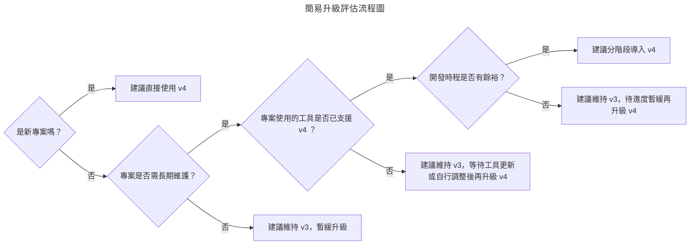

#  Tailwind CSS v4 update

- [前言](#前言)
- [重大變更總覽](#重大變更總覽)
  - [✏️重大變更對照表](#重大變更對照表)
  - [Breaking Changes](#breaking-changes)
  - [新功能與改進](#新功能與改進)
- [升級流程](#升級流程)
- [常見相容性問題](#常見相容性問題)
- [升級必要性評估](#升級必要性評估)

## 前言
### 版本定位
2025 年 1 月，Tailwind CSS 釋出了 v4.0 版本，這並非小幅更新，而是一次**核心重構**。隨著 Tailwind CSS 的普及，v3 架構在效能與擴展性上逐漸顯現限制。而 v4 的推出，正是針對這些問題進行重構，確保框架能在未來持續演進。

為了幫助開發者快速上手 Tailwind CSS v4，本文將帶你理解其核心變化，並提供升級方法與說明，協助你在最短時間內完成遷移，或評估是否需要立即升級。

### 文件閱讀對象
- **Tailwind v3 使用者**：想快速了解 v4 的更新項目，並評估是否有立即升級的必要。
- **新專案開發者**：不熟悉 Tailwind，對 v3 和 v4 的差異不太了解。
- **架構師 / 技術決策者**：需要掌握 v4 帶來的性能、瀏覽器支援範圍與長期發展方向。

## 重大變更總覽
### 重大變更對照表
| 項目 | v3 | v4 |
| --- | --- | --- |
| **安裝方式** | 需搭配 PostCSS、Autoprefixer 等依賴項目 | 不再依賴 PostCSS 和 Autoprefixer |
| **配置檔** | 必須使用 `tailwind.config.js` 作為配置檔 | 可選。仍支援 config 檔，但大部分自訂可直接在 CSS 中完成 |
| **編譯性能** | v3 JIT 編譯已啟用，但仍有較高記憶體占用 | 編譯引擎完全重寫，增量重建速度大幅提升，記憶體占用更低 |
| **CSS 配置** | Design token 和主題必須在 config 檔定義 | 可直接在匯入的 CSS 檔透過 `@theme` 等指令定義 |
| **瀏覽器要求** | 與舊版瀏覽器相容性較好 | 聚焦於現代瀏覽器，目標是 Safari 16.4, Chrome 111 和 Firefox 128 |
| **擴展性** | 透過 PostCSS + plugin 擴展，型別支援有限 | 移除 PostCSS 依賴，擴展方式更簡化，支援更完整的 arbitrary values ，並提供更佳的型別推斷與 IDE 支援 |

### Breaking Changes
以下為 Tailwind v4 的重大變更，這些都是會讓舊版配置/語法無法正常運作的更新，開發者須多加注意。

#### 瀏覽器要求變更

Tailwind CSS v4 是專為現代瀏覽器設計，依賴如 `@property` 和 `color-mix()` 的現代 CSS 功能，因此 Tailwind CSS v4 無法在舊版瀏覽器中運作。

所以如果需要支援 **Safari 16.4, Chrome 111 和 Firefox 128** 以下的瀏覽器，最好使用 v3，以免相容性問題影響到開發進程。

#### 移除 @tailwind 指令

在 v3 使用的 `@tailwind` 指令已不存在於 v4，而是改用  `@import` 指令將 Tailwind 匯入 CSS。

```css
/* v3 */
@tailwind base;
@tailwind components;
@tailwind utilities;

/* v4 */
@import "tailwindcss";
```

#### 容器配置移除

在 v3 中，`container` 是一個內建的工具類別（utility），常用在頁面佈局的最外層，讓內容在不同斷點下保持一致的寬度。但在 v4 已移除。

如果在 v4 中有自訂 `container` 的需求 ，可透過以下方式替代：

- 使用現有 utilities，如：`mx-auto px-4 max-w-screen-lg`
- 使用 `@utility` 指令擴展，自訂樣式：

```css
@utility container {
  margin-inline: auto;
  padding-inline: 2rem;
}
```

#### Arbitrary Values 語法更新

開發者可以直接輸入任意值（arbitrary values）作為 CSS 變數，v3 中使用的是中括號（`[]`），v4 則是改為括號（`()`）。此語法變動是為了避免任意值與 CSS 變數、函數混淆。

```html
<!-- v3 -->
<div class="bg-[--brand-color]"></div>
<div class="bg-[color-mix(in srgb, red, blue)]"></div>

<!-- v4 -->
<div class="bg-(--brand-color)"></div>
<div class="bg-(color-mix(in srgb, red, blue))"></div>
```

#### 不再支援 `corePlugins`、`safelist`、`separator`

這些在 v3 常見的 JS config 選項在 v4 已被移除。

- `corePlugins` → 不再能停用內建工具類別，只能透過 `@utility` 或自訂 CSS 來達成。
- `safelist` → 請改用 `@source inline()`。
- `separator` → 不再提供自訂分隔符。

#### 不再自動讀取 `tailwind.config.js`

在 v3 中，Tailwind 會自動找到並讀取根目錄的 `tailwind.config.js` 。

在 v4 中，Tailwind 仍支援 JS config，但不會自動讀取。如果需要使用，必須在 CSS 中用 `@config` 顯式載入：

```css
@config "../../tailwind.config.js";
```

#### 不支援 CSS 前處理器

由於 Tailwind v4 將自身定位為 CSS 前處理器，因此官方選擇不再支援外部 **Sass、Less、Stylus** 等工具。

`.scss` / `.less` / `.styl` 以及 Vue、Svelte、Astro 框架中的 `<style lang="scss">` 都會失效。必須改回原生 CSS 。

### 新功能與改進
除了重大變更之外，Tailwind CSS v4 也帶來了一系列的新功能與改進，讓開發者能更快速靈活地使用框架。

#### 編譯效能提升

編譯引擎已全面翻新：

- 完整構建（Full builds）可快達 **數倍。**
- 增量構建（Incremental builds）幾乎即時。
- 記憶體占用顯著降低。

#### 自動內容偵測

不須再設定 content paths，Tailwind v4 會自動掃描專案檔案以生成對應的樣式。

#### CSS-First 配置模式

從以 JS 配置為主導的方式，轉向以 CSS 配置為主的模式，開發者可以透過 `@theme`、`@custom-variant` 等指令，直接在 CSS 中匯入所有自訂項，不須額外建立 `tailwind.config.js` 檔案。

```css
@theme {
  --color-brand: #1DA1F2;
  --spacing-72: 18rem;
}
```

`tailwind.config.js` 仍可使用，但需用 `@config` 指令載入。

#### Container Queries 支援

原生支援 CSS Container Queries，不需要額外插件即可針對父容器大小調整樣式，補充傳統以 viewport 為基準的響應式設計。

```html
<div class="@container">
  <div class="grid grid-cols-1 @sm:grid-cols-3 @lg:grid-cols-4">
    <!-- ... -->
  </div>
</div>
```

#### 樣式工具升級

- **漸層功能增強**：新增支援 **radial** 與 **conic** gradients，並加強梯度插值模式。

```html
<!-- 線性漸層支援旋轉角度 -->
<div class="bg-linear-45 from-indigo-500 via-purple-500 to-pink-500"></div>

<!-- radial 與 conic gradients -->
<div class="bg-radial-[at_25%_25%] from-white to-zinc-900 to-75%"></div>
<div class="bg-conic/[in_hsl_longer_hue] from-red-600 to-red-600"></div>

<!-- 透過修飾符套用 sRGB 或 OKLCH 等色彩空間 -->
<div class="bg-linear-to-r/srgb from-indigo-500 to-teal-400">...</div>
<div class="bg-linear-to-r/oklch from-indigo-500 to-teal-400">...</div>

```

- **3D 變形支援**：可直接透過 class 實現 3D 旋轉、位移等效果。

```html
<div class="size-20 transform-3d ...">
  <div class="translate-z-12 rotate-x-0 bg-sky-300/75 ...">1</div>
  <div class="-translate-z-12 rotate-y-18 bg-sky-300/75 ...">2</div>
  <div class="translate-x-12 rotate-y-90 bg-sky-300/75 ...">3</div>
  <div class="-translate-x-12 -rotate-y-90 bg-sky-300/75 ...">4</div>
  <div class="-translate-y-12 rotate-x-90 bg-sky-300/75 ...">5</div>
  <div class="translate-y-12 -rotate-x-90 bg-sky-300/75 ...">6</div>
</div>
```

- **Variants 擴充**：包含 `@starting-style`（配合 CSS transitions）、`not-*` variant 等新選項，讓樣式條件更靈活。

```html
<!-- @starting-style -->
<div>
  <button popovertarget="my-popover">Check for updates</button>
  <div popover id="my-popover" class="opacity-0 starting:open:opacity-0 ...">
    <!-- ... -->
  </div>
</div>

<!-- not 選擇器 -->
<button class="bg-indigo-600 hover:not-focus:bg-indigo-700">
  Click
</button>
```

#### 插件系統更新

- 移除 PostCSS 依賴，插件更輕量
- 可直接擴展 utilities / directives
- 型別支援提升，更友善於 TypeScript / IDE

## 升級流程
### 前置需求

- **Node.js 版本**：Node.js 20 或更高。
- **升級工具**：官方提供的 `@tailwindcss/upgrade` ，能自動處理從 v3 到 v4 的升級工作。

### 升級說明

建議在新分支執行升級工具：

```bash
npx @tailwindcss/upgrade
```

#### 升級工具會自動處理的項目

- **✅ 套件安裝 / 相依更新**：升級工具將自動安裝必要套件（如 `@tailwindcss/postcss`、`@tailwindcss/vite`、`@tailwindcss/cli`），並移除不再需要的 `postcss` / `autoprefixer`。
- **✅ 配置檔調整**：自動轉換 `tailwind.config.js` 為 v4 支援的格式，並移除大部分已廢棄選項。
- **✅ 核心匯入**：自動將 globals.css 中的 `@tailwind` 改為 `@import` 。

#### 需要人工修改的項目

- **✍️ 移除 `.container`**：工具不會轉換 container 替代方式，須由人工改成 `max-w-*`、`mx-auto` 或自訂 utility。
- **✍️ Arbitrary values 語法變更**：部分語法的中括號 `[]` 改為括號 `()`，須透過人工搜尋並修改。
- **✍️ 移除 CSS 前處理器**：工具不會自動修改 `<style lang="scss">`，須手動改為純 CSS `<style>`。

## 常見相容性問題
### 與第三方 Tailwind plugin 的相容性
#### daisyUI
- 與 v4 已相容（需升級到最新版本），但若使用到自訂 theme token，可能需要改寫成 v4 的 `@theme` 格式。
- 建議：升級 daisyUI 至最新，並檢查是否有 theme config 警告。

#### eslint-plugin-tailwindcss

- Tailwind CSS v4 推出後，eslint-plugin-tailwindcss 仍在持續更新，目前已**部分支援 v4 規則**（例如 `bg-(...)`），詳細規則請見 [npmjs](https://www.npmjs.com/package/eslint-plugin-tailwindcss)。
- 建議：確保 `eslint-plugin-tailwindcss` 更新至最新版本，以獲得 v4 的部分支援；若專案規模較大，請先評估 lint 規則對專案的影響，在考慮是否升級 Tailwind 至 v4 版本。

#### 其他 community plugin

- v4 移除 PostCSS 相依，因此任何依賴 PostCSS API 的第三方 plugin 都需要更新。
- 建議：查看該 plugin 的 issue / release notes，若尚未支援 v4，考慮暫時停用或自行 fork 調整。

### 與常見框架的整合

#### Next.js

- v4 不再需要 `postcss.config.js` 中的舊 plugin。
- 建議：移除 `tailwindcss`、`autoprefixer` 設定，僅保留 `@tailwindcss/postcss`。

#### React / CRA

- CRA 預設打包流程與 v4 的新架構不完全相容，若不想自行維護繁瑣的設定，建議考慮遷移到 Vite 或 Next.js。

#### Vue / Svelte / Astro

- `<style lang="scss">` 已不支援 Tailwind，若專案依賴 Sass，需要手動改為 `<style>` 純 CSS。
- Astro：若使用 `@astrojs/tailwind`，需要更新至支援 v4 的版本。

### 升級後常見坑與解法

#### 版本問題

- 若 Node.js 版本低於 20，升級時可能報錯。
- 解法：確認 Node.js 已升級至 v20 以上。

#### 樣式失效

- 升級後部分 class 名稱可能因 arbitrary values 語法錯誤 (`[]` → `()`) 而無效。
- 解法：全域搜尋 `[--`、`[color-` 等 pattern，逐一改為新語法。

#### config 未生效

- 忘記在 CSS 中加入 `@config` 指令，導致自訂設定無法讀取。
- 解法：在 `globals.css` 或專案入口 CSS 裡明確載入：
    
    ```css
    @config "./tailwind.config.js";
    ```
    

#### Prettier / ESLint 衝突

- 舊版 Prettier plugin 可能無法解析 v4 語法（特別是 `bg-(...)`）。
- 解法：更新 `prettier-plugin-tailwindcss` 與 `eslint-plugin-tailwindcss` 至最新。

## 升級必要性評估

Tailwind CSS v4 帶來全新的編譯器與更簡化的配置方式，能顯著提升開發體驗。但是否要立即升級，仍需依專案情境評估。以下從**專案生命周期、工具鏈相容性、升級成本、升級效益**四個角度切入。

### 專案生命周期

#### 新專案

建議**可直接採用 v4**，配置更簡單、效能更好、確保長期支援，也避免日後再進行大規模遷移。

#### 活躍維護的專案

若專案需長期維護，建議**規劃升級**，避免 v3 在未來失去更新與社群支援。

#### 封存或短期專案

**無需強制升級**。若系統已穩定且無新功能需求，維持 v3 即可，避免升級帶來額外風險。

### 工具鏈相容性

#### 已支援 v4 的工具

Next.js、Vite、Astro 等現代框架，以及官方 plugin（forms、typography、aspect-ratio）已更新相容，升級阻力小，可**規劃升級**。

#### 相容性未完整的工具

- `eslint-plugin-tailwindcss`：仍在持續更新，部分 v4 語法支援不完整。
- 部分社群 plugin：若依賴 PostCSS API，可能無法使用，需要等待更新或自行調整。

### 升級成本

#### 工具支援

官方提供的 `@tailwindcss/upgrade` 可自動完成大部分套件與配置更新。

#### 人工修改

如 `.container` 移除、arbitrary values 語法、CSS 前處理器棄用等，需要手動修改。若專案龐大，可能需消耗大量人力成本。

#### 團隊影響

需調整 lint / Prettier 設定，CI/CD pipeline 也可能需要更新。對團隊的 coding style 可能有較大影響。

### 升級效益

#### 效能

全新編譯器讓完整構建與增量構建速度大幅提升，尤其在大型專案中表現更為明顯。

#### 開發體驗

配置更簡潔，熱重載更快，錯誤訊息更清楚，開發流程更順暢。

#### 未來性

Tailwind 官方預期新功能（variants、container queries、CSS-first 配置）都只會在 v4 演進，v3 最終將逐步淡出支援。



### 參考資料

- [Tailwind CSS - Tailwind CSS v4.0](https://tailwindcss.com/blog/tailwindcss-v4)
- [Tailwind CSS - Upgrade guide](https://tailwindcss.com/docs/upgrade-guide)
- [Tailwind CSS - Compatibility](https://tailwindcss.com/docs/compatibility?utm_source=chatgpt.com)
- [npmjs - eslint-plugin-tailwindcss](https://www.npmjs.com/package/eslint-plugin-tailwindcss)
- [[獨自升級] TailwindCSS v4.1 - 安裝與介紹](https://summer10920.github.io/2025/08-21/tailwindcss-4.1-learn/)
