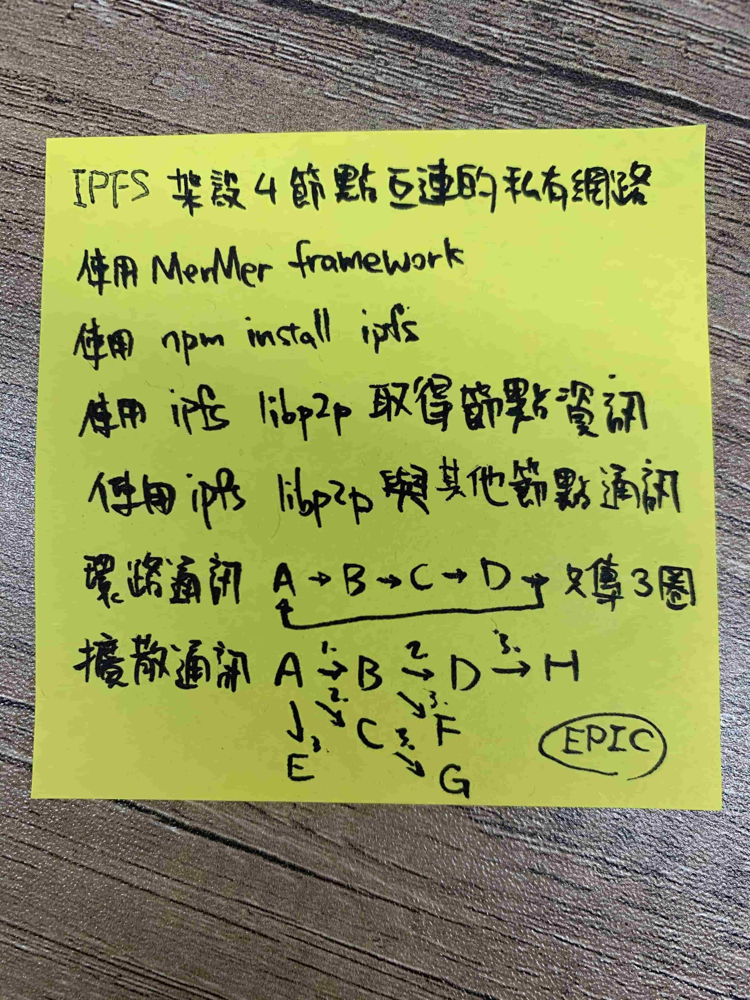

# libp2p 搭建私有 ipfs 網路

## 目標



- 建立私有網路與其他節點通訊
  - ⭕️ 單機版本實驗
  - ❌ 多機版本實驗(遇到 node 2, node 3 之間資料讀不到)
- ❌ 實作環狀通訊 protocol
- ❌ 實作擴散通訊 protocol


## 建立私有網路與其他節點通訊

[搭建 IPFS](./IPFS-Install.md) - 建立私有 IPFS 網路 中，建立三個節點，其中 節點2 跟 節點3 都只連向 節點1，然後在 節點2 上傳檔案，在 節點3 應該要可以存取

### libp2p 實作單機實驗版本

在 [js-libp2p](https://github.com/libp2p/js-libp2p) 專案中有關於 (Private Networking with IPFS) 的 example，但在後面的 PR([refactor: examples/pnet #523](https://github.com/libp2p/js-libp2p/pull/523)) 已經將 ipfs 拔除，只單存依靠 libp2p 來實現私有網路

下面範例已修改前的版本改寫

`package.json`

```json
{
  "name": "pnet-ipfs-example",
  "version": "1.0.0",
  "description": "An example of private networking with IPFS",
  "main": "index.js",
  "scripts": {
    "test": "echo \"Error: no test specified\" && exit 1",
    "start": "node index.js"
  },
  "keywords": [],
  "author": "",
  "license": "ISC",
  "dependencies": {
    "ipfs": "^0.40.0",
    "libp2p": "^0.26.2",
    "libp2p-mplex": "^0.8.5",
    "libp2p-secio": "^0.11.1",
    "libp2p-tcp": "^0.13.2"
  }
}
```

`utils.js`

```javascript
'use strict'
const fs = require('fs')
const path = require('path')

/**
 * mkdirp recursively creates needed folders for the given dir path
 * @param {string} dir
 * @returns {string} The path that was created
 */
module.exports.mkdirp = (dir) => {
  return path
    .resolve(dir)
    .split(path.sep)
    .reduce((acc, cur) => {
      const currentPath = path.normalize(acc + path.sep + cur)

      try {
        fs.statSync(currentPath)
      } catch (e) {
        if (e.code === 'ENOENT') {
          fs.mkdirSync(currentPath)
        } else {
          throw e
        }
      }
      return currentPath
    }, '')
}
```

`libp2p-bundle.js`

```javascript
'use strict'

const Libp2p = require('libp2p')
const TCP = require('libp2p-tcp')
const MPLEX = require('libp2p-mplex')
const SECIO = require('libp2p-secio')
const fs = require('fs')
const Protector = require('libp2p/src/pnet')

/**
 * Options for the libp2p bundle
 * @typedef {Object} libp2pBundle~options
 * @property {PeerInfo} peerInfo - The PeerInfo of the IPFS node
 * @property {PeerBook} peerBook - The PeerBook of the IPFS node
 * @property {Object} config - The config of the IPFS node
 * @property {Object} options - The options given to the IPFS node
 */

/**
 * privateLibp2pBundle returns a libp2p bundle function that will use the swarm
 * key at the given `swarmKeyPath` to create the Protector
 *
 * @param {string} swarmKeyPath The path to our swarm key
 * @returns {libp2pBundle} Returns a libp2pBundle function for use in IPFS creation
 */
const privateLibp2pBundle = (swarmKeyPath) => {
  /**
   * This is the bundle we will use to create our fully customized libp2p bundle.
   *
   * @param {libp2pBundle~options} opts The options to use when generating the libp2p node
   * @returns {Libp2p} Our new libp2p node
   */
  const libp2pBundle = (opts) => {
    // Set convenience variables to clearly showcase some of the useful things that are available
    const peerInfo = opts.peerInfo
    const peerBook = opts.peerBook

    // Build and return our libp2p node
    return new Libp2p({
      peerInfo,
      peerBook,
      modules: {
        transport: [TCP], // We're only using the TCP transport for this example
        streamMuxer: [MPLEX], // We're only using mplex muxing
        // Let's make sure to use identifying crypto in our pnet since the protector doesn't
        // care about node identity, and only the presence of private keys
        connEncryption: [SECIO],
        // Leave peer discovery empty, we don't want to find peers. We could omit the property, but it's
        // being left in for explicit readability.
        // We should explicitly dial pnet peers, or use a custom discovery service for finding nodes in our pnet
        peerDiscovery: [],
        connProtector: new Protector(fs.readFileSync(swarmKeyPath))
      }
    })
  }

  return libp2pBundle
}

module.exports = privateLibp2pBundle
```

`index.js`

```javascript
/* eslint no-console: ["off"] */
'use strict'

const IPFS = require('ipfs')
const assert = require('assert').strict
const { generate: writeKey } = require('libp2p/src/pnet')
const path = require('path')
const fs = require('fs')
const privateLibp2pBundle = require('./libp2p-bundle')
const { mkdirp } = require('./utils')

// Create two separate repo paths so we can run two nodes and check their output
const repo1 = path.resolve('./tmp', 'repo1', '.ipfs')
const repo2 = path.resolve('./tmp', 'repo2', '.ipfs')
const repo3 = path.resolve('./tmp', 'repo3', '.ipfs')
mkdirp(repo1)
mkdirp(repo2)
mkdirp(repo3)

// Create a buffer and write the swarm key to it
const swarmKey = Buffer.alloc(95)
writeKey(swarmKey)

// This key is for the `TASK` mentioned in the writeFileSync calls below
const otherSwarmKey = Buffer.alloc(95)
writeKey(otherSwarmKey)

// Add the swarm key to both repos
const swarmKey1Path = path.resolve(repo1, 'swarm.key')
const swarmKey2Path = path.resolve(repo2, 'swarm.key')
const swarmKey3Path = path.resolve(repo3, 'swarm.key')
fs.writeFileSync(swarmKey1Path, swarmKey)
// TASK: switch the commented out line below so we're using a different key, to see the nodes fail to connect
fs.writeFileSync(swarmKey2Path, swarmKey)
fs.writeFileSync(swarmKey3Path, swarmKey)
// fs.writeFileSync(swarmKey2Path, otherSwarmKey)

// Create the first ipfs node
const node1 = new IPFS({
  repo: repo1,
  libp2p: privateLibp2pBundle(swarmKey1Path),
  config: {
    Addresses: {
      // Set the swarm address so we dont get port collision on the nodes
      Swarm: ['/ip4/0.0.0.0/tcp/9101']
    }
  }
})

// Create the second ipfs node
const node2 = new IPFS({
  repo: repo2,
  libp2p: privateLibp2pBundle(swarmKey2Path),
  config: {
    Addresses: {
      // Set the swarm address so we dont get port collision on the nodes
      Swarm: ['/ip4/0.0.0.0/tcp/9102']
    }
  }
})
const node3 = new IPFS({
  repo: repo3,
  libp2p: privateLibp2pBundle(swarmKey3Path),
  config: {
    Addresses: {
      // Set the swarm address so we dont get port collision on the nodes
      Swarm: ['/ip4/0.0.0.0/tcp/9103']
    }
  }
})

console.log('auto starting the nodes...')

// `nodesStarted` keeps track of how many of our nodes have started
let nodesStarted = 0
/**
 * Calls `connectAndTalk` when both nodes have started
 * @returns {void}
 */
const didStartHandler = () => {
  if (++nodesStarted === 3) {
    // If both nodes are up, start talking
    connectAndTalk()
  }
}

/**
 * Exits the process when all started nodes have stopped
 * @returns {void}
 */
const didStopHandler = () => {
  if (--nodesStarted < 1) {
    console.log('all nodes stopped, exiting.')
    process.exit(0)
  }
}

/**
 * Stops the running nodes
 * @param {Error} err An optional error to log to the console
 * @returns {void}
 */
const doStop = (err) => {
  if (err) {
    console.error(err)
  }

  console.log('Shutting down...')
  node1.stop()
  node2.stop()
  node3.stop()
}

/**
 * Connects the IPFS nodes and transfers data between them
 * @returns {void}
 */
const connectAndTalk = async () => {
  console.log('connecting the nodes...')
  const node2Id = await node2.id()
  const dataToAdd = Buffer.from('Hello, private friend!')

  // Connect the nodes
  // This will error when different private keys are used
  try {
    await node1.swarm.connect(node2Id.addresses[0])
  } catch (err) {
    return doStop(err)
  }
  console.log('the nodes 2 are connected, let\'s add some data')
  const node3Id = await node3.id()
  try {
    await node1.swarm.connect(node3Id.addresses[0])
  } catch (err) {
    return doStop(err)
  }
  console.log('the nodes 3 are connected, let\'s add some data')

  // Add data1 to node 1
  let addedCID
  try {
    addedCID = await node1.add(dataToAdd)
  } catch (err) {
    return doStop(err)
  }
  console.log(`added ${addedCID[0].path} to the node1`)

  // Add data2 to node 2
  const dataToAdd2 = Buffer.from('add file in node2!')
  let addedCID2
  try {
    addedCID2 = await node2.add(dataToAdd2)
  } catch (err) {
    return doStop(err)
  }
  console.log(`added ${addedCID2[0].path} to the node2`)

  // Retrieve data1 from node 2
  let cattedData
  try {
    cattedData = await node2.cat(addedCID[0].path)
  } catch (err) {
    return doStop(err)
  }
  assert.deepEqual(cattedData.toString(), dataToAdd.toString(), 'Should have equal data')
  console.log(`successfully retrieved "${dataToAdd.toString()}" from node2`)

  // Retrieve data2 from node 1
  let cattedData2
  try {
    cattedData2 = await node1.cat(addedCID2[0].path)
  } catch (err) {
    return doStop(err)
  }
  assert.deepEqual(cattedData2.toString(), dataToAdd2.toString(), 'Should have equal data')
  console.log(`node1 successfully retrieved "${dataToAdd2.toString()}" from node2`)

  // Retrieve data2 from node 3
  let cattedData3
  try {
    cattedData3 = await node3.cat(addedCID2[0].path)
  } catch (err) {
    return doStop(err)
  }
  assert.deepEqual(cattedData3.toString(), dataToAdd2.toString(), 'Should have equal data')
  console.log(`node3 successfully retrieved "${dataToAdd2.toString()}" from node2`)

  doStop()
}

// Wait for the nodes to boot
node1.once('start', didStartHandler)
node2.once('start', didStartHandler)
node3.once('start', didStartHandler)

// Listen for the nodes stopping so we can cleanup
node1.once('stop', didStopHandler)
node2.once('stop', didStopHandler)
node3.once('stop', didStopHandler)
```

```
node index.js
```

在單機版實驗中，node2 跟 node3 之間透過 node1 來達到資料的傳遞

### libp2p 實作多機實驗版本

#### 三個節點同樣的檔案

`package.json`

```json
{
  "name": "pnet-ipfs-example",
  "version": "1.0.0",
  "description": "An example of private networking with IPFS",
  "main": "app.js",
  "scripts": {
    "test": "echo \"Error: no test specified\" && exit 1",
    "start": "node app.js"
  },
  "keywords": [],
  "author": "",
  "license": "ISC",
  "dependencies": {
    "ipfs": "^0.40.0",
    "libp2p": "^0.26.2",
    "libp2p-mplex": "^0.8.5",
    "libp2p-secio": "^0.11.1",
    "libp2p-tcp": "^0.13.2"
  }
}
```
 
`IPFS.js`

```javascript
const Libp2p = require('libp2p')
const TCP = require('libp2p-tcp')
const MPLEX = require('libp2p-mplex')
const SECIO = require('libp2p-secio')
const fs = require('fs')
const Protector = require('libp2p/src/pnet')
const PeerInfo = require('peer-info')

/**
 * Options for the libp2p bundle
 * @typedef {Object} libp2pBundle~options
 * @property {PeerInfo} peerInfo - The PeerInfo of the IPFS node
 * @property {PeerBook} peerBook - The PeerBook of the IPFS node
 * @property {Object} config - The config of the IPFS node
 * @property {Object} options - The options given to the IPFS node
 */

/**
 * privateLibp2pBundle returns a libp2p bundle function that will use the swarm
 * key at the given `swarmKeyPath` to create the Protector
 *
 * @param {string} swarmKeyPath The path to our swarm key
 * @returns {libp2pBundle} Returns a libp2pBundle function for use in IPFS creation
 */
const privateLibp2pBundle = (swarmKeyPath) => {
  /**
   * This is the bundle we will use to create our fully customized libp2p bundle.
   *
   * @param {libp2pBundle~options} opts The options to use when generating the libp2p node
   * @returns {Libp2p} Our new libp2p node
   */
  const libp2pBundle = (opts) => {
    // Set convenience variables to clearly showcase some of the useful things that are available
    const peerInfo = opts.peerInfo
    const peerBook = opts.peerBook

    // Build and return our libp2p node
    return new Libp2p({
      peerInfo,
      peerBook,
      modules: {
        transport: [TCP], // We're only using the TCP transport for this example
        streamMuxer: [MPLEX], // We're only using mplex muxing
        // Let's make sure to use identifying crypto in our pnet since the protector doesn't
        // care about node identity, and only the presence of private keys
        connEncryption: [SECIO],
        // Leave peer discovery empty, we don't want to find peers. We could omit the property, but it's
        // being left in for explicit readability.
        // We should explicitly dial pnet peers, or use a custom discovery service for finding nodes in our pnet
        peerDiscovery: [],
        connProtector: new Protector(fs.readFileSync(swarmKeyPath))
      }
    })
  }
  return libp2pBundle
}

module.exports = privateLibp2pBundle
```

`swarm.key`

```
/key/swarm/psk/1.0.0/
/base16/
7eaa83c6a1000837e88add22dc22d59c05675e7baa2cc502b3d20687d15e8d27
```

#### node 1

`app.js`

```javascript
const IPFS = require('ipfs')
const privateLibp2pBundle = require('./IPFS.js');

const swarmKeyPath = './swarm.key'

async function main() {
  try {
	  const PeerInfo = require('peer-info')

    const node = new IPFS({
      libp2p: privateLibp2pBundle(swarmKeyPath)({ peerInfo: await PeerInfo.create() }),
      config: {
        Addresses: {
          // Set the swarm address so we dont get port collision on the nodes
          Swarm: ['/ip4/0.0.0.0/tcp/9101']
        }
      }
    })

    await node.ready

    const bootstraps = await node.bootstrap.list()
	  for(let addr of bootstraps.Peers) {
	  	await node.bootstrap.rm(addr)
	  }

    const dataToAdd = Buffer.from('add file in node1!')
    let addedCID
    try {
      addedCID = await node.add(dataToAdd)
    } catch (err) {
      console.log('err:', err)
    }
    console.log(`added ${addedCID[0].path} to the node1`)

    /*
      // retrieved data from node 2
      setTimeout(async () => {
        let cattedData
        try {
          cattedData = await node.cat('QmYdbCJqKs5uLGNi7JUVw7fQrES4uPmcZopZNT7UvyZ8i6')
        } catch (err) {
          return doStop(err)
        }
        console.log(`successfully retrieved "${cattedData.toString()}" from node2`)
      }, 5000)
    */

  } catch (e) {
    console.log('e:', e);
  }
}

main()
```


#### node 2

`app.js`

```javascript
const IPFS = require('ipfs')
const privateLibp2pBundle = require('./IPFS.js');

const swarmKeyPath = './amd/swarm.key'

async function main() {
  try {
    const node = new IPFS({
      libp2p: privateLibp2pBundle(swarmKeyPath),
      config: {
        Addresses: {
          // Set the swarm address so we dont get port collision on the nodes
          Swarm: ['/ip4/0.0.0.0/tcp/9101']
        }
      }
    })

    await node.ready

    const bootstraps = await node.bootstrap.list()
    for(let addr of bootstraps.Peers) {
      await node.bootstrap.rm(addr)
    }

    await node.swarm.connect('/ip4/192.168.50.4/tcp/9101/ipfs/QmXE9Mw7kqCHHyR1GGN7H2RBxyYo6c1Wbkvr9PguPhgZL3') // connect node 1

    let cattedData
    try {
      cattedData = await node.cat('QmbxREZexEukiXYFRzmdZkuszNKFP7WXCqi1PmTyD29SsD') // cat node 1 data
    } catch (err) {
      return doStop(err)
    }
    console.log(`successfully retrieved "${cattedData.toString()}" from node1`)


    const dataToAdd = Buffer.from('add file in node2  2!')
    let addedCID
    try {
      addedCID = await node.add(dataToAdd)
    } catch (err) {
            console.log('err:', err)
    }
    console.log(`added ${addedCID[0].path} to the node2`)

  } catch (e) {
    console.log('e:', e);
  }
}

main()
```


#### node 3

`app.js`

```javascript
const IPFS = require('ipfs')
const privateLibp2pBundle = require('./IPFS.js');

const swarmKeyPath = './swarm.key'

async function main() {
  try {
    const node = new IPFS({
      libp2p: privateLibp2pBundle(swarmKeyPath),
      config: {
        Addresses: {
          // Set the swarm address so we dont get port collision on the nodes
          Swarm: ['/ip4/0.0.0.0/tcp/9101']
        }
      }
    })

    await node.ready

    const bootstraps = await node.bootstrap.list()
    for(let addr of bootstraps.Peers) {
          await node.bootstrap.rm(addr)
    }

    await node.swarm.connect('/ip4/192.168.50.4/tcp/9101/ipfs/QmXE9Mw7kqCHHyR1GGN7H2RBxyYo6c1Wbkvr9PguPhgZL3') // connect node 1


    const dataToAdd = Buffer.from('add file in node3!')
    let addedCID
    try {
      addedCID = await node.add(dataToAdd)
    } catch (err) {
            console.log('err:', err)
    }
    console.log(`added ${addedCID[0].path} to the node3`)

    let cattedData
    try {
      cattedData = await node.cat('QmYdbCJqKs5uLGNi7JUVw7fQrES4uPmcZopZNT7UvyZ8i6') // cat node 2 data
    } catch (err) {
      return doStop(err)
    }
    console.log(`successfully retrieved "${cattedData.toString()}" from node2`)

  } catch (e) {
    console.log('e:', e);
  }
}

main()
```

在三台機器分別執行，會發現 node 2 的檔案 node 3 讀不到

## 實作環狀通訊 protocol

未實作

## 實作擴散通訊 protocol

未實作
