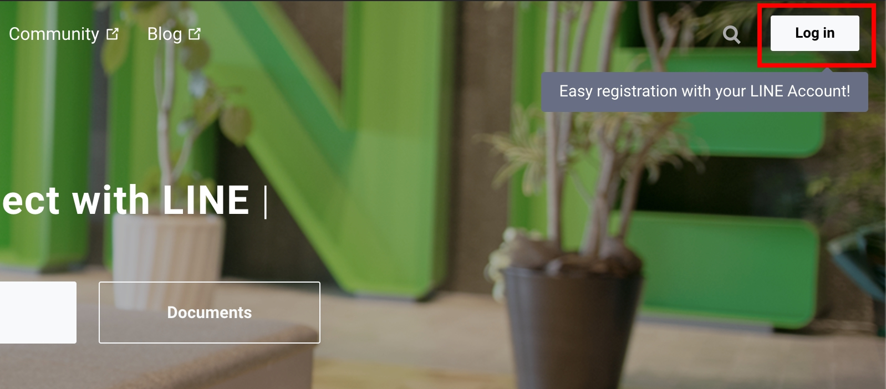
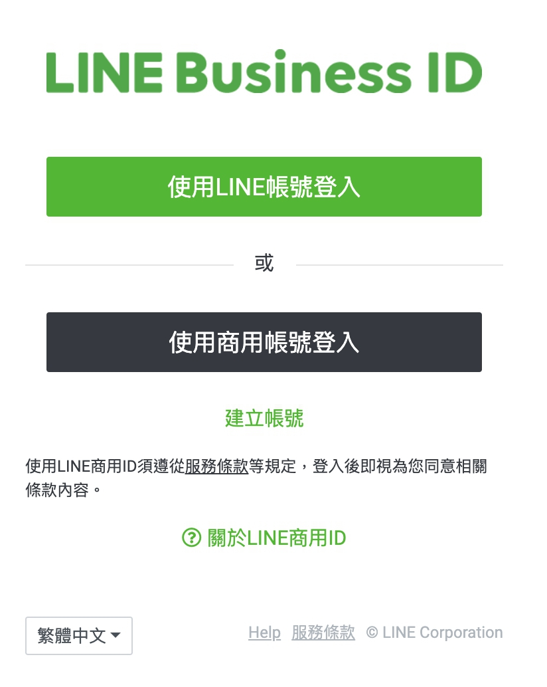
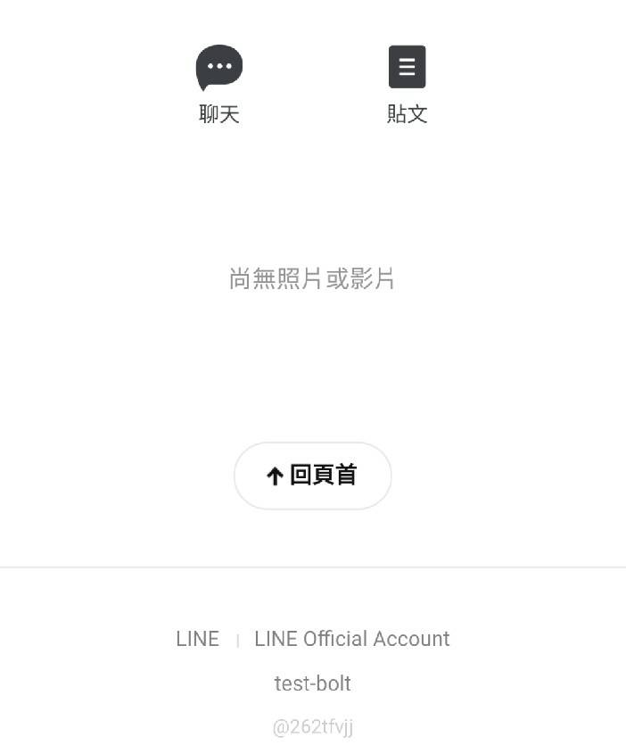
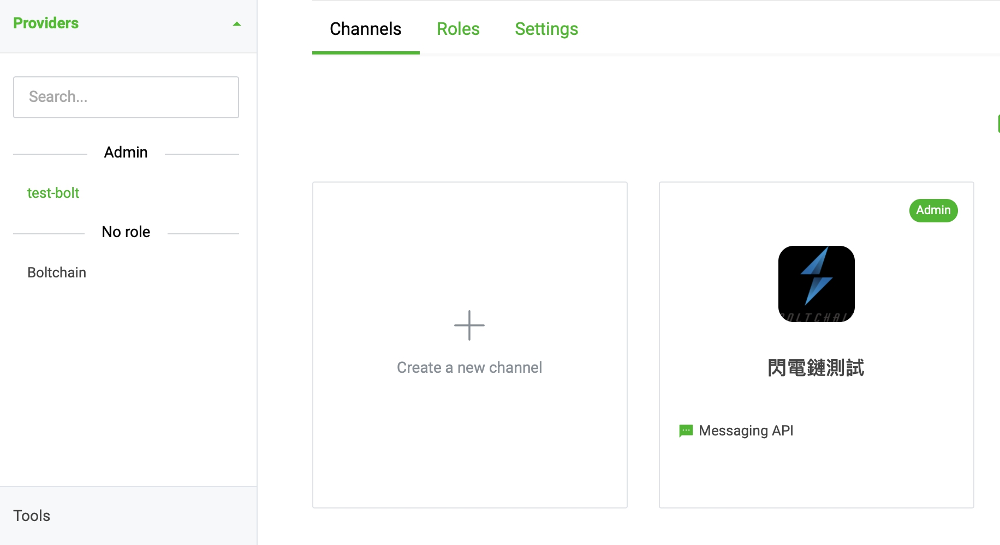
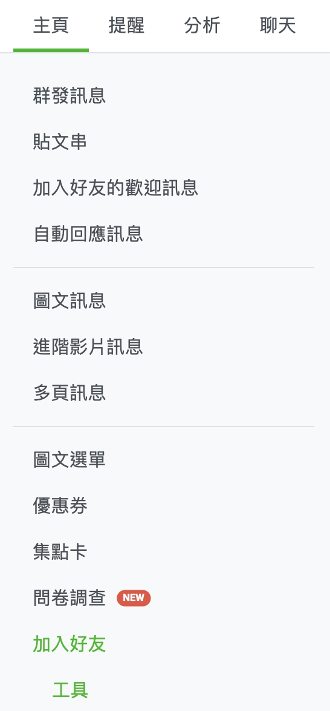
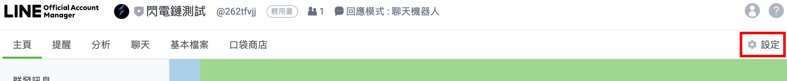
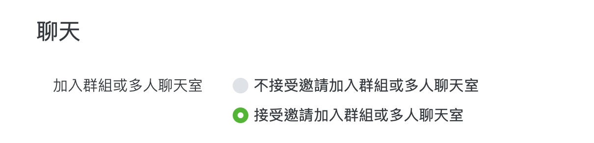
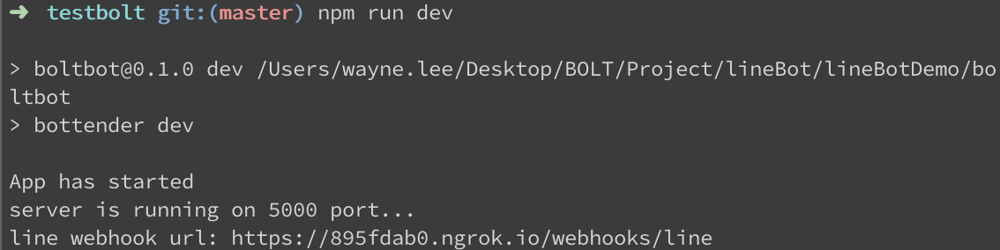

# 從零開始的line機器人

## 申請developer帳號
>https://developers.line.biz/zh-hant/

1. 點選Log in


2. 選擇"使用LINE帳號登入"，填入自己的line登入就可以了


## 建立Provider
登入後首先要建立Provider，Provider會顯示在機器人帳號底下


## 建立Channel
官方的名詞解釋
>Communication path for using the functions provided by the LINE Platform in the services developed by the provider. You can create channels in the LINE Developers console.

1. 點選剛建立的Provider
2. Create a new channel
3. 選擇由於是聊天機器人，選擇messaging api，然後填入各項資訊
    * Channel icon: 顯示在line上的icon
    * Channel name: 聊天機器人的顯示名稱
    * Channel description: 聊天機器人的簡介，不過這欄隨便填就可以了，因為好像不會被任何人看見。
    * Category：這個隨便選
    * Subcategory：這個也隨便選
4. 建立完成後就能在Provider看到了


## 發布聊天機器人
>https://manager.line.biz/

1. 點選要發布的機器人
2. 選擇加入好友



## 聊天機器人基本設定
要修改名稱、icon、自動回應的訊息等都可以在這找到。
>https://manager.line.biz/

1. 點選要設定的機器人
2. 右上角設定

3. 帳號設定 -> 聊天 -> 加入群組或多人聊天室，選擇“接受邀請加入群組或多人聊天室”

4. 回應設定 -> 進階設定 -> 停用自動回應訊息
5. 回應設定 -> 進階設定 -> 開啟webhook


## 取得機器人 Channel secret, Channel access token
需要設定聊天機器人，從這個網址可以找到。
>https://developers.line.biz/console

1. 點進目標的Providor -> 點進目標的機器人
2. 在Basic setting可以取得Channel secret
3. 在Messaging API可以建立Channel access token

## 使用bottender建立專案
>https://bottender.js.org/docs/channel-line-setup

設定之後都可以在 bottender.config.js 修改

1. 安裝bottender
>npm i -g bottender
2. 建立專案（名稱需全小寫）
>npx create-bottender-app my-app
3. 平台選line
4. session store 選 memory
5. 修改 channels.line.enable
>`bottender.config.js`
```js
module.exports = {
    //...
    channels: {
        line: {
            enabled: true,
        path: '/webhooks/line',
        accessToken: process.env.LINE_ACCESS_TOKEN,
        channelSecret: process.env.LINE_CHANNEL_SECRET,
        },
    },
};
```
6. 寫入上面取得的 Channel secret, Channel access token
>`.env`
```
LINE_ACCESS_TOKEN=
LINE_CHANNEL_SECRET=
```
7. 執行測試，成功就會看到webhook url
>npm run dev



## 設定機器人webhook
>注意：line只吃https

1. https://developers.line.biz/console
2. 點進目標的Providor -> 點進目標的機器人
3. 在Messaging API填入webhook網址